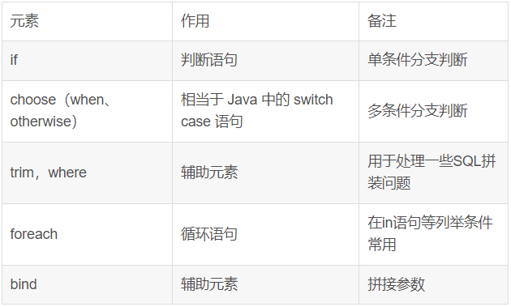

# MyBatis动态SQL



## foreach

```xml
<select id="findALL" resultType="Student" parameterType="Integer">
	<include refid ="selectvp"/> WHERE sid in
	<foreach item="ids" collection="array" open="(" separator=","close=")">
		#{ids｝
	</foreach>
</select>
```


## include

引用其他mapepr

```xml
<sql id="Base_Column_List"> ID,MAJOR,BIRTHDAY,AGE,NAME,HOBBY</sql>
<include refid="com.xxx.dao.xxMapper.Base_Column_List"></include>
```

本mapper：

```xml
<sql id="selectvp">
    select  *  from  student
</sql>
<include refid="selectvp"/>
```


参考：

https://mp.weixin.qq.com/s/de55g6VPEU3_p8GvocXy3w

