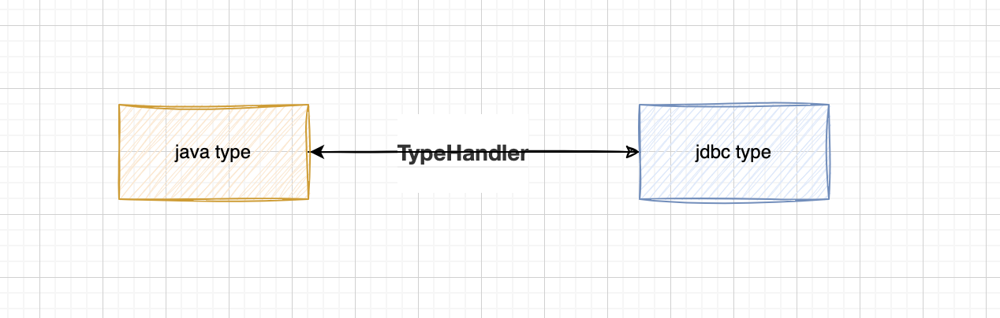

# MyBatis自定义类型处理器TypeHandler



```java
public interface TypeHandler<T> {

    /**
     * 设置 PreparedStatement 的指定参数。
     * 
     * @param ps        PreparedStatement 对象。
     * @param index     参数在 PreparedStatement 中的位置。
     * @param parameter 要设置的参数值。
     * @param jdbcType  JDBC 类型。这是一个可选参数，可以用来控制设置参数时的行为。
     * @throws SQLException 如果在设置参数时发生 SQL 异常。
     */
    void setParameter(PreparedStatement ps, int index, T parameter, JdbcType jdbcType) throws SQLException;

    /**
     * 从 ResultSet 中获取数据并转换为 Java 类型。
     * 
     * @param rs        ResultSet 对象。
     * @param columnName 要获取的数据的列名。
     * @return 转换后的 Java 类型数据。
     * @throws SQLException 如果在获取数据时发生 SQL 异常。
     */
    T getResult(ResultSet rs, String columnName) throws SQLException;

    /**
     * 从 ResultSet 中获取数据并转换为 Java 类型。
     * 
     * @param rs         ResultSet 对象。
     * @param columnIndex 要获取的数据的列索引。
     * @return 转换后的 Java 类型数据。
     * @throws SQLException 如果在获取数据时发生 SQL 异常。
     */
    T getResult(ResultSet rs, int columnIndex) throws SQLException;

    /**
     * 从 CallableStatement 中获取数据并转换为 Java 类型。
     * 
     * @param cs         CallableStatement 对象。
     * @param columnIndex 要获取的数据的列索引。
     * @return 转换后的 Java 类型数据。
     * @throws SQLException 如果在获取数据时发生 SQL 异常。
     */
    T getResult(CallableStatement cs, int columnIndex) throws SQLException;
}

```

## 配置方式

1. 在Mapper.xml中声明(应用**单个**指定字段)

   ```xml
   <resultMap id="BaseResultMap" type="com.xxx.EntiyDto">
   	<result column="enum1" jdbcType="INTEGER" property="enum1" typeHandler="com.xxx.handler.IntegerArrayTypeHandler"/>
   </resultMap>
   ```

2. 在springboot的yml配置文件中设置类型处理器所在的**包名**，不是处理器路径（应用到**全局**）

   ```yml
   mybatis-plus:
     type-handlers-package: com.xxx.handler 
   ```

3. 实体类指定类型处理器。**必须在实体类上加`@TableName(autoResultMap = true)`,否则不生效**


```java
@Data
@Accessors(chain = true)
@TableName(autoResultMap = true)
public class User {
}
```


参考材料：

https://juejin.cn/post/7320211683871801363?utm_source=gold_browser_extension
