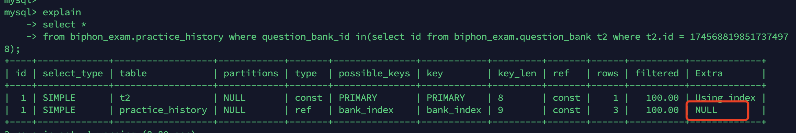

# MySQL-explain

EXPLAIN关键字可以模拟优化器执行SQL查询语句，从而知道MySQL是如何处理你的SQL语句的。


## 常见优化方案

- 索引失效，没有充分利用到索引：创建索引
- 关联查询太多JOIN（尽量减少此类操作）：SQL优化
- 数据过多：分库分表
- 服务器调/优及各个参数设置（缓冲、线程数等）：调整my.cnf

## 回表

- 索引的列在 select 所需获得的列中（因为在 mysql 中索引是根据索引列的值进行排序的，所以索引节点中存在该列中的部分值）或者根据一次索引查询就能获得记录就不需要回表
- select 所需获得列中有大量的非索引列，索引就需要到表中找到相应的列的信息，这就叫回表。



## 索引覆盖

只需要在一棵索引树上就能获取SQL所需的所有列数据，无需回表，速度更快。explain的输出结果Extra字段为Using index时，能够触发索引覆盖。将被查询的字段，建立到联合索引里去。

## id

select 的序列号，有几个 select 就有几个id，并且id的顺序是按 select 出现的顺序增长的。

MySQL将 select 查询分为简单查询(SIMPLE)和复杂查询(PRIMARY)。

复杂查询：

- 简单子查询、派生表（from语句中的子查询）、union 查询。
- id列越大执行优先级越高，id相同则从上往下执行，id为NULL最后执行。

## select_type

select_type 表示对应行是简单还是复杂的查询，如果是复杂的查询，又是上述三种复杂查询中的哪一种。

1. simple简单查询。查询不包含子查询和union

2. primary：复杂查询中最外层的 select
3. subquery：包含在 select 中的子查询（不在 from 子句中）
4. derived：包含在 from 子句中的子查询。MySQL会将结果存放在一个临时表中，也称为派生表（derived的英文含义）。
5. union：在 union 中的第二个和随后的 select
6. union result：从 union 临时表检索结果的 select

## table

单表：显示这一行的数据是关于哪张表的。

```
explain select * from practice_history where id = 1780924119466397697;
```


多表关联：驱动表和被驱动表。（内连接时，MySQL性能优化器会自动判断哪个表是驱动表，哪个表示被驱动表，和书写的顺序无关）


子查询时：table列是格式，表示当前查询依赖 id=N 的查询，于是先执行 id=N 的查询。

当有 union 时，UNION RESULT 的 table 列的值为`<union1,2>`，1和2表示参与 union 的 select 行id。

## type

表示关联类型或访问类型，即MySQL决定如何查找表中的行，查找数据行记录的大概范围。

最优到最差分别为：system > const > eq_ref > ref > range > index > ALL 一般来说，得保证查询达到range级别，最好达到ref

- NULL值：

  mysql能够在优化阶段分解查询语句，在执行阶段用不着再访问表或索引。例如：在索引列中选取最小值，可以单独查找索引来完成，不需要在执行时访问表。

- const（system）：

  mysql能对查询的某部分进行优化并将其转化成一个常量（可以看show warnings 的结果）。用于 primary key 或 unique key 的所有列与常数比较时，所以表最多有一个匹配行，读取1次，速度比较快。

  system是const的特例，表里只有一条元组匹配时为system。

- eq_ref：

  primary key 或 unique key 索引的所有部分被连接使用 ，最多只会返回一条符合条件的记录。

  这可能是在 const 之外最好的联接类型了，简单的 select 查询不会出现这种 type。

- ref：

  相比 eq_ref，不使用唯一索引，而是使用普通索引或者唯一性索引的部分前缀，索引要和某个值相比较，可能会找到多个符合条件的行。

   简单 select 查询：普通索引（非唯一索引）

  关联表查询：联合索引

- range：

  范围扫描通常出现在 in(), between ,> ,<, >= 等操作中。使用一个索引来检索给定范围的行。

- index：

  扫描全表索引，这通常比ALL快一些。（index是从索引中读取的，而all是从硬盘中读取）

- ALL：全表扫描，mysql需要从头到尾去查找所需要的行。**需要增加索引来进行优化**。

  

  

## possible_keys

这一列显示查询可能使用哪些索引来查找。

explain 时可能出现 possible_keys 有列，而 key 显示 NULL 的情况，这种情况是因为表中数据不多，mysql认为索引对此查询帮助不大，选择了全表查询。

如果该列是NULL，则没有相关的索引。在这种情况下，可以通过检查 where 子句看是否可以创造一个适当的索引来提高查询性能，然后用 explain 查看效果。

## key

这一列显示mysql实际采用哪个索引来优化对该表的访问。

如果没有使用索引，则该列是 NULL。如果想强制mysql使用或忽视possible_keys列中的索引，在查询中使用 force index、ignore index。

## key_len

这一列显示了mysql在索引里使用的字节数，通过这个值可以算出具体使用了索引中的哪些列。

## Extra 额外信息

- Using index：查询的列被索引覆盖，并且where筛选条件是索引的前导列，是性能高的表现。一般是使用了覆盖索引(索引包含了所有查询的字段)。对于innodb来说，如果是辅助索引性能会有不少提高

- Using where：查询的列未被索引覆盖，where筛选条件非索引的前导列

- Using where Using index：查询的列被索引覆盖，并且where筛选条件是索引列之一但是不是索引的前导列，意味着无法直接通过索引查找来查询到符合条件的数据

- NULL：查询的列未被索引覆盖，并且where筛选条件是索引的前导列，意味着用到了索引，但是部分字段未被索引覆盖，必须通过“回表”来实现，不是纯粹地用到了索引，也不是完全没用到索引

  ```sql
  explain
  select *
  from biphon_exam.practice_history where question_bank_id in(select id from biphon_exam.question_bank t2 where t2.id = 1745688198517374978);
  
  explain
  select t1.id
  from biphon_exam.practice_history t1 where question_bank_id in(select id from biphon_exam.question_bank t2 where t2.id = 1745688198517374978);
  ```

  

  

- Using index condition：与Using where类似，查询的列不完全被索引覆盖，where条件中是一个前导列的范围；

- Using temporary：mysql需要创建一张临时表来处理查询。出现这种情况一般是要进行优化的，首先是想到用索引来优化。

- Using filesort：mysql 会对结果使用一个外部索引排序，而不是按索引次序从表里读取行。此时mysql会根据联接类型浏览所有符合条件的记录，并保存排序关键字和行指针，然后排序关键字并按顺序检索行信息。这种情况下一般也是要考虑使用索引来优化的。

- Using join buffer (hash join)：使用了连接缓冲(哈希连接)。

- no matching row in const table：使用唯一索引查询不到记录。

  


> https://juejin.cn/post/7305235970285305867?utm_source=gold_browser_extension#heading-3