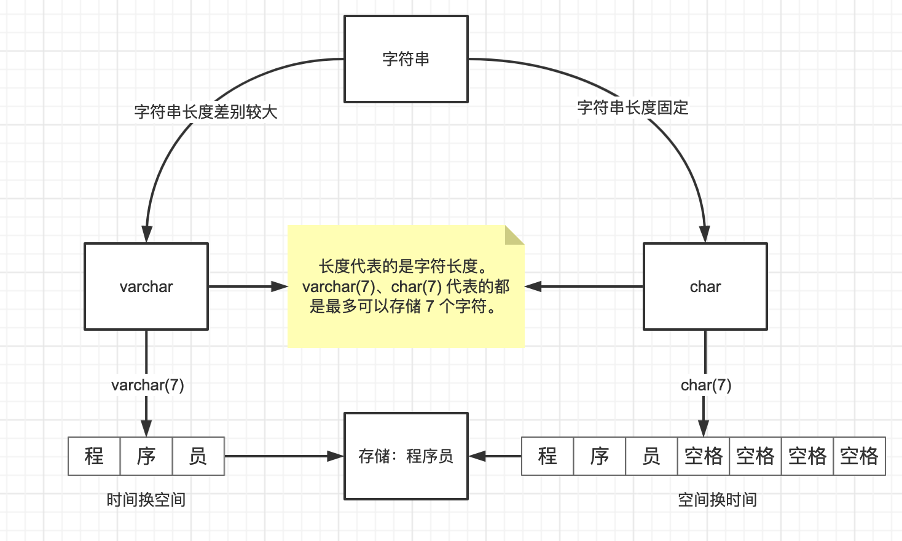

# MySQL-varchar与char

**如何选择：**

- 字符串长度固定或者差别不大，选择char类型。
- 字符串长度差别较大，选择varchar类型。

**相同点：**

- 长度代表的是字符长度（其它类型都是代表字节长度）：varchar(7)、char(7) 代表的都是最多可以存储 7 个字符。

**varchar（最多能存放的字符个数为 65532）：**

- 可变长字符串，长度是可变的。
- 插入的数据是多长，就按照多长来存储。
- 时间换空间：长度不固定，存取慢，不占据多余的空间。

**char（最多能存放的字符个数为 255，和编码无关）：**

- 定长字符串，长度是固定的。
- 插入数据的长度小于 char 的固定长度时，则用空格填充。
- 空间换时间：长度固定，存取速度比 varchar 快，会占据多余的空间。

