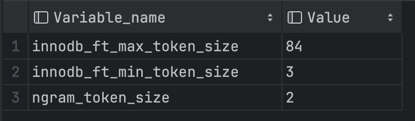
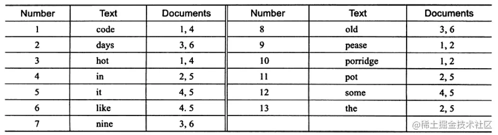
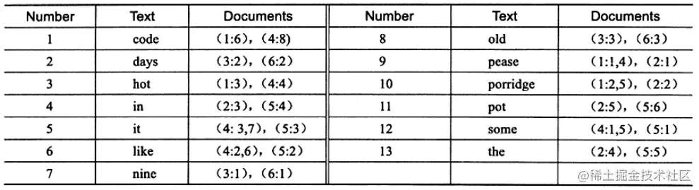
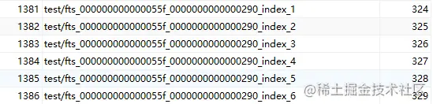

# MySQL全文索引

[MySQL :: MySQL 8.2 Reference Manual :: 12.9.6 Fine-Tuning MySQL Full-Text Search](https://dev.mysql.com/doc/refman/8.2/en/fulltext-fine-tuning.html)

以下是翻译一部分个人认为比较重要的数据：

- MySQL的全文搜索功能几乎没有用户可调的参数。
- 全文搜索经过仔细调整，以提高效率。在大多数情况下，修改默认行为实际上会降低效率。
- 大多数全文变量都必须在服务器启动时设置。需要重新启动服务器才能更改它们；在服务器运行时不能修改它们。
- 某些变量更改要求重新生成表中的FULLTEXT索引。

MySQL全文索引是一种用于快速搜索文本字符串的索引，在MySQL数据库中，它可以用来提高文本搜索的效率。全文索引不同于普通索引，普通索引只是对列值进行排序，而全文索引则会对列的内容进行**分词**，并且对每个分词建立索引，从而可以在文本中进行模糊搜索、部分匹配和多词搜索等操作。

## 配置最小和最大字长

```sql
show variables like '%token%';
```



- innodb_ft_min_token_size：默认3，表示最小3个字符作为一个关键词，增大该值可减少全文索引的大小 
- innodb_ft_max_token_size： 默认84，表示最大84个字符作为一个关键词，限制该值可减少全文索引的大小
- ngram_token_size：默认2，表示2个字符作为内置分词解析器的一个关键词,合法取值范围是1-10，如对“abcd”建立全文索引，关键词为’ab’，‘bc’，‘cd’ 当使用ngram分词解析器时，innodb_ft_min_token_size和innodb_ft_max_token_size 无效

**注意：最小和最大字长全文参数不适用于使用ngram语法分析器创建的FULLTEXT索引。ngram令牌大小由ngram_token_size选项定义。**

更改任何这些选项后，重新生成FULLTEXT索引以使更改生效，然后重新启动服务器并重新生成FULLTEXT索引。

## 注意点

1. 自然语言全文索引创建索引时的字段需与查询的字段保持一致，即MATCH里的字段必须和FULLTEXT里的一模一样；
2. 自然语言检索时，检索的关键字在所有数据中不能超过50%（即常见词），则不会检索出结果。可以通过布尔检索查询；

## stopword

查询所有的stopword：

```sql
SELECT * FROM INFORMATION_SCHEMA.INNODB_FT_DEFAULT_STOPWORD
```

1. 不建议使用方法：stopword一般是mysql自建的，但可以通过设置ft_stopword_file变量为自定义文件，从而自己设置stopword，设置完成后需要重新创建索引。
2. 使用**布尔索引查询**

小于最短长度和大于最长长度的关键词无法查出结果。可以通过设置对应的变量来改变长度限制，修改后需要重新创建索引。

## 配置自然语言搜索阈值


## 测试数据


## 语法

全文索引只能用于CHAR、VARCHAR、TEXT和BLOB类型的字段。此外，在MySQL 5.6版本以前，全文索引只支持MyISAM存储引擎，而在MySQL 5.6版本以后，InnoDB存储引擎也支持全文索引。

```sql
CREATE FULLTEXT INDEX index_name
ON table_name (column_name)
[WITH PARSER parser_name]
```

- index_name：索引名称
- table_name：索引表名称
- column_name：索引列名称
- WITH PARSER子：可选，用于指定在创建索引时要使用的**解析器**。

## 使用全文索引进行查询

```sql
SELECT * FROM table_name WHERE MATCH(column_name) AGAINST('keyword');	
```

## ngram解析器

内置的FULLTEXT解析器通过查找特定的分隔符来确定单词的开始和结束位置;例如:(空格)，(逗号)，和.(点号)。如果单词之间没有分隔符(例如中文)，则内置的FULLTEXT解析器无法确定单词的开始或结束位置。

可以使用**ngram解析器**插件(用于**中文**、日文或韩文)或MeCab解析器插件(用于日文)创建FULLTEXT索引。

ngram是给定文本序列中**n个字符的连续序列**。ngram解析器将文本序列标记为连续的n个字符序列。例如，我们可以使用ngram全文解析器将“abcd”标记为不同的n值。

```sql
n=1: 'a', 'b', 'c', 'd'
n=2: 'ab', 'bc', 'cd'
n=3: 'abc', 'bcd'
n=4: 'abcd'
```

这里的n事实上是ngram指定的令牌大小（token size），Ngram令牌大小可以使用**ngram_token_size**配置选项进行配置，该选项的最小值为1，最大值为10。

- 修改ngram_token_size需要重启mysql服务器
- 修改了ngram_token_size之后，我们需要重建fulltext索引，一般我们采用删了重加的方式重建。
- 对于使用ngram解析器的FULLTEXT索引，忽略以下最小和最大字长配置选项:innodb_ft_min_token_size, innodb_ft_max_token_size, ft_min_word_len和ft_max_word_len。这些参数分别是innodb、myIsam引擎在使用非ngram分词时对应的设置令牌大小的参数。

**ngram_token_size设置为要搜索的最大令牌的大小。如果我们需要只搜索单个字符，请将ngram_token_size设置为1。**

比如我们要使用全文索引，查询name字段中包含“刘”字的记录。

创建使用ngram分词的全文索引：

```sql
alter table `user` add fulltext index idx_name (name) with parser ngram
```

使用Match Against语法进行查询：

```sql
SELECT * FROM `uuc_business_user` where MATCH(name) AGAINST('刘')
```

需要注意的是，我是使用单个汉字（刘）进行查询的，这个时候如果想要查询到结果，需要将ngram_token_size设置为1，如果ngram_token_size的值是大于1的数，将查询不到任何记录。如果我们要支持搜索单个字符，记住需要将ngram_token_size设置为1。

ngram_token_size设置为1之后，使用大于1个的汉字进行搜索时，mysql会将汉字拆分为多个单个汉字分别进行搜索，然后将结果进行合并。

比如使用 MATCH(name) AGAINST('刘娅')进行查询时，得到的结果，会如下所示：


如果想要查询结果，同时包含“刘”和“娅”，可以使用如下语法进行查询：

```sql
SELECT * FROM uuc_business_user WHERE MATCH (name) AGAINST ('"刘娅"' IN BOOLEAN MODE);
```

上面的语句中使用了布尔模式，包含在双引号内的搜索词语“刘娅”被看作一个短语，表示**必须同时包含**这两个词语，即只有完全匹配“刘娅”这个词语的文档才会被返回。在布尔模式下，使用双引号括起来的搜索词语表示一个短语，这个短语必须完全匹配才能返回结果。因此，这个查询只会返回包含完整短语“刘娅”的文档，不会返回包含“刘”和“娅”这两个词语的文档。

而如果不加`in BOOLEAN MODE`，则默认是使用了自然语言模式，MySQL会使用内置的自然语言处理技术对搜索查询进行分词和停用词处理，并根据每个词语在文档中的重要性对文档进行打分。在自然语言模式下，使用双引号括起来的搜索词语表示一个短语，但并不要求这个短语必须完全匹配。因此，这个查询将返回包含“刘”和“娅”这两个词语的文档，不一定是完全匹配“刘娅”这个短语的文档。

## 自然模式和布尔模式

在MySQL中，全文搜索支持两种主要的查询模式：**自然语言模式和布尔模式**。这两种模式的主要区别在于它们如何处理搜索查询和返回结果。

### 自然模式 （IN NATURAL LANGUAGE MODE)

全文搜索中的自然语言模式是默认模式，它使用自然语言处理技术来解析搜索查询并返回最相关的结果。自然语言模式会对搜索查询进行分词和停用词处理，并根据每个词语在文档中的重要性对文档进行打分。然后，MySQL会根据文档的得分对搜索结果进行排序，并返回最相关的文档。

例如，以下查询将在自然语言模式下搜索包含“刘”和“娅”的文档，并按照相关性进行排序：

```sql
SELECT * FROM users
WHERE MATCH(name) AGAINST('刘 娅' IN NATURAL LANGUAGE MODE);
```

## 布尔模式（IN BOOLEAN MODE)

全文搜索中的布尔模式允许用户使用布尔运算符**（AND、OR、NOT）** 来组合搜索条件，并通过对文档进行匹配来确定文档是否符合查询条件。在布尔模式下，MySQL会将搜索查询视为布尔表达式，并使用布尔运算符来确定每个文档是否符合查询条件。

例如，以下查询将在布尔模式下搜索包含“刘”和“娅”的文档:

```sql
SELECT * FROM users
WHERE MATCH(name) AGAINST('+刘 +娅' IN BOOLEAN MODE);
```

在布尔模式下，“+”符号表示必须包含该词语，“-”符号表示不包含该词语，“|”符号表示或者。这个查询将返回包含“apple”和“iphone”两个词语的文档。

需要注意的是，自然语言模式和布尔模式都有各自的优点和缺点。自然语言模式通常更易于使用和理解，但可能会导致一些不准确的结果。布尔模式更灵活，可以**更精确地控制**搜索条件，但需要更多的查询语法知识。在使用全文搜索时，应根据具体情况选择合适的查询模式。

## 全文索引与 like "%%"

全文索引和LIKE "%%"是两个不同的文本搜索方法，它们在实现和性能上有很大的差异。

全文索引是一种特殊类型的索引，用于对文本字段进行全文搜索，它可以支持模糊搜索、部分匹配和多词搜索等操作。全文索引可以显著提高文本搜索的性能和效率，特别是在处理大量文本数据时。

与此不同，LIKE "%%"是一种基于通配符的模式匹配操作，可以在文本字段中查找包含指定字符串的记录。但是，LIKE "%%"操作通常会导致**全表扫描**，并且性能较低，特别是在处理大量数据时。

与此不同，LIKE "%%"是一种基于通配符的模式匹配操作，可以在文本字段中查找包含指定字符串的记录。但是，LIKE "%%"操作通常会导致**全表扫描**，并且性能较低，特别是在处理大量数据时。

## 总结

mysql使用全文索引来提高文本搜索的效率。我们可以使用FULLTEXT关键字来声明一个全文索引列，创建全文索引后，可以使用MATCH AGAINST语句来执行全文搜索查询。我们需要使用ngram分词器来支持中文全文搜索。ngram_token_size用来指定令牌大小。全文搜索支持两种主要的查询模式：自然语言模式和布尔模式，自然语言模式通常更易于使用和理解，但可能会导致一些不准确的结果。布尔模式更灵活，可以**更精确地控制**搜索条件，但需要更多的查询语法知识。


InnoDB 在模糊查询数据时使用 "`%xx`" 会导致索引失效。

全文索引（Full-Text Search）是将存储于数据库中的整本书或整篇文章中的任意信息查找出来的技术。它可以根据需要获得全文中有关章、节、段、句、词等信息，也可以进行各种统计和分析。


## 倒排索引

全文检索通常使用倒排索引（inverted index）来实现，倒排索引同 B+Tree 一样，也是一种索引结构。

它在辅助表中存储了单词与单词自身在一个或多个文档中所在位置之间的映射，这通常利用关联数组实现，拥有两种表现形式：

- `inverted file index`：{单词，单词所在文档的id}
- `full inverted index`：{单词，（单词所在文档的id，再具体文档中的位置）}



上图为 inverted file index 关联数组，可以看到其中单词"code"存在于文档1,4中，这样存储再进行全文查询就简单了，可以直接根据 Documents 得到包含查询关键字的文档；而 full inverted index 存储的是对，即（DocumentId,Position），因此其存储的倒排索引如下图，如关键字"code"存在于文档1的第6个单词和文档4的第8个单词。

> 相比之下，full inverted index 占用了更多的空间，但是能更好的定位数据，并扩充一些其他搜索特性。



## 全文检索

```sql
CREATE TABLE table_name ( 
  id INT UNSIGNED AUTO_INCREMENT NOT NULL PRIMARY KEY, 
  author VARCHAR(200), 
	title VARCHAR(200), 
  content TEXT(500), 
  FULLTEXT full_index_name (col_name) ) ENGINE=InnoDB;
```

```sql
CREATE FULLTEXT INDEX full_index_name ON table_name(col_name);
```

```sql
SELECT table_id, name, space from INFORMATION_SCHEMA.INNODB_TABLES
WHERE name LIKE 'test/%';
```



上述六个索引表构成倒排索引，称为辅助索引表。当传入的文档被标记化时，单个词与位置信息和关联的DOC_ID，根据单词的第一个字符的字符集排序权重，在六个索引表中对单词进行完全排序和分区。

MySQL 数据库支持全文检索的查询，全文索引只能在 InnoDB 或 MyISAM 的表上使用，并且只能用于创建 char,varchar,text 类型的列。

```sql
MATCH(col1,col2,...) AGAINST(expr[search_modifier])
search_modifier:
{
    IN NATURAL LANGUAGE MODE
    | IN NATURAL LANGUAGE MODE WITH QUERY EXPANSION
    | IN BOOLEAN MODE
    | WITH QUERY EXPANSION
}
```

全文搜索使用 `MATCH()` `AGAINST()`语法进行，其中，`MATCH()`采用逗号分隔的列表，命名要搜索的列。`AGAINST()`接收一个要搜索的字符串，以及一个要执行的搜索类型的可选修饰符。全文检索分为三种类型：自然语言搜索、布尔搜索、查询扩展搜索，下面将对各种查询模式进行介绍。

### Natural Language

自然语言搜索将搜索字符串解释为自然人类语言中的短语，`MATCH()`默认采用 Natural Language 模式，其表示查询带有指定关键字的文档。

```sql
SELECT
    count(*) AS count 
FROM
    `fts_articles` 
WHERE
    MATCH ( title, body ) AGAINST ( 'MySQL' );
```

```sql
SELECT
    count(IF(MATCH ( title, body ) 
    against ( 'MySQL' ), 1, NULL )) AS count 
FROM
    `fts_articles`;
```

上述两种语句虽然得到的结果是一样的，但从内部运行来看，第二句SQL的执行速度更快些，因为第一句SQL（基于where索引查询的方式）还需要进行相关性的排序统计，而第二种方式是不需要的。

通过SQL语句查询相关性：

```sql
SELECT
    *,
    MATCH ( title, body ) against ( 'MySQL' ) AS Relevance 
FROM
    fts_articles;
```

## 全文索引优化

**优化MATCH AGAINST使用：**

1. 对要进行全文索引的字段进行适当的格式化和清洗，去除无用信息，减少全文搜索的数据量。
2. 优化FULLTEXT搜索的关键词。可以将关键词进行“分词”，去掉无意义的单词或标点，避免将无关单词搜索。
3. 设置最大列数和最大行数的参数，限制全文索引搜索范围，提高性能。

**使用多字段索引：**

MySQL中，创建全文索引时可以同时对多个字段创建索引。如果查询语句中涉及到多个字段的全文检索，那么可以使用多字段索引，可以大大提高检索性能。具体做法是在FULLTEXT关键字后面按顺序列举需要索引的字段，如下：

```sql
CREATE TABLE article (
....
FULLTEXT(title,auth,content)
);
```

同时，需要在MATCH AGAINST语句中按照FULLTEXT索引中给出的顺序对搜索字段进行指定，如下：

```sql
SELECT * FROM article WHERE MATCH (title, author, content) AGAINST ('搜索词');
```

**使用memcached、CDN等缓存技术：**

MySQL中，全文检索会根据搜索条件匹配，然后返回结果。如果数据量很大，复杂度很高，会导致查询时间变长，影响查询性能。可以使用缓存技术，如memcached、CDN等技术，将全文检索的结果进行缓存，对于下一次相同的查询，直接从缓存中取结果，提高检索速度。


- **调整全文搜索相关配置参数：** 在 MySQL 中，一些配置参数影响全文搜索的性能，如 `innodb_ft_num_word_optimize` 和 `innodb_ft_result_cache_limit`。根据具体需求进行调整。
- **适当调整 InnoDB 配置：** 调整 InnoDB 相关的配置参数，例如 `innodb_buffer_pool_size`，确保适当的内存用于缓存索引和数据。

