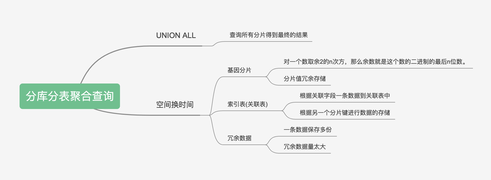
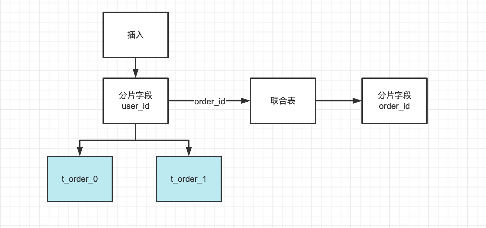

# MySQL分表分库-分库分表聚合查询

在分库分表的数据库系统中，通常会将数据按照一定的规则分散存储在不同的数据库或表中。这些规则通常基于数据中的某个字段，称为分片字段。例如，可以按照用户 ID 对用户数据进行分库分表，每个用户的数据都存储在不同的数据库或表中。

如果进行的是非分片字段查询，即查询条件中不包含分片字段，那么数据库系统将不能根据分库分表规则确定查询的目标数据库或表。在这种情况下，数据库系统通常会执行全库或全表扫描，查询所有的数据库或表，这样可能会导致性能问题。

## 分库分表聚合查询常见解决方案



## union all

UNION ALL 是 SQL 语言中用于合并多个查询结果集的语法。它与 UNION 的区别在于，UNION ALL 会将多个查询结果集完整地合并在一起，而 UNION 会在合并之前对查询结果集进行去重处理。

UNION ALL 语法的一般形式如下：

```sql
SELECT column1, column2, ...
FROM table1
WHERE condition1

UNION ALL

SELECT column1, column2, ...
FROM table2
WHERE condition2
```

当使用非分片字段查询时，通过全局扫描的形式返回所有的结果集。

## 基因法(融合法)

分库分表基因法是一种数据库系统中分库分表的策略。它是通过将每个数据库或表看作一个基因，并通过组合基因来决定数据存储位置的方法。

例如，在基因法分库分表系统中，可以将每个数据库或表都赋予一个唯一的基因编码，然后将每条数据的基因编码与数据库或表的基因编码进行匹配，来决定该数据存储在哪个数据库或表中。

使用基因法分库分表的优点在于，可以通过更改基因编码的对应关系来调整数据分布情况，而不需要重新进行数据迁移。这可以帮助数据库系统更加灵活地应对数据分布变化，提高系统的稳定性和性能。

基因法：**对一个数取余2的n次方，那么余数就是这个数的二进制的最后n位数。**


```java
用户的uid为9, 那么  9%4
9			4
0001 0000	0100
按照最后两位作为分库因子 00

订单表 oid(64位) 使用分布式ID生成62位(如雪花算法) + 分库因子

按照上述方法,可以保证同一个用户的所有订单,都落在同一个库上,可以通过用户uid%4定位库,也可以通过oid%4定位到库
```

## 索引表（关联表）法

```sql
CREATE TABLE idx_orderid_userid （
  order_id bigint
  user_id bigint,
  PRIMARY KEY (order_id)
)
```



原始SQL：

```sql
SELECT * FROM T_ORDER WHERE order_id = 1
```

拆分后的SQL：

```sql
# step 1
SELECT user_id FROM idx_orderid_userid 
WHERE order_id = 1

# step 2
SELECT * FROM T_ORDER 
WHERE user_id = ? AND order_id = 1
```

不论有多少个分片，也只需要查询 2个分片的信息，这样 SQL 的查询性能可以得到极大的提升。

## 冗余数据法

一条数据保存多份。

也就是说各分个的，原来只有一个分片字段，再增加一个分片字段。