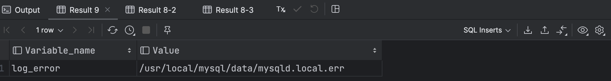
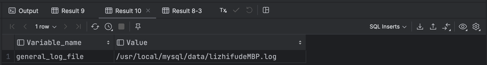
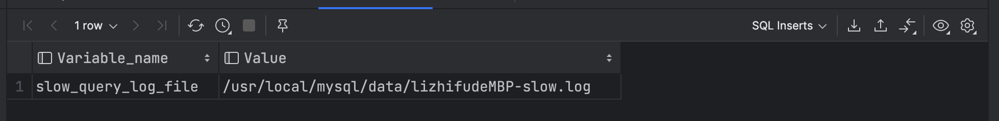

# MYSQL 日志

MySQL中有多种类型的日志，用于不同的目的，如事务记录、故障恢复、性能监控和审计等。

## 常规日志文件

1. **错误日志（Error Log）**：

   - 错误日志记录了MySQL服务器的错误和警告消息。
   - 通常，错误日志的位置是MySQL的数据目录中，文件名通常是`error.log`。
   - 可以使用`SHOW VARIABLES LIKE 'log_error';`命令来查看错误日志文件的位置。

   

2. **查询日志（Query Log）**：

   - 查询日志记录了执行的SQL查询语句。
   - 可以通过设置`general_log`变量来启用或禁用查询日志。
   - 查询日志的位置可以通过`SHOW VARIABLES LIKE 'general_log_file';`查看。

   

1. **慢查询日志（Slow Query Log）**：
   - 慢查询日志记录了执行时间超过某个阈值的查询，以帮助优化性能。

   - 可以通过设置`slow_query_log`和`long_query_time`变量来启用和配置慢查询日志。

   - 慢查询日志的位置可以通过`SHOW VARIABLES LIKE 'slow_query_log_file';`查看。

   

4. **查询缓存日志（Query Cache Log）**：
   - 查询缓存日志用于记录查询缓存的操作，包括查询缓存的命中和失效情况。
   - MySQL 8.0版本后，查询缓存已被移除，所以这个日志在新版MySQL中不再使用。

## 性能监控（Performance Schema）

- Performance Schema 提供了有关MySQL性能的详细信息，包括执行计划、等待事件和资源使用等。
- 用于性能分析和调优。

## 审计（Audit Log）

**审计日志（Audit Log）**：

- 审计日志记录了关于身份验证和授权的信息，以帮助监视和审计数据库访问。
- MySQL自身通常不提供内置的审计日志功能，但可以使用第三方工具或插件来实现。

## 事务日志（Transaction Log）

事务日志用于记录事务的更改，以确保ACID（原子性、一致性、隔离性、持久性）属性，由MySQL内部管理。

1. **二进制日志（Binary Log）**：
   - 二进制日志记录了数据库中的更改，包括INSERT、UPDATE和DELETE操作。
   - 二进制日志对于复制、恢复和故障恢复非常重要。
   - 可以通过设置`log_bin`变量来启用或禁用二进制日志。
   - 二进制日志的位置可以通过`SHOW MASTER STATUS;`查看。
3. **重放日志（Redo Log）**：
   - 重放日志用于在数据库恢复期间还原数据的更改。
   - 这些日志通常不直接访问，而是由MySQL内部管理。
5. **回滚日志（Undo Log）**：
   - 用于支持事务和多版本并发控制（MVCC）的关键组件
   - 存储在事务执行期间所做的更改的旧数据版本，以便在需要时进行回滚和提供一致的读取。

