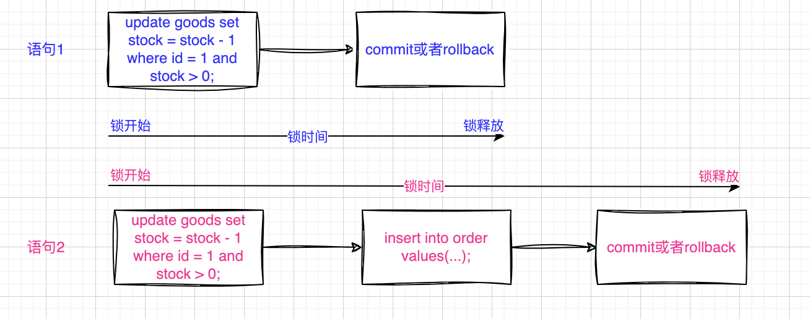

# MySQL更新优化

以库存更新为例：

流程1：

```sql
# 开始事务
begin;
# 先从数据库查询
select stock from goods where id = 1;
# 判断库存数量
if (stock > 0) {
	  # 插入订单表
    insert into order values(...); 
    # 更新库存
    update goods set stock = stock - 1 where id = 1 and stock > 0;
}

if (updateCount > 0) {
		# 提交事务
    commit;
} else {
   # 回滚事务
    rollback;
}

```

流程2：

```sql
# 开始事务
begin;
# 先从数据库查询
select stock from goods where id = 1;
# 判断库存数量
if (stock > 0) {
    # 更新库存
    update goods set stock = stock - 1 where id = 1 and stock > 0;
    # 插入订单表
    insert into order values(...);
}

if (updateCount > 0) {
	  # 提交事务
    commit;
} else {
		# 回滚事务
    rollback;
}

```

## 分析

1. 查询都是在事务内：重试机制，version 等等原因，一般放在事务内进行。
2. 先插入再更新
3. 先更新再插入

结论：先插入再更新，TPS 比第二种高得多。

### 锁的角度

1. update 命令会施加一个 X 型记录锁，X 型记录锁是写互斥的。如果 A 事务对 goods 表中 id = 1 的记录行加了记录锁，B 事务想要对这行记录加记录锁就会被阻塞。
2. insert 命令会施加一个插入意向锁，但插入意向锁是互相兼容的。如果 A 事务向 order 表 insert 一条记录，不会影响 B 事务 insert 一条记录。
3. **记录锁要等到事务提交之后才会释放**



## 总结

在编写一个事务的时候，加行锁的操作应在不影响业务的情况下，尽可能地靠近 commit 语句，因为这样有助于最小化行锁的持有时间，从而提高事务的吞吐量（通常以TPS（每秒事务数）衡量）。

这是因为行锁在被获取后，会阻止其他事务访问被锁定的行，因此锁的持有时间越短，允许更多的并发操作。

