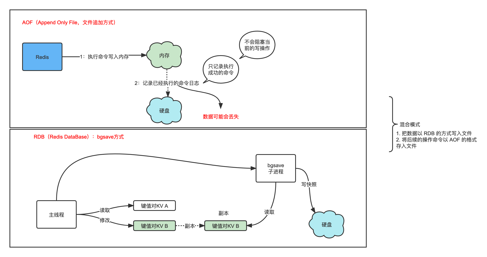

# Redis 数据持久化

Redis数据是存储在内存中的，为了保证Redis数据不丢失，那就要把数据从内存存储到磁盘上，以便在服务器重启后还能够从磁盘中恢复原有数据，这就是Redis的数据持久化。

三种方式：

- AOF 日志（Append Only File，文件追加方式）：记录所有的操作命令，并以文本的形式追加到文件中。
- RDB 快照（Redis DataBase）：将某一个时刻的内存数据，以二进制的方式写入磁盘。
- 混合持久化方式：Redis 4.0 新增了混合持久化的方式，集成了 RDB 和 AOF 的优点。



## AOF（Append Only File，文件追加方式）

AOF采用的是写后日志的方式，Redis先执行命令把数据写入内存，然后再记录日志到文件中。AOF日志记录的是操作命令，不是实际的数据，如果采用AOF方法做故障恢复时需要将全量日志都执行一遍。

Redis在写入日志之前，不对命令进行语法检查，所以只记录执行成功的命令，避免出现记录错误命令的情况，而且在命令执行后再写日志不会阻塞当前的写操作。

问题：

- 数据可能会丢失：如果 Redis 刚执行完命令，此时发生故障宕机，会导致这条命令存在丢失的风险。
- 可能阻塞其他操作：AOF 日志其实也是在主线程中执行，所以当 Redis 把日志文件写入磁盘的时候，还是会阻塞后续的操作无法执行。

配置（Redis 6.0 之后已经默认是开启了）：

```shell
appendonly yes
```

持久化方式：

1. `appendfsync always`：主线程调用 `write` 执行写操作后，后台线程（ `aof_fsync` 线程）立即会调用 `fsync` 函数同步 AOF 文件（刷盘），`fsync` 完成后线程返回，这样会严重降低 Redis 的性能（`write` + `fsync`）。
2. `appendfsync everysec`：主线程调用 `write` 执行写操作后立即返回，由后台线程（ `aof_fsync` 线程）每秒钟调用 `fsync` 函数（系统调用）同步一次 AOF 文件（`write`+`fsync`，`fsync`间隔为 1 秒）
3. `appendfsync no`：主线程调用 `write` 执行写操作后立即返回，让操作系统决定何时进行同步，Linux 下一般为 30 秒一次（`write`但不`fsync`，`fsync` 的时机由操作系统决定）。
4. Redis 7.0.0 开始，Redis 使用了 **Multi Part AOF** 机制。将原来的单个 AOF 文件拆分成多个 AOF 文件。

## RDB（Redis DataBase）

RDB采用的是内存快照的方式，它记录的是某一时刻的数据，而不是操作，所以采用RDB方法做故障恢复时只需要直接把RDB文件读入内存即可，实现快速恢复。Redis 对 RDB 的执行频率非常重要，因为这会影响快照数据的完整性以及 Redis 的稳定性

- `save` 命令在主线程中执行，会导致阻塞，**所以快照的时候不能修改数据**
- `bgsave` 命令则会创建一个子进程，用于写入 RDB 文件的操作，避免了对主线程的阻塞，这也是 Redis RDB 的默认配置。

redis.conf 配置文件：

```shell
save 900 1           #在900秒(15分钟)之后，如果至少有1个key发生变化，Redis就会自动触发bgsave命令创建快照。

save 300 10          #在300秒(5分钟)之后，如果至少有10个key发生变化，Redis就会自动触发bgsave命令创建快照。

save 60 10000        #在60秒(1分钟)之后，如果至少有10000个key发生变化，Redis就会自动触发bgsave命令创建快照。
```


## **混合**

1. 把数据以 RDB 的方式写入文件
2. 将后续的操作命令以 AOF 的格式存入文件
3. 用AOF做数据的保存,用RDB用来冷备数据