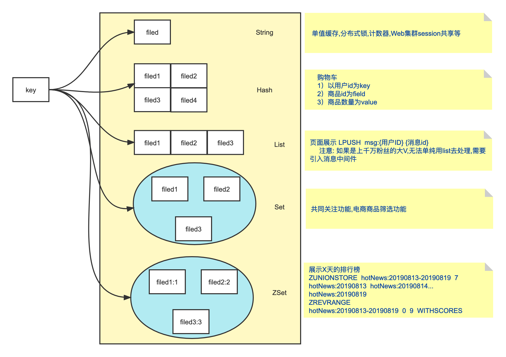

# Redis简介

Redis 全称 Remote Dictionary Server，可以理解为**远程数据服务**或**远程字典服务**，它是一个基于内存实现的键值型（key-value）非关系（NoSQL）数据库，使用 C 语言编写。

Redis 是完全开源的，遵守 BSD 协议。

应用场景：

缓存，数据库，消息队列，分布式锁，点赞列表，排行榜等等

## 安装

```shell
-- 搜索
brew search redis
-- 安装/更新
brew install redis
-- 启动
redis-server
-- 另起窗口
redis-cli
-- 更新
brew upgrade redis

brew link --overwrite redis
redis-server -v     // 查看是否更新到最新版本
-- 安装目录/usr/local/Cellar/redis/6.2.6 /usr/local/opt/redis@6.2/bin
-- 配置文件目录 /usr/local/etc
```


## 数据类型

**五种基本数据类型:**

- **1.string**:字符串类型，常被用来存储计数器，粉丝数等，简单的分布式锁也会用到该类型
- **2.hashmap**:key - value 形式的，value 是一个map
- **3.list**:基本的数据类型，列表。在 Redis 中可以把 list 用作栈、队列、阻塞队列。
- **4.set**:集合，不能有重复元素，可以做点赞，收藏等
- **5.zset**:有序集合，不能有重复元素，有序集合中的每个元素都需要指定一个分数，根据分数对元素进行升序排序。可以做排行榜

**三种特殊数据类型:**

- **1.geospatial**: Redis 在 3.2 推出 Geo 类型，该功能**可以推算出地理位置信息，两地之间的距离**。
- **2.hyperloglog**:基数：数学上集合的元素个数，是不能重复的。这个数据结构**常用于统计网站的 UV**。
- **3.bitmap**: bitmap 就是通过最小的单位 bit 来进行0或者1的设置，表示某个元素对应的值或者状态。一个 bit 的值，或者是0，或者是1；也就是说一个 bit 能存储的最多信息是2。bitmap **常用于统计用户信息比如活跃粉丝和不活跃粉丝、登录和未登录、是否打卡等**。

