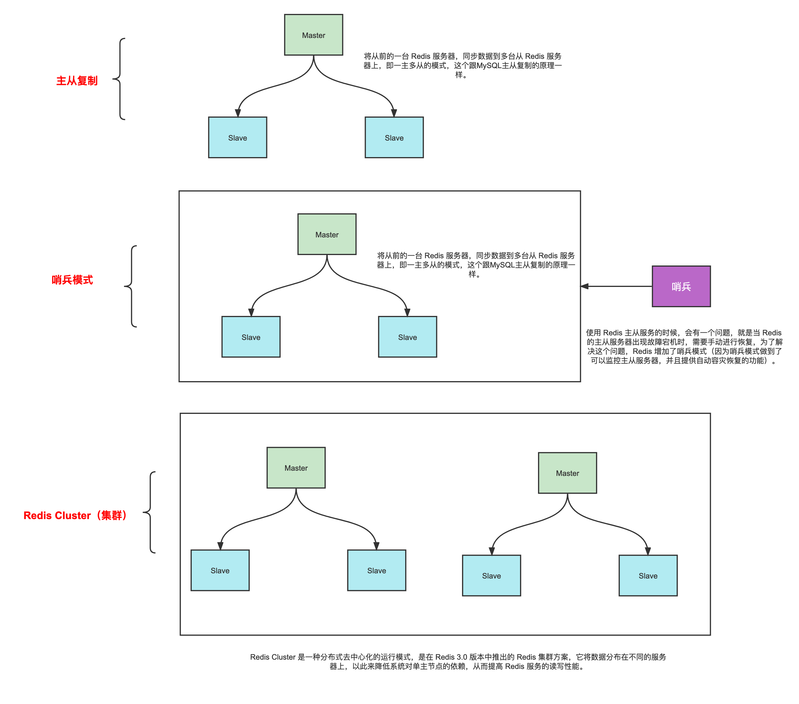
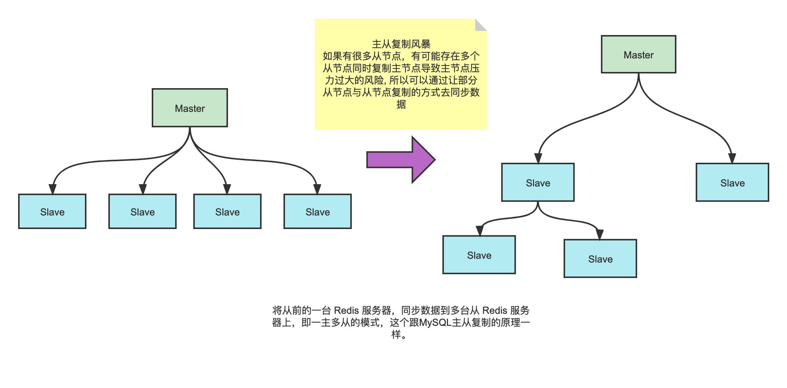
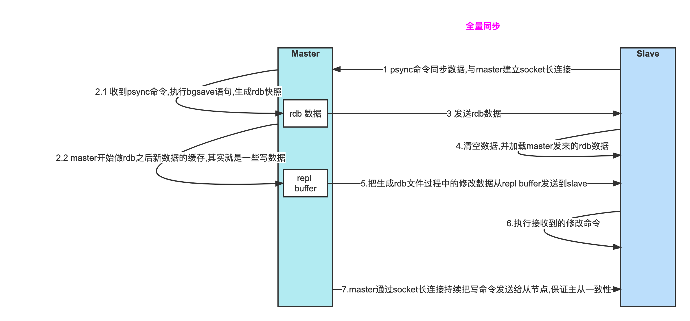
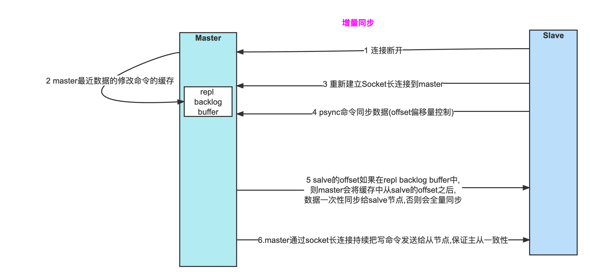
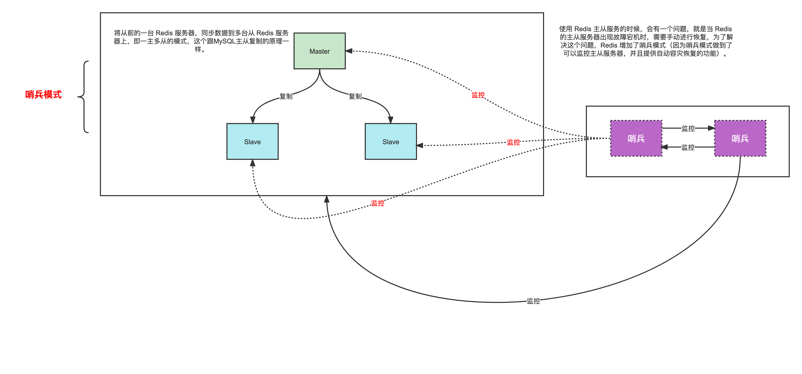
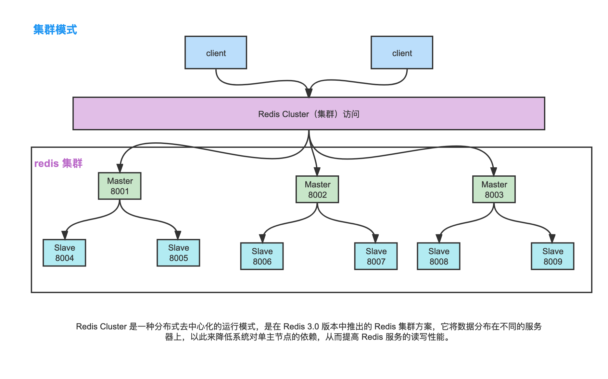
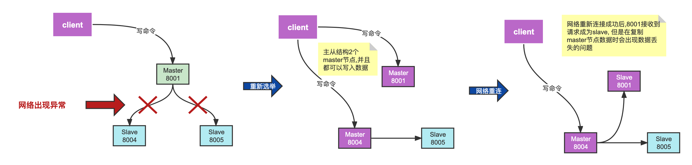

# Redis集群方式

单节点数据持久化：通过RDB和AOF持久化机制能将数据持久化到硬盘上。

集群方式:

主从复制、哨兵模式，以及 Redis 集群。

## 三种模式比较



## 主从复制

将一台Redis（master）服务的数据，复制到其他Redis（slave）服务器上，分担读压力，类似于Mysql的主从复制，分为全量同步和增量同步。

redis 策略是，首先会尝试进行增量同步，如不成功，要求从机进行全量同步。



主从模式不具备自动容错和恢复功能，主节点故障，集群则无法进行工作，可用性比较低，从节点升主节点需要人工手动干预。

### 主要作用

1. 数据备份(故障恢复)：当主节点出现问题时，可以由从节点提供服务，实现快速的故障恢复。
2. 读写分离(负载均衡)：提高服务器的负载能力，由主节点提供写服务，由从节点提供读服务，可随时改变从库的数量，和 myql 基本保持一样。
3. 高可用：主从复制是Redis高可用的基础，哨兵和集群都是基于此模式进行。

### 全量同步

一般发生在Slave初始化阶段，这时Slave需要将Master上的所有数据都复制一份。



全量同步基本流程：

1. slave 通过 psync命令同步数据,与master建立socket长连接

2. master 收到psync命令,执行bgsave语句,生成rdb快照；开始做rdb之后新数据的缓存,其实就是一些写数据

3. master  发送rdb数据

4. slave  清空数据,并加载master发来的rdb数据

5. master  把生成rdb文件过程中的修改数据从repl buffer发送到slave

6. slave  执行接收到的修改命令
7. master通过socket长连接持续把写命令发送给从节点,保证主从一致性

### 增量同步

指Slave初始化后，Master发生的**写操作**同步到从服务器的过程。

如果出现网络闪断或者命令丢失等异常情况时，当主从连接恢复后，由于从节点之前保存了自身已复制的偏移量和主节点的运行ID。因此会把它们当作psync参数发送给主节点，要求进行部分复制操作，格式为psync {runId} {offset}。



增量同步基本流程：

1. slave 连接断开
2. master最近数据的修改命令的缓存
3. slave  重新建立Socket长连接到master
4. slave  psync命令同步数据(offset偏移量控制)
5. master 判断 salve的offset如果在repl backlog buffer中,则master会将缓存中从salve的offset之后,数据一次性同步给salve节点,否则会全量同步
6. master通过socket长连接持续把写命令发送给从节点,保证主从一致性

### 如何配置

redis.conf

```shell
# Redis默认不是以守护进程的方式运行，可以通过该配置项修改，使用yes启用守护进程
daemonize yes
# slave 服务器 新版本为 replicaof
slaveof 192.168.1.100 6379  
# slave 只读，master 写，实现读写分离
slave-read-only  yes  
# slave 复制超时时间
repl-timeout 60 
# slave 离线之后，master 会把离线之后的写入命令存储在一个特定大小的队列中，避免短时间断开服务却进行全量同步的问题
repl-backlog-size 1M 
# 无盘复制，主从全量同步时，主库并不会在本地创建RDB 文件，而是创建一个子进程通过Socket将RDB文件写入到从服务器，节约IO资源
repl-diskless-sync yes 
# 客户端输出缓冲区配置。每个客户端连接（包括从库）后都会申请一个buffer空间，通过该选项限制可以避免buffer持续增长消耗内存。如果超过限制主库会强制断开连接，也就是说从库处理慢导致主库buffer积压达到限制后主库会强制断开从库的连接，此时主从复制会中断，中断后如果从库再次发起复制请求还会继续被断开导致恶性循环，引发复制风暴。调为0则不限制
client-output-buffer-limit slave 256mb 64mb 60  
# 当master服务设置了密码保护时，slav服务连接master的密码
masterauth <master-password>
# Redis连接密码，如果配置了连接密码，客户端在连接Redis时需要通过AUTH <password>命令提供密码，默认关闭
requirepass 123456
```

## 哨兵模式

使用 Redis 主从服务的时候，会有一个问题，就是当 Redis 的主从服务器出现故障宕机时，需要手动进行恢复，为了解决这个问题，Redis 增加了哨兵模式（因为哨兵模式做到了可以监控主从服务器，并且提供自动容灾恢复的功能）。

哨兵模式因为sentinel的存在, 可以定时向redis主从架构发送心跳包, 并且在出现主节点宕机的时候, 选举出一个从节点作为对外服务的窗口,从而解决Redis宕机的问题。    

但是因为只有一个写节点,所以支持的并发量并不高(5-10W的QPS),并且单机的内存并不大(单机Redis <10G)。 并且存在主从切换的瞬间访问瞬断的风险。

哨兵模式核心还是主从复制，只不过在相对于主从模式在主节点宕机导致不可写的情况下，多了一个竞选机制：从所有的从节点竞选出新的主节点。竞选机制的实现，是依赖于在系统中启动一个sentinel进程。



哨兵模式并不是真正的集群方案：

- 每台 Redis 服务器都存储相同的数据。
- 当数据量较大时，主从同步时会影响master性能。
- master宕机时，salve选举期间，直到新的master恢复，期间服务是不可用。
- 只有一个Redis主机来接收和处理写请求，写操作还是受单机瓶颈影响，并不是真正的分布式架构。

## Cluster 集群模式

redis cluster主要是针对海量数据+高并发+高可用的场景，海量数据，数据量不是很大时，使用sentinel就够了。

Redis Cluster 是一种分布式去中心化的运行模式，是在 Redis 3.0 版本中推出的 Redis 集群方案，它将数据分布在不同的服务器上，以此来降低系统对单主节点的依赖，从而提高 Redis 服务的读写性能。

主从节点群组成的分布式服务器群，它具有复制、高可用和分片特性。Redis集群不需 要sentinel哨兵也能完成节点移除和故障转移的功能。可以部分解决哨兵模式的瞬断问题。



Redis集群脑裂问题：

redis集群没有过半机制会有脑裂问题，网络分区导致脑裂后多个主节点对外提供写服务，一旦网络分区恢复，会将其中一个主节点变为从节点，这时会有大量数据丢失。



解决方案: （不能完全保障数据不丢失）
min-slaves-to-write ：1

含义： 如果配置了min-slaves-to-write，健康的slave的个数小于配置项N，mater就禁止写入。

master最少得有多少个健康的slave存活才能执行写命令。这个配置虽然不能保证N个slave都一定能接收到master的写操作，但是能避免没有足够健康的slave的时候，master不能写入来避免数据丢失 。

设置为0关闭该功能。

Redis Cluster采用的是**类一致性哈希算法实现节点选择的**：

- Redis Cluster将自己分成了16384个**Slot**（槽位）

- 哈希槽类似于数据分区，每个键值对都会根据它的 key，被映射到一个哈希槽中。

  - 根据键值对的 key，按照 CRC16 算法计算一个 16 bit 的值。

  - 再用 16bit 值对 16384 取模，得到 `0~16383` 范围内的模数，每个模数代表一个相应编号的哈希槽。

    | 节点 |   处理槽位    |
    | :--: | :-----------: |
    |  A   |    0-5000     |
    |  B   | 5001 - 10000  |
    |  C   | 10001 - 16383 |

    这样就实现了cluster节点的选择。

## 要点

哨兵模式归根节点还是主从模式，在主从模式下我们可以通过增加salve节点来扩展读并发能力，但是没办法扩展写能力和存储能力，存储能力只能是master节点能够承载的上限。所以为了扩展写能力和存储能力，我们就需要引入集群模式。