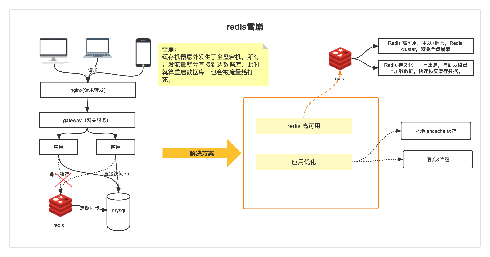
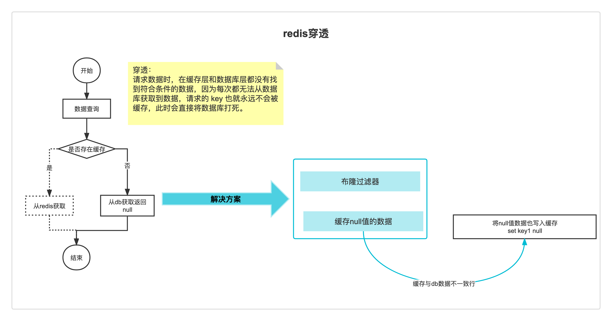
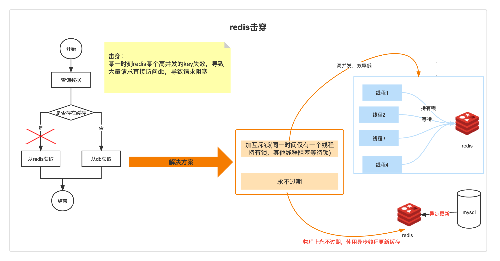

# 击穿、穿透、雪崩

使用缓存的过程中会存在各种各样的问题，以下简单介绍几种常见的问题。

## 缓存雪崩

缓存机器意外发生了全盘宕机，所有并发流量就会直接到达数据库，此时就算重启数据库，也会被流量给打死。

简单解决方案：

- 事前：Redis 高可用，主从+哨兵，Redis cluster，避免全盘崩溃。
- 事中：本地 ehcache 缓存 + 限流&降级，避免 MySQL 被打死。
- 事后：Redis 持久化，一旦重启，自动从磁盘上加载数据，快速恢复缓存数据。

限流&降级：

- 限流组件确保了每秒只有多少个请求能通过，保障数据库的安全。
- 用户的请求不会被完全处理。

## 缓存穿透

请求数据时，在缓存层和数据库层都没有找到符合条件的数据，因为每次都无法从数据库获取到数据，请求的 key 也就永远不会被缓存，此时会直接将数据库打死。

例如：支付系统中提供一个订单查询接口，由于缓存中没有数据，数据库也没有数据，此时有可能被利用，导致数据库被打死（实际情况可能不会发生，因为数据库也会分库，也会有类似 hmac 的校验）

简单解决方案：

- API入口，对参数进行校验，过滤非法值。

- 数据库中没有查询到数据，此时写一个空值（或者默认值）到缓存里去，并设置过期时间，缓存失效之前，都可以直接从缓存中取数据。
  - 需要额外的系统资源，如果真的存在恶意漏洞，也是一个问题。
  - 过期时间需要很好的设置，例如如果查询是走的查询库，数据同步虽然时间很短，也是有可能会查询不到数据，此时会有短期内的数据查询不到。

- 布隆过滤器
  - key 不存在于布隆过滤器中，此时数据就一定不存在，系统可以立即返回不存在。
  - key 存在于布隆过滤器中，则继续再向缓存中查询。
  - 存在误判可能

## 缓存击穿

缓存击穿，就是说某个 key 非常热点，访问非常频繁，处于集中式高并发访问的情况，当这个 key 在失效的瞬间，大量的请求就击穿了缓存，直接请求数据库，就像是在一道屏障上凿开了一个洞。

- 若缓存的数据是基本不会发生更新的，则可尝试将该热点数据设置为永不过期。
- 若缓存的数据更新不频繁，且缓存刷新的整个流程耗时较少的情况下，则可以采用基于 Redis、zookeeper 等分布式中间件的分布式互斥锁，或者本地互斥锁以保证仅少量的请求能请求数据库并重新构建缓存，其余线程则在锁释放后能访问到新缓存。
- 若缓存的数据更新频繁或者在缓存刷新的流程耗时较长的情况下，可以利用定时线程在缓存过期前主动地重新构建缓存或者延后缓存的过期时间，以保证所有的请求能一直访问到对应的缓存。
- 缓存预热，根据当前业务进行相关热点数据的提取加载到缓存，例如定时触发。

## 区别

缓存击穿看着有点像缓存雪崩，其实它两区别是：

- 缓存雪崩是指数据库压力过大甚至down机
- 缓存击穿只是大量并发请求到了DB数据库层面
- 缓存击穿可以认为是缓存雪崩的一个子集。也可以认为它俩区别，是区别在于击穿针对某一热点key缓存，雪崩则是很多key。