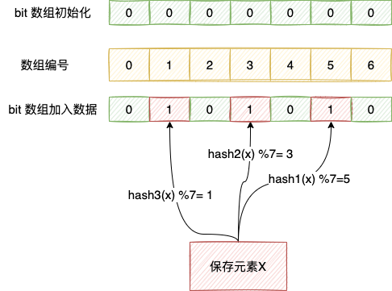

# 布隆过滤器

- 大数据量去重
  - 黑名单过滤
  - 文章推荐
- 解决[缓存穿透](./击穿穿透雪崩.md)问题

## 概念

布隆过滤器（Bloom Filter）是1970年由布隆提出的。它实际上是一个很长的二进制向量和一系列随机映射函数。布隆过滤器可以用于检索一个元素是否在一个集合中。它的优点是空间效率和查询时间都比一般的算法要好的多，缺点是有一定的误识别率和删除困难。

- 数据存在时，这个数据可能不存在
  - 哈希函数会出现碰撞，所以布隆过滤器会存在误判
- 数据不存在时，那么这个数据一定不存在
- 可以插入元素，但不可以删除已有元素
  - 删除意味着需要将对应的 k 个 bits 位置设置为 0，其中有可能是其他元素对应的位。
- 元素越多，false positive rate(误报率)越大，但是 false negative (漏报)是不可能的



## Redis 集成布隆过滤器

### Mac 安装

mac 下需要安装Xcode Command Line Tools：

```shell
xcode-select --install
xcode-select --version 
```

### RedisBloom

下载：[Releases · RedisBloom/RedisBloom (github.com)](https://github.com/RedisBloom/RedisBloom/releases)

编译：

```shell
➜  RedisBloom-2.2.14 make
ld /Users/lizhifu/Downloads/RedisBloom-2.2.14/src/rebloom.o /Users/lizhifu/Downloads/RedisBloom-2.2.14/contrib/MurmurHash2.o /Users/lizhifu/Downloads/RedisBloom-2.2.14/rmutil/util.o /Users/lizhifu/Downloads/RedisBloom-2.2.14/src/sb.o /Users/lizhifu/Downloads/RedisBloom-2.2.14/src/cf.o /Users/lizhifu/Downloads/RedisBloom-2.2.14/src/rm_topk.o /Users/lizhifu/Downloads/RedisBloom-2.2.14/src/topk.o /Users/lizhifu/Downloads/RedisBloom-2.2.14/src/rm_cms.o /Users/lizhifu/Downloads/RedisBloom-2.2.14/src/cms.o -o /Users/lizhifu/Downloads/RedisBloom-2.2.14/redisbloom.so -syslibroot /Library/Developer/CommandLineTools/SDKs/MacOSX.sdk -dylib -exported_symbol _RedisModule_OnLoad -lm -lc
➜  RedisBloom-2.2.14
```

修改 redis.conf 文件，新增 `loadmodule`配置

```properties
################################## MODULES #####################################

# Load modules at startup. If the server is not able to load modules
# it will abort. It is possible to use multiple loadmodule directives.
#
# loadmodule /path/to/my_module.so
# loadmodule /path/to/other_module.so
# 如果是集群，则每个实例的配置文件都需要加入配置。
loadmodule /Users/lizhifu/Downloads/RedisBloom-2.2.14/redisbloom.so
```

启动：

```shell
redis-server /usr/local/etc/redis.conf
```

启动成功：Module 'bf' loaded from /Users/lizhifu/Downloads/RedisBloom-2.2.14/redisbloom.so

```shell
28582:M 13 Apr 2022 13:20:05.083 # Server initialized
28582:M 13 Apr 2022 13:20:05.083 * Module 'bf' loaded from /Users/lizhifu/Downloads/RedisBloom-2.2.14/redisbloom.so
28582:M 13 Apr 2022 13:20:05.083 * Loading RDB produced by version 6.2.6
28582:M 13 Apr 2022 13:20:05.083 * RDB age 3 seconds
28582:M 13 Apr 2022 13:20:05.083 * RDB memory usage when created 1.04 Mb
28582:M 13 Apr 2022 13:20:05.083 # Done loading RDB, keys loaded: 0, keys expired: 0.
28582:M 13 Apr 2022 13:20:05.083 * DB loaded from disk: 0.000 seconds
28582:M 13 Apr 2022 13:20:05.083 * Ready to accept connections
```

## 客户端使用

```shell
BF.ADD --添加一个元素到布隆过滤器
BF.EXISTS --判断元素是否在布隆过滤器
BF.MADD --添加多个元素到布隆过滤器
BF.MEXISTS --判断多个元素是否在布隆过滤器
```

```shell
127.0.0.1:6379> bf.add user keben
(integer) 1
127.0.0.1:6379>  bf.add user zhangsan
(integer) 1
127.0.0.1:6379> bf.add user zhaosi
(integer) 1
127.0.0.1:6379> bf.exists user keben
(integer) 1
127.0.0.1:6379> bf.madd user xiaoming zhangwu wanger
1) (integer) 1
2) (integer) 1
3) (integer) 1
127.0.0.1:6379> bf.mexists user xiaoming zhangwu wanger
1) (integer) 1
2) (integer) 1
3) (integer) 1
127.0.0.1:6379>
```

## Redis客户端

```java
public class BloomFilterService {
    @Autowired
    private RedissonClient redissonClient;

    /**
     * 创建布隆过滤器
     * @param filterName 布隆过滤器名称
     * @param expectedInsertions 布隆过滤器期望插入数量
     * @param falseProbability 布隆过滤器期望误判率
     * @param <T>
     * @return 布隆过滤器
     */
    public <T> RBloomFilter<T> create(String filterName, long expectedInsertions, double falseProbability) {
        // 集群环境下，可以使用下面的方式创建布隆过滤器
        // RClusteredBloomFilter<SomeObject> bloomFilter = redisson.getClusteredBloomFilter("filterName");
        RBloomFilter<T> bloomFilter = redissonClient.getBloomFilter(filterName);
        // 初始化布隆过滤器
        bloomFilter.tryInit(expectedInsertions, falseProbability);
        return bloomFilter;
    }
}
```

