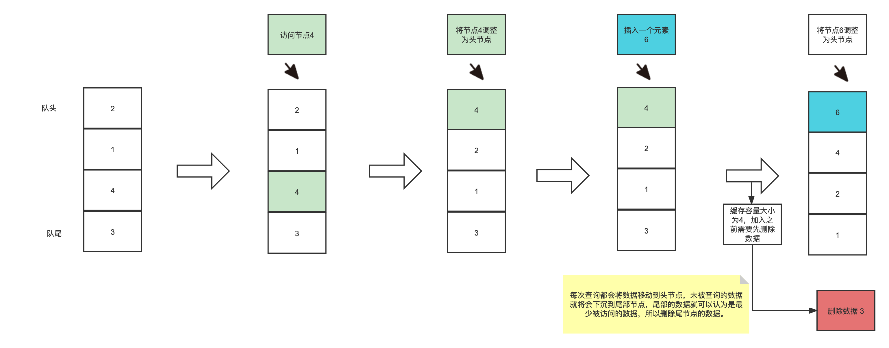
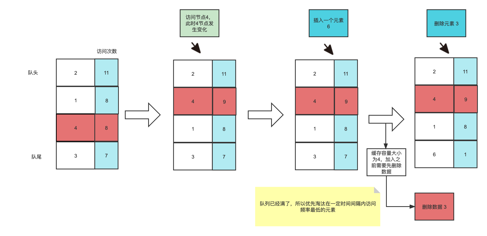

# 常见缓存淘汰算法

- FIFO：First in First out，先进先出
- LRU：Least Recently Used，最近最久未使用算法
- LFU：Least Frequently Used ，最近最少使用算法
- W-TinyLFU：Window Tiny Least Frequently Used ，是对LFU的的优化和加强。

## FIFO算法

最简单、最公平的一种思想，如果一个数据最先进入缓存中，则应该最早淘汰掉。也就是说，当缓存满的时候，应当把最先进入缓存的数据给淘汰掉。

- get(key)：如果cache中存在该key，则返回对应的value值，否则，返回-1；

- set(key,value)：
  - 如果cache中存在该key，则重置value值
  - 如果不存在该key，则将该key插入到到cache中
  - 若cache已满，则淘汰最早进入cache的数据

不足：

热点元素如果某段时间没有访问就会被放置到队列尾部，即使重新访问也依然在队列尾部，会被误删。

## LRU算法

如果一个数据在最近一段时间没有被访问到，那么可以认为在将来它被访问的可能性也很小。因此，当空间满时，最久没有访问的数据最先被置换（淘汰）。

分布式缓存系统（如Redis, Memcached）中使用较多。

- set(key,value)：
  - 如果key不在cache中，则将该(key,value)插入cache中
  - 如果cache已满，则必须把最近最久未使用的元素从cache中删除
  - 如果key在cache中，则重置value的值

- get(key)：如果key在cache中，则返回对应的value值，否则返回-1

不足点：

大量元素查询，此时数据就会被加载到缓存队列中，真正的热点元素存在被删除的风险。

## LFU算法

如果一个数据在最近一段时间内使用次数很少，那么在将来一段时间内被使用的可能性也很小。

- set(key,value)：
  - 如果cache中存在该key，则重置value值；
  - 如果不存在该key，则将该key插入到到cache中
  - 若cache已满，则淘汰最少访问的数据
- get(key)：如果Cache中存在该key，则返回对应的value值，否则，返回-1；

不足点：

如果突然一批数据被访问了上千万次，但是第二天这批数据就不再访问了，但是又由于之前秒杀活动导致这批数据的访问基数太过高，导致一直无法清空，所以会一直占用着本地缓存的空间。

## W-TinyLFU算法

当一个数据进来的时候，会进行筛选比较，进入W-LRU窗口队列，以此应对流量突增，经过淘汰后进入过滤器，通过访问频率判决是否进入缓存。如果一个数据最近被访问的次数很低，那么被认为在未来被访问的概率也是最低的，当规定空间用尽的时候，会优先淘汰最近访问次数很低的数据；

- Count-Min Sketch 算法存储访问频率，节省空间；定期衰减操作，应对访问模式变化。可以认为是布隆过滤器的一种变种。
- window-lru机制尽可能避免缓存污染的发生，在过滤器内部会进行筛选处理，避免低频数据置换高频数据。

感兴趣的可以结合 Caffeine 的源码进行学习。