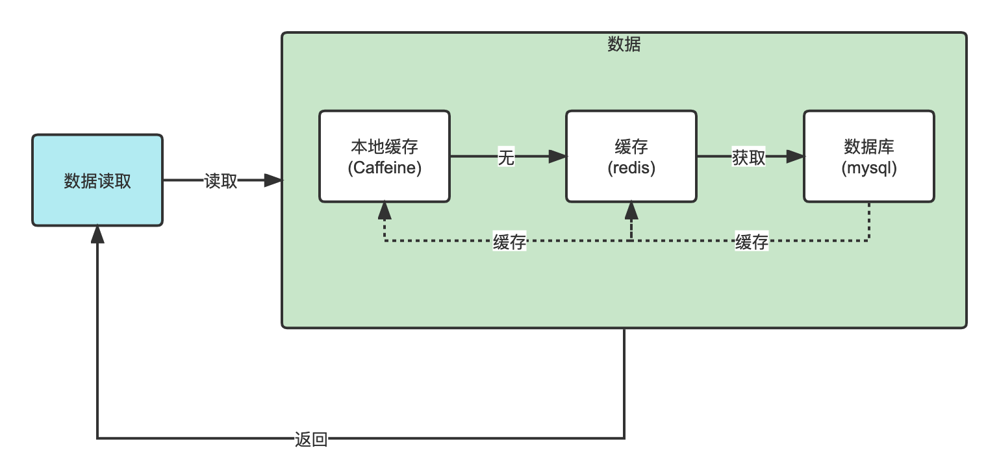
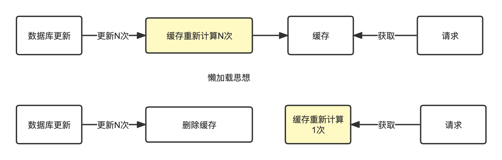
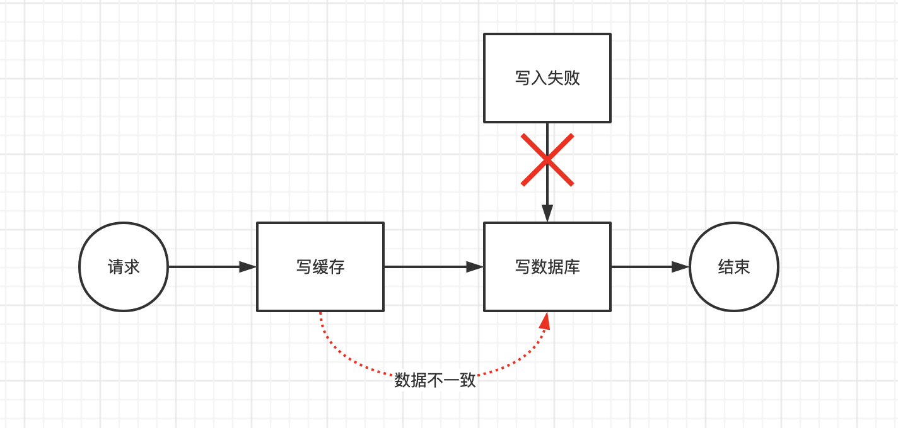
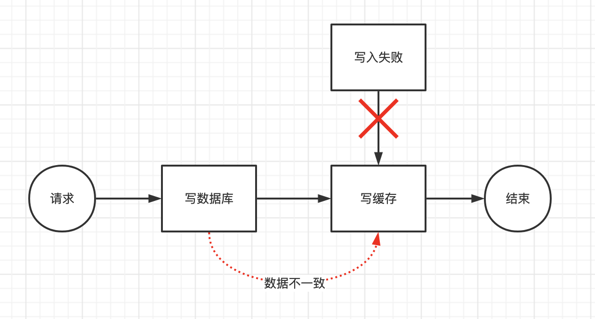
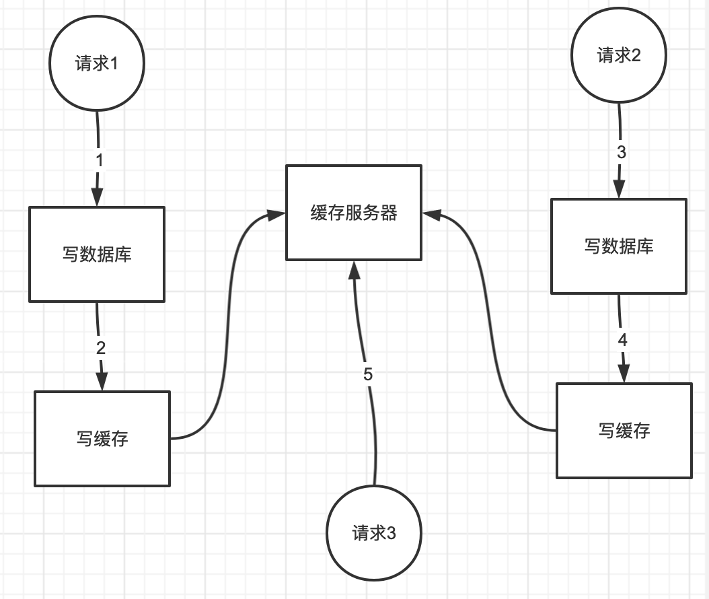
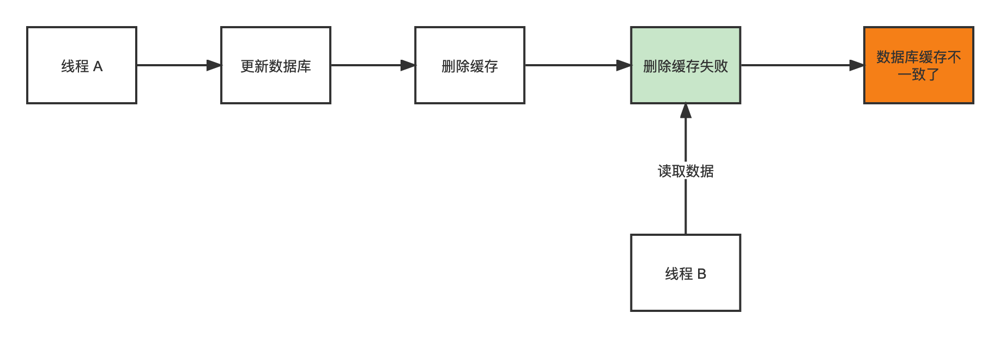
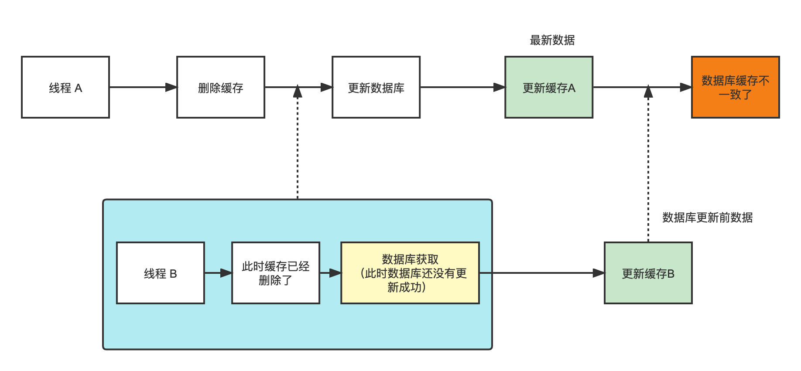
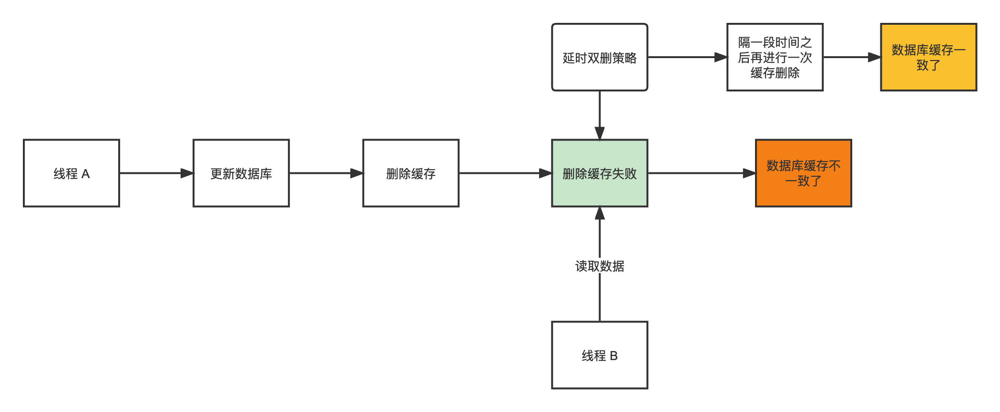

# 缓存和数据库的一致性问题

数据库和缓存（redis）双写数据一致性问题，在高并发的场景下，这个问题尤为严重。

首先：只要是双写，总会有数据一致性的问题，大多数情况下我们并不是严格要求**缓存+数据库** 必须保持一致性。

简单数据获取流程：

## 缓存删除而不是更新

其实删除缓存，而不是更新缓存，就是一个 lazy 计算的思想，不要每次都重新做复杂的计算，不管它会不会用到，而是让它到需要被使用的时候再重新计算。

## 常见的四种方案

1. 先更新缓存，再更新数据库
2. 先更新数据库，再更新缓存
3. 先删缓存，再更新数据库
4. 先更新数据库，再删缓存

### 先更新缓存，再更新数据库

此时缓存和数据库中的数据出现不一致，缓存中的数据也就没有了意义。

### 先更新数据库，再更新缓存

数据库是新数据，而缓存是旧数据或者没有数据，出现数据不一致的情况。

步骤说明（图中顺序为请求顺序）：

1. 请求1：进行到步骤2时出现问题，此时发生了延迟
2. 请求2：步骤3、4，顺利执行
3. 请求1：步骤2此时才开始执行。
4. 请求3：获取缓存内的数据，此时获取到的是请求1写入缓存的数据，此时读取的是旧数据。

### 先更新数据库，再删除缓存

先更新数据库，再删除缓存。如果删除缓存失败了，那么会导致数据库中是新数据，缓存中是旧数据，数据就出现了不一致。

### 先删除缓存，再更新数据库

- 数据库更新失败了，那么数据库中是旧数据，缓存中是空的，那么数据不会不一致
- 读的时候缓存没有，所以去读了数据库中的旧数据，然后更新到缓存中。

### 延时双删

依旧是**先更新数据库，再删除缓存**，一段时间间隔后再一次删除缓存。

- 使用 `DelayQueue`，会随着 JVM 进程的死亡，丢失更新的风险
- 使用 `MQ`
- 缓存设置有效期
- 订阅 Mysql 数据库的 binlog 日志对缓存进行操作