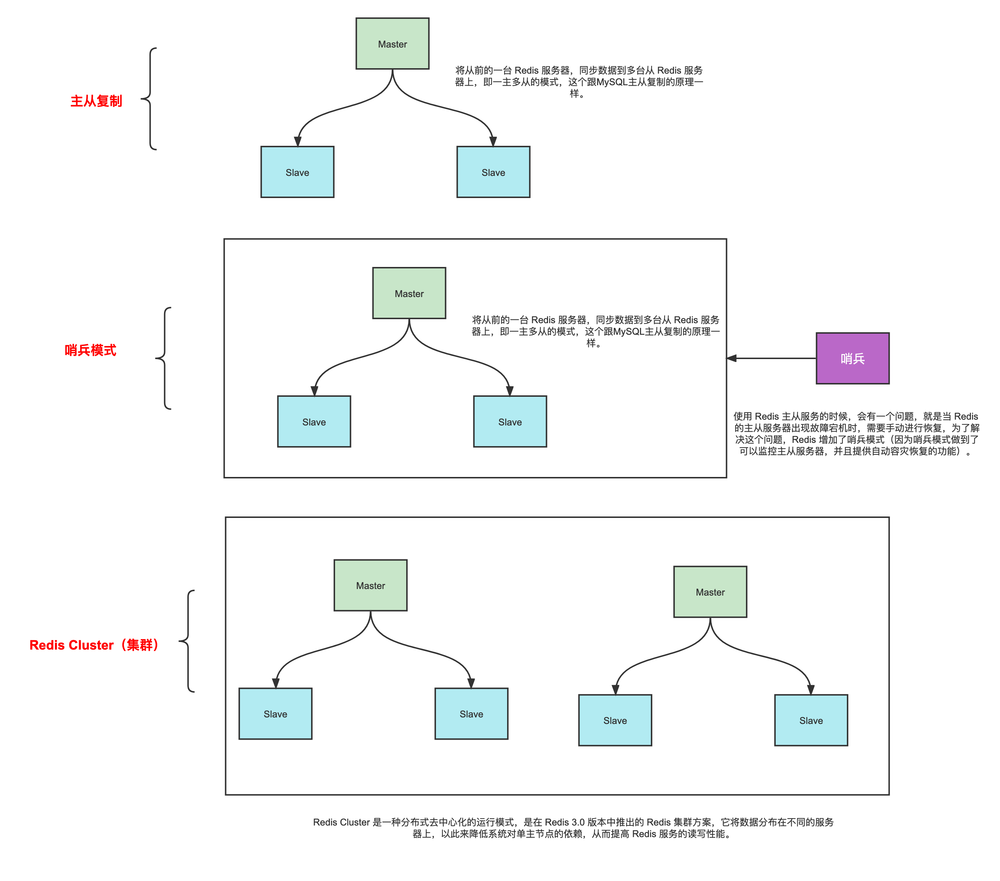
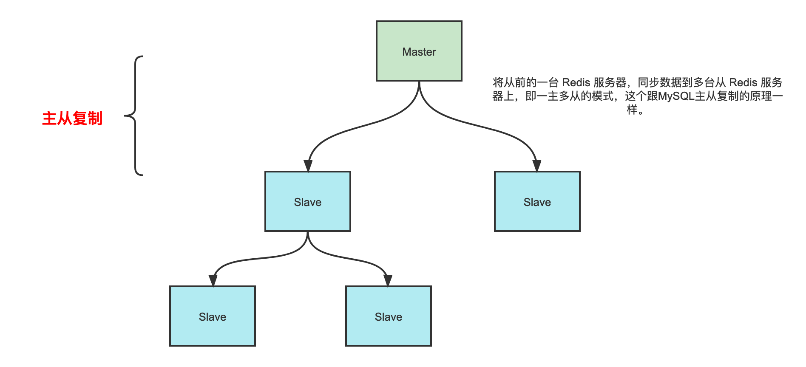
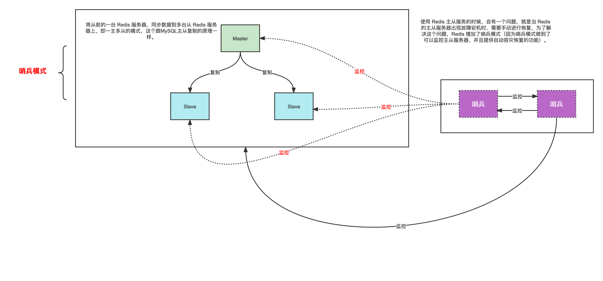

# Redis集群方式

单节点数据持久化：通过RDB和AOF持久化机制能将数据持久化到硬盘上。

集群方式:

主从复制、哨兵模式，以及 Redis 集群。

## 三种模式比较

## 主从复制

一个master可以有多个salve节点；salve节点可以有slave节点，从节点是级联结构。

主从模式不具备自动容错和恢复功能，主节点故障，集群则无法进行工作，可用性比较低，从节点升主节点需要人工手动干预。

## 哨兵模式

使用 Redis 主从服务的时候，会有一个问题，就是当 Redis 的主从服务器出现故障宕机时，需要手动进行恢复，为了解决这个问题，Redis 增加了哨兵模式（因为哨兵模式做到了可以监控主从服务器，并且提供自动容灾恢复的功能）。

哨兵模式核心还是主从复制，只不过在相对于主从模式在主节点宕机导致不可写的情况下，多了一个竞选机制：从所有的从节点竞选出新的主节点。竞选机制的实现，是依赖于在系统中启动一个sentinel进程。

## Cluster 集群模式

哨兵模式并不是真正的集群方案：

- 每台 Redis 服务器都存储相同的数据。
- 当数据量较大时，主从同步时会影响master性能。
- master宕机时，salve选举期间，直到新的master恢复，期间服务是不可用。
- 只有一个Redis主机来接收和处理写请求，写操作还是受单机瓶颈影响，并不是真正的分布式架构。

redis cluster主要是针对海量数据+高并发+高可用的场景，海量数据，数据量不是很大时，使用sentinel就够了。

Redis Cluster采用的是**类一致性哈希算法实现节点选择的**：

- Redis Cluster将自己分成了16384个**Slot**（槽位）

- 哈希槽类似于数据分区，每个键值对都会根据它的 key，被映射到一个哈希槽中。

  - 根据键值对的 key，按照 CRC16 算法计算一个 16 bit 的值。

  - 再用 16bit 值对 16384 取模，得到 `0~16383` 范围内的模数，每个模数代表一个相应编号的哈希槽。

    | 节点 |   处理槽位    |
    | :--: | :-----------: |
    |  A   |    0-5000     |
    |  B   | 5001 - 10000  |
    |  C   | 10001 - 16383 |

    这样就实现了cluster节点的选择。

## 要点

哨兵模式归根节点还是主从模式，在主从模式下我们可以通过增加salve节点来扩展读并发能力，但是没办法扩展写能力和存储能力，存储能力只能是master节点能够承载的上限。所以为了扩展写能力和存储能力，我们就需要引入集群模式。