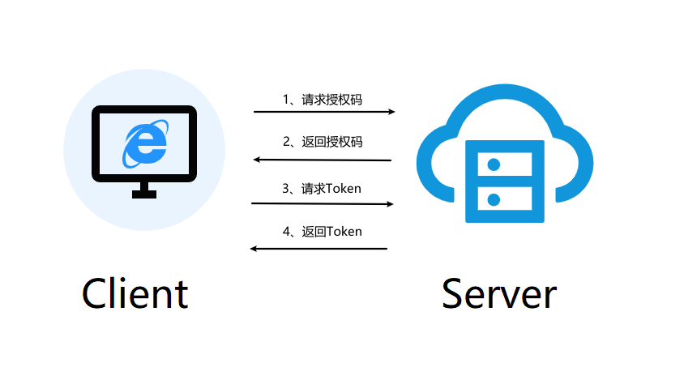

# OAuth 2.0 基本概念

OAuth（开放授权）是一个开放标准，允许用户让第三方应用访问该用户在某一网站上存储的私密的资源（如照片，视频，联系人列表），而无需将用户名和密码提供给第三方。

##  OAuth2 授权流程中的角色

- 资源拥有者（`resource owner`）
  - 最终用户：能授权访问受保护资源的一个实体，可以是一个人。
- 资源服务器（`resource server`）
  - 存储受保护资源，客户端通过`access token`请求资源，资源服务器响应受保护资源给客户端；
- 授权服务器（`authorization server`）
  - 成功验证资源拥有者并获取授权之后，授权服务器颁发授权令牌（`Access Token`）给客户端。
- 客户端（`client`）
  - 第三方应用，也可以是它自己的官方应用；其本身不存储资源，而是资源拥有者授权通过后，使用它的授权（授权令牌）访问受保护资源，然后客户端把相应的数据展示出来/提交到服务器。

## 四种模式

1. 授权码（Authorization Code）：OAuth2.0标准授权步骤，Server端向Client端下放Code码，Client端再用Code码换取授权Token
2. 隐藏式（Implicit）：无法使用授权码模式时的备用选择，Server端使用URL重定向方式直接将Token下放到Client端页面
3. 密码式（Password）：Client直接拿着用户的账号密码换取授权Token
4. 客户端凭证（Client Credentials）：Server端针对Client级别的Token，代表应用自身的资源授权

