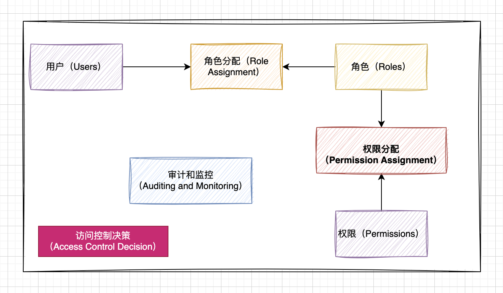
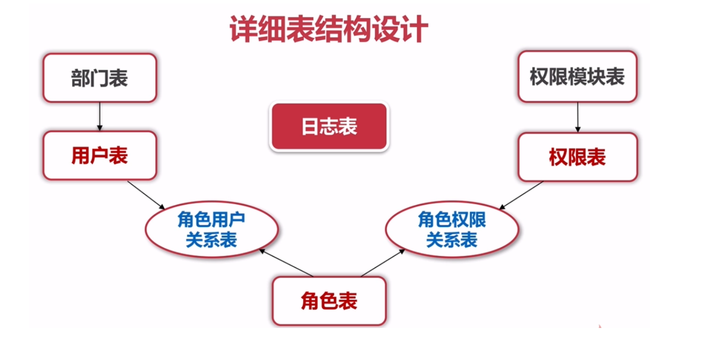
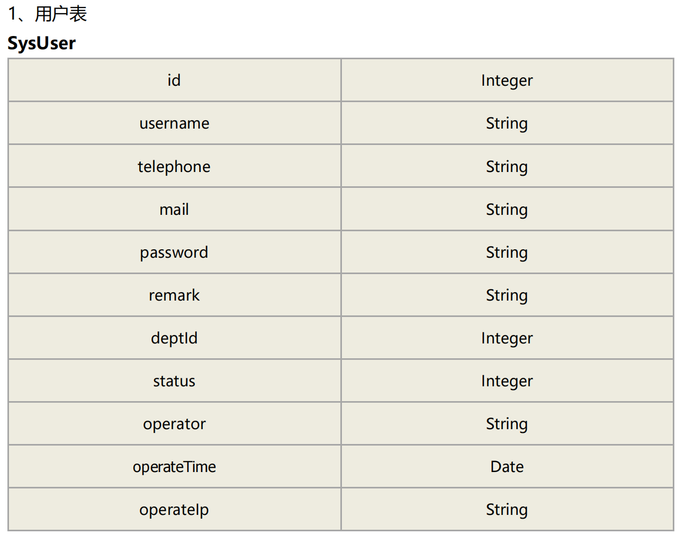
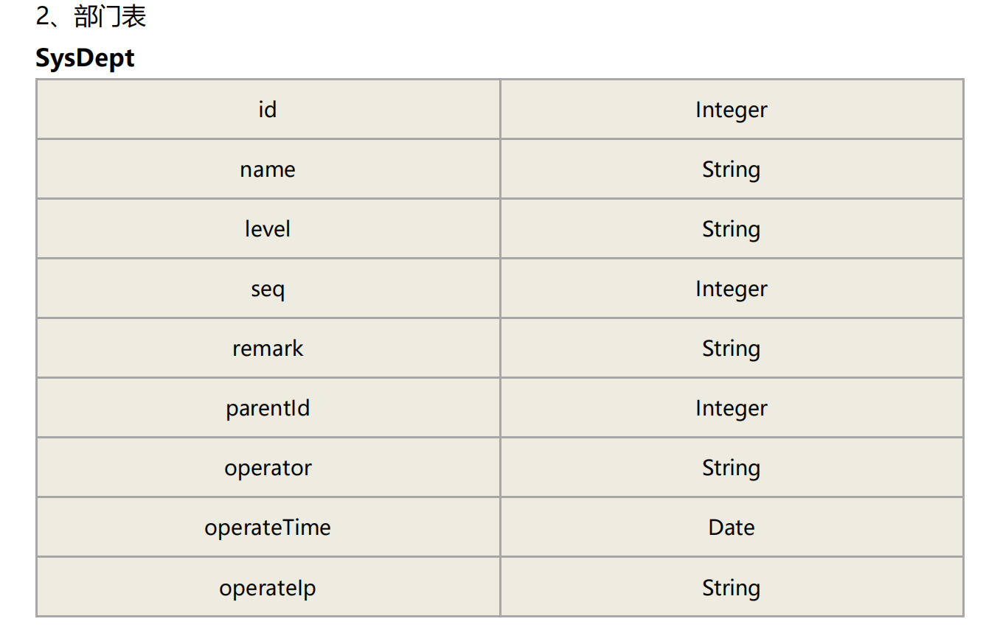
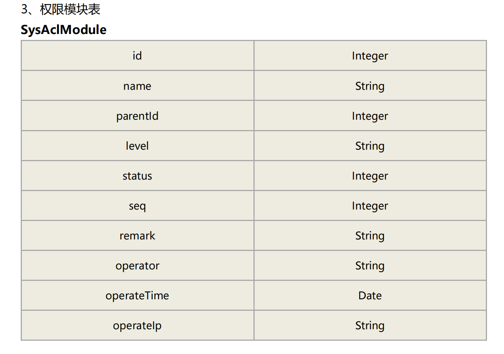
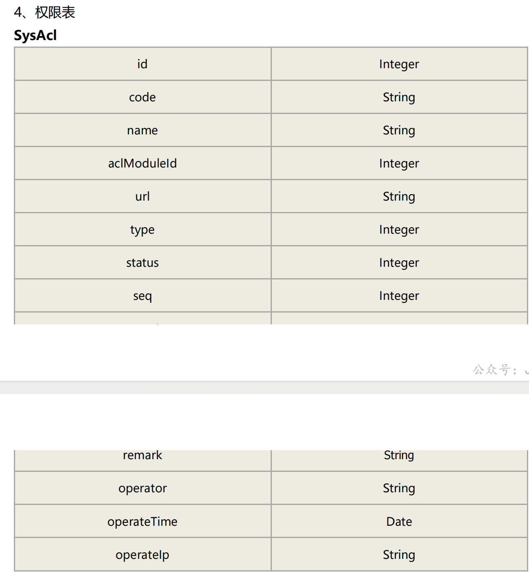
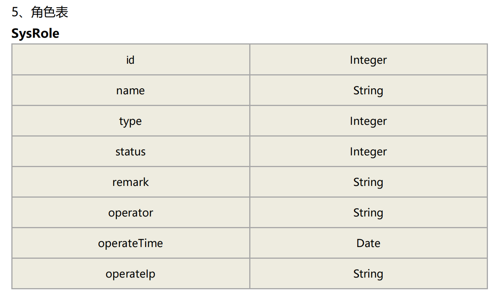
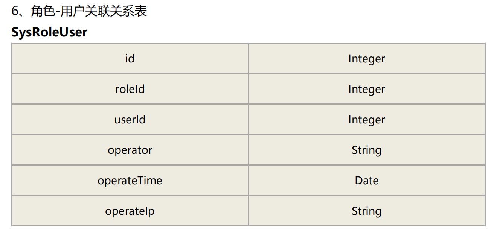
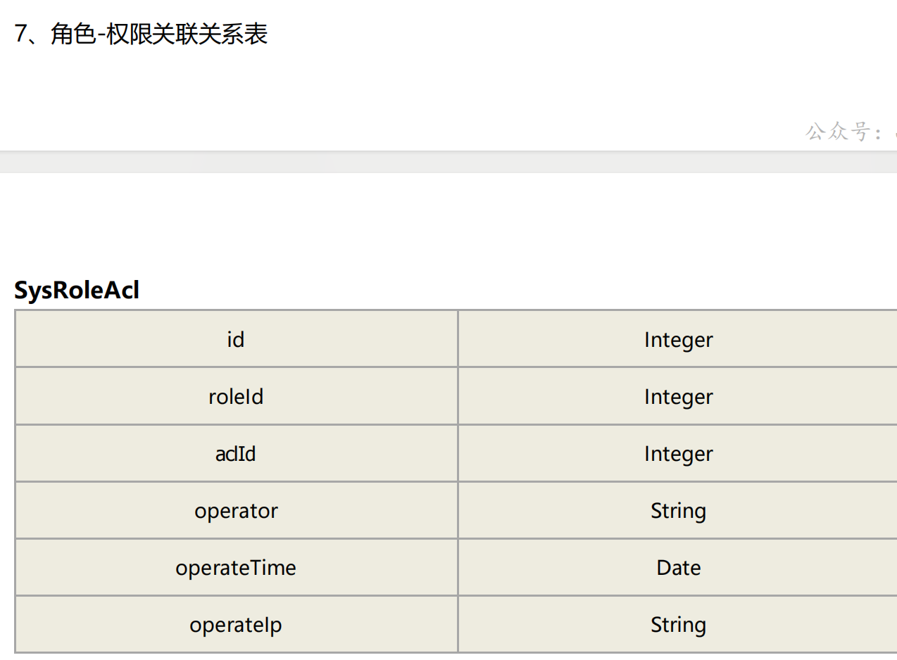
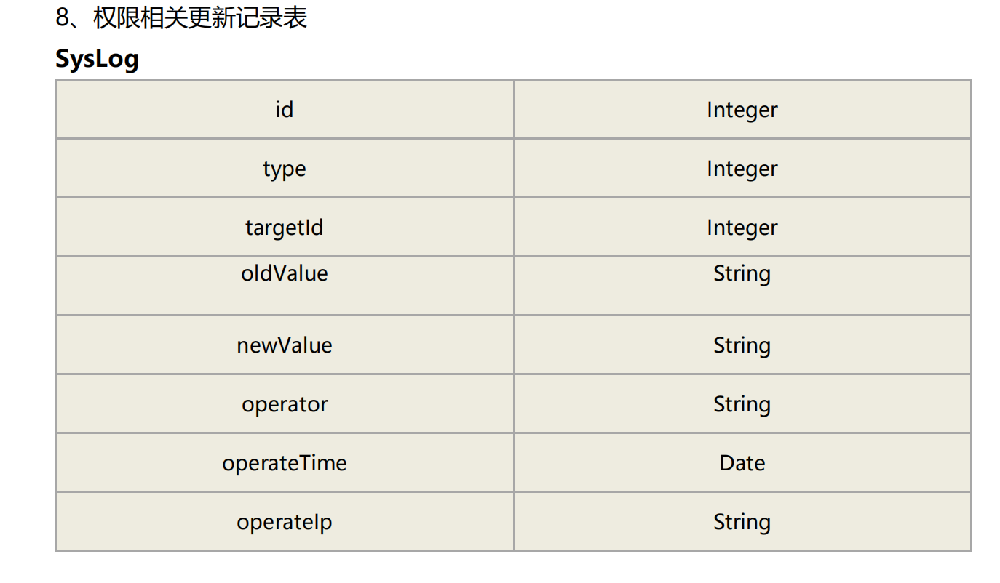

# 权限系统设计

RBAC（基于角色的访问控制）或 ABAC（基于属性的访问控制）模型。

## RBAC（基于角色的访问控制）

RBAC（Role-Based Access Control，基于角色的访问控制）是一种常见的访问控制模型，用于管理系统中的用户对资源的访问权限。RBAC模型的核心思想是将权限分配给角色，而不是直接分配给用户，从而简化了权限管理和维护。

RBAC模型的关键概念和要点：

1. **角色（Roles）**：
   - 角色是一组相关的权限集合。
   - 每个用户可以被分配一个或多个角色。
   - 角色通常根据用户的职责和职位来定义，例如管理员、编辑、审计员等。
2. **权限（Permissions）**：
   - 权限是可以执行的操作或访问的资源。
   - 权限可以与角色相关联，而不是直接与用户相关联。
   - 例如，一个编辑角色可能具有编辑文章、发布文章和删除文章等权限。
3. **用户（Users）**：
   - 用户是系统的最终使用者。
   - 每个用户可以被分配一个或多个角色，从而获得相关权限。
4. **权限分配（Permission Assignment）**：
   - 权限被分配给角色，而不是直接分配给用户。
   - 这样可以轻松管理和修改权限，因为只需更改角色的权限，而不需要逐个修改用户的权限。
5. **角色分配（Role Assignment）**：
   - 用户被分配一个或多个角色。
   - 用户继承与角色相关联的权限。
6. **访问控制决策（Access Control Decision）**：
   - 当用户尝试访问系统资源时，RBAC系统会基于其角色和相关权限来做出访问控制决策。
   - 如果用户拥有所需的权限，他们将被允许访问资源；否则，访问将被拒绝。
7. **审计和监控（Auditing and Monitoring）**：
   - RBAC系统通常包括审计功能，用于记录用户访问和操作的日志。
   - 这有助于追踪系统的安全性和合规性，并检测潜在的安全问题。
8. **优点**：
   - RBAC简化了权限管理，降低了管理成本。
   - 提高了系统的可维护性和可扩展性。
   - 增强了安全性，因为权限更容易管理和审计。
9. **缺点**：
   - 对于复杂的组织结构和权限需求，RBAC可能变得复杂。
   - 不适用于一些情况，如需要动态、细粒度的访问控制或基于属性的访问控制。

RBAC是一种强大的访问控制模型，适用于许多应用程序和组织，特别是那些需要管理多个用户和多个角色的系统。然而，对于某些特殊情况，可能需要考虑其他访问控制模型，如ABAC（基于属性的访问控制）或规则引擎。

### 一种表结构

## ABAC（基于属性的访问控制）模型

ABAC（Attribute-Based Access Control，基于属性的访问控制）是一种灵活且精细的访问控制模型，与RBAC（基于角色的访问控制）相比，它更注重用户的属性和资源的属性来决定访问权限。在ABAC中，访问决策基于多个属性，并且可以根据需要实现非常复杂的策略。

ABAC模型的关键概念和要点：

1. **属性（Attributes）**：
   - 属性是描述用户、资源和环境的特征或信息。
   - 用户属性可以包括身份信息（如用户名、角色、组织）、位置、安全级别等。
   - 资源属性可以包括文件类型、所有者、创建日期等。
   - 环境属性可以包括时间、位置、网络条件等。
2. **策略（Policies）**：
   - 策略定义了访问控制规则，指定了哪些属性组合允许或拒绝对资源的访问。
   - 策略可以根据需要非常灵活，例如，只有当用户的地理位置位于特定区域并且访问时间在工作日上午才允许访问某些资源。
   - 策略通常由安全管理员定义和管理。
3. **访问控制决策（Access Control Decision）**：
   - 当用户尝试访问资源时，ABAC系统会根据用户的属性、资源的属性和环境属性来决定访问是否允许。
   - 这些属性将与策略进行匹配，以确定是否授予或拒绝访问权限。
4. **动态性（Dynamic Nature）**：
   - ABAC允许访问控制策略随时间和情境的变化而动态调整。
   - 这意味着在某些条件下用户可以获得访问权限，而在其他条件下可以被拒绝。
5. **粒度控制（Fine-Grained Control）**：
   - ABAC允许实现非常细粒度的访问控制，以确保只有具有特定属性组合的用户可以访问资源。
   - 这对于需要高度个性化访问控制的系统非常有用。
6. **优点**：
   - 灵活性：ABAC允许实现高度个性化的访问控制策略。
   - 动态性：策略可以根据环境和需求动态调整。
   - 精细粒度控制：可以实现非常详细的权限管理。
7. **缺点**：
   - 复杂性：管理和维护ABAC策略可能需要更多的工作，因为它们可以非常复杂。
   - 性能：对于大规模系统，ABAC可能导致性能开销较大。

ABAC是一种非常适合需要高度个性化和灵活访问控制的系统的访问控制模型。它通常用于复杂的、安全性要求高的环境，如医疗保健、金融服务和政府部门。然而，设计和管理ABAC策略需要深入的安全知识和仔细的规划。
