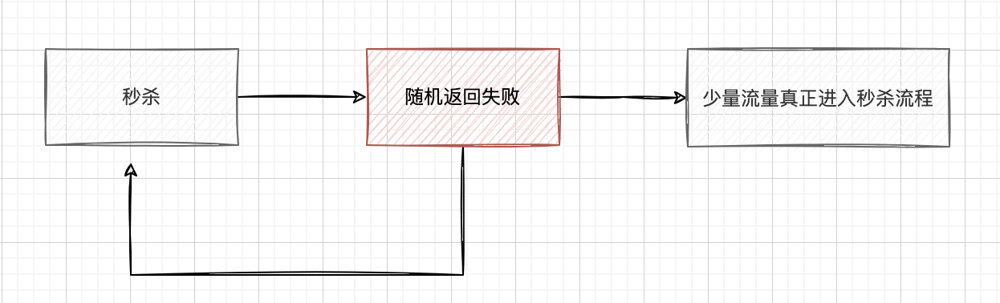
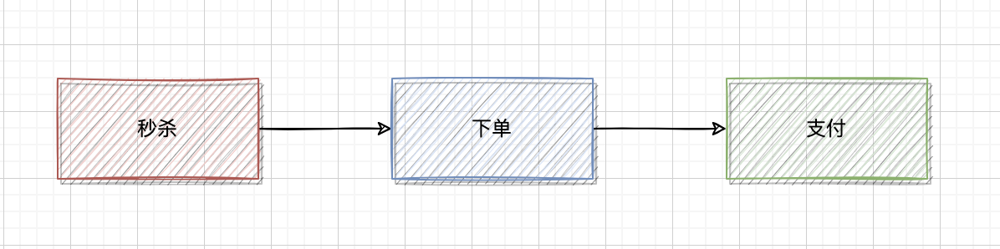
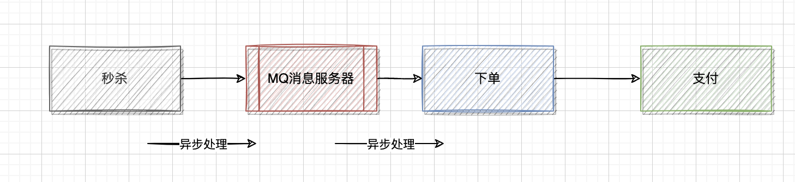
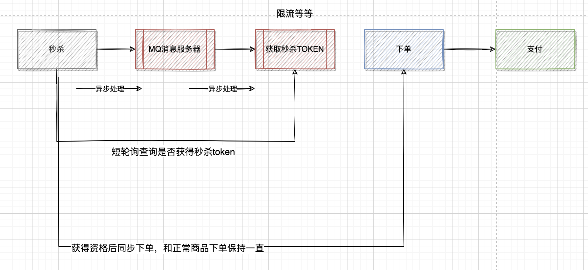

# 秒杀活动设计

秒杀的业务特点：

1. 折扣价格。商品或服务通常以折扣价格出售，这吸引了许多消费者。
2. 限定时间。通常在特定时间段内进行，消费者只能在这段时间内购买商品或服务。
3. 限定数量。商品或服务的数量通常是有限的，消费者需要在限定时间内抢购，以免错过机会。
4. 快速购买。通常具有快速购买功能，消费者可以快速浏览商品或服务，并在几秒钟内完成购买。
5. 高并发访问。通常会吸引大量消费者，因此秒杀系统需要能够应对高并发访问，保证数据安全和系统可靠性。

秒杀的系统特点：

1. 瞬时并发量非常高：瞬间并发峰值非常高。
2. 读多写少：库存的查询访问数量远远大于商品的购买数量。

## 业务思路

**首先有个核心的宗旨：秒杀的本质不是卖商品，而是一个人气，说白了就是没必要那么认真**

1. 预约秒杀，只有预约的人才能参与秒杀
2. 指定秒杀数量，其实就是假秒杀，例如 100% 的流量，随机返回一部分直接失败（记得后端返回），无所谓卖不卖的完，只要不超卖就可以了。



## 常见技术方案

为了应对这种高流量和高并发的情况，秒杀系统通常需要采用特殊的技术和方案来保证系统的稳定性和性能。

- 缓存技术，例如 Redis，来存储商品的库存信息，并通过读取缓存来提高系统的访问速度。
- 消息队列技术，例如 RabbitMQ，来处理大量用户的购买请求，并通过异步处理来减轻系统的压力。
- 分布式技术，例如分布式数据库和分布式服务架构，来提高系统的可扩展性和容错能力。
- 安全技术，例如双重验证和授权认证，来防止恶意用户的攻击和欺诈行为。

## 流程分析



其实在三个流程中，只有秒杀是并发量是最大的。场景的处理方式是把下单做成异步的。



这种流程看着是没有什么问题，但是实际的情况是下单是没有什么并发的，这样把整个流程给拉长了，可以进行进一步的优化如下：



## 缓存预热

秒杀的场景是 读>写，避免了因为缓存中没有数据而降低系统性能的问题。

1. 定时任务将 状态为已发布且未开始的秒杀活动、秒杀商品写入redis缓存；
2. 扫描已过期的秒杀活动，移除缓存。

## 限流操作

1. 同一ip限流
2. 同一用户限流
3. 接口请求次数限流
4. 验证码限流，建议使用滑块验证码，安全性较高。

## 扣减库存

1. 数据库：保障不超卖的最终手段

基于数据库的乐观锁，这样会少一次数据库查询，而且能够天然的保证数据操作的原子性。

```xml
<update id="updateSkillRemaining">
        update
            t_skill_goods
        set
            version = version + 1,
            skill_remaining = skill_remaining - 1
        where
            id = #{id}
            and skill_remaining > 0
            and version = #{version}
</update>
```

2. Redis lua 脚本扣减库存

```lua
local key = KEYS[1]
-- 先判断商品id是否存在，如果不存在则直接返回
if (redis.call('exists', key) == 1) then
    local stock = tonumber(redis.call('get', key));
    -- 获取该商品id的库存，判断库存如果是-1，则直接返回，表示不限制库存
    if (stock == -1) then
        -- 无库存限制
        return 1;
    end
    -- 如果库存大于0，则扣减库存。
    if (stock > 0) then
        redis.call('incrby', key, -1);
        -- 返回剩余库存数
        return stock - 1;
    end
    -- 如果库存等于0，是直接返回，表示库存不足。
    return 0;
end
-- 缓存不存在
return -1;
```
