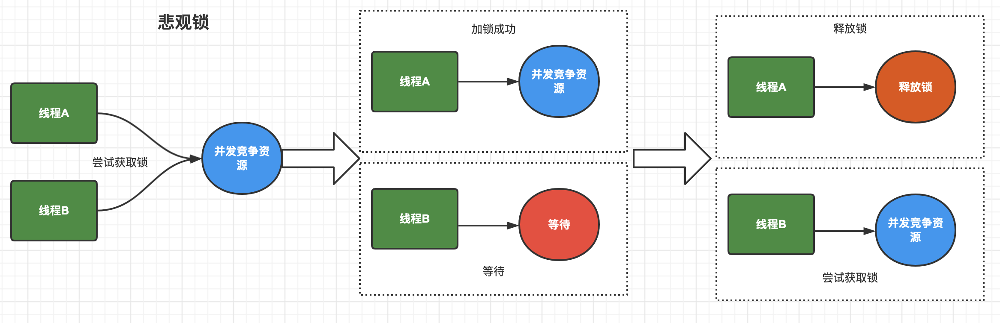
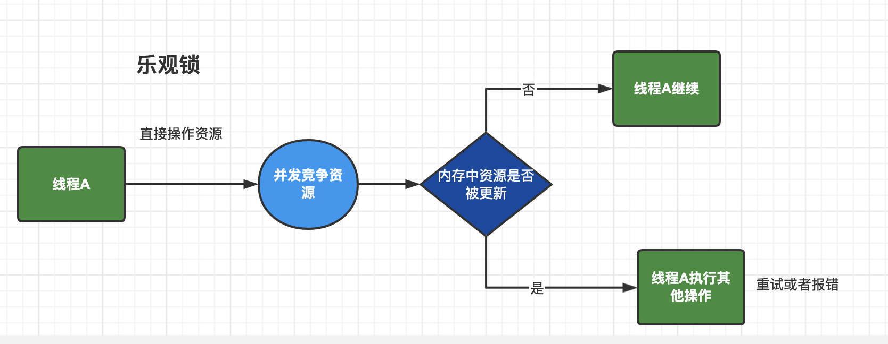

# 乐观锁和悲观锁

一句话：线程是否需要锁住资源。

## 悲观锁

- 在获取数据的时候会先加锁，确保数据不会被别的线程修改。
- Java中，synchronized关键字和Lock的实现类都是悲观锁。

## 乐观锁

- 使⽤数据时不会有别的线程修改数据，所以不会添加锁。
- 更新数据的时候去判断之前有没有别的线程更新了这个数据。
- 如果这个数据没有被更新，当前线程将⾃⼰修改的数据成功写⼊。
- 如果数据已经被其他线程更新，则根据不同的实现⽅式执⾏不同的操作（例如报错或者⾃动重试）。
- Java中是通过使⽤⽆锁编程来实现，最常采⽤的是CAS算法，Java原⼦类中的递增操作就通过CAS⾃旋实现的。 

## 结论

- 悲观锁适合 **写>读 **的场景，先加锁可以保证写操作时数据正确。
- 乐观锁适合 **读>写 **的场景，不加锁的特点能够使其读操作的性能⼤幅提升。 
