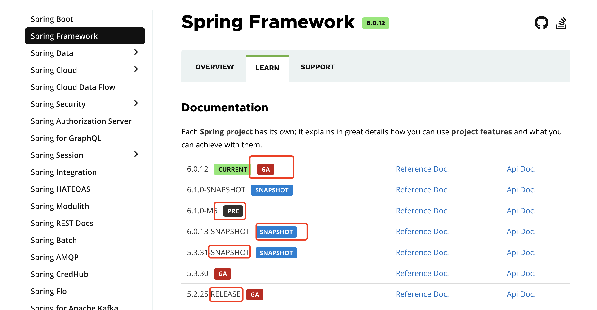

# 版本号命名规则

以 Spring Framework 举例：

**GA：（general availability）**

General Availability，正式发布的版本，国外通常用 GA 来标识 release 版本，GA 版本是开发团队认为该版本是稳定版（有的软件可能会标识为 Stable 版本或者 Production 版本，其意思和 GA 相同），可以在较为关键的场合使用，比如生产环境。

**Release**

该版本意味“最终版本”，在前面版本的一系列测试版之后，终归会有一个正式版本，是最终交付用户使用的一个版本。该版本有时也称为标准版。一般情况下，Release不会以单词形式出现在软件封面上，取而代之的是符号®

**Beta**

该版本相对于Alpha版已有了很大的改进，消除了严重的错误，但还是存在着一缺陷，需要经过多次测试来进一步消除。这个阶段的版本会一直加入新的功能。`

**RC：(Release Candidate)**

Candidate是候选人的意思，用在软件上就是候选版本。Release.Candidate.就是发行候选版本。和Beta版最大的差别在于Beta阶段会一直加入新的功能，但是到了RC版本，几乎就不会加入新的功能了，而主要着重于除错，主要着重于修复测试中发现的缺陷! RC版本是最终发放给用户的最接近正式版的版本，发行后改正bug就是正式版了，就是正式版之前的最后一个测试版。

**Alpha**

Alpha是内部测试版，表示最初的版本，一般不向外部发布。Alpha版会有很多Bug，除非你想去测试最新的功能，否则一般不建议使用

**SNAPSHOT**

快照版，可以稳定使用，且仍在继续改进版本。

**PRE**

预览版，主要提供给开发测试人员找bug的。