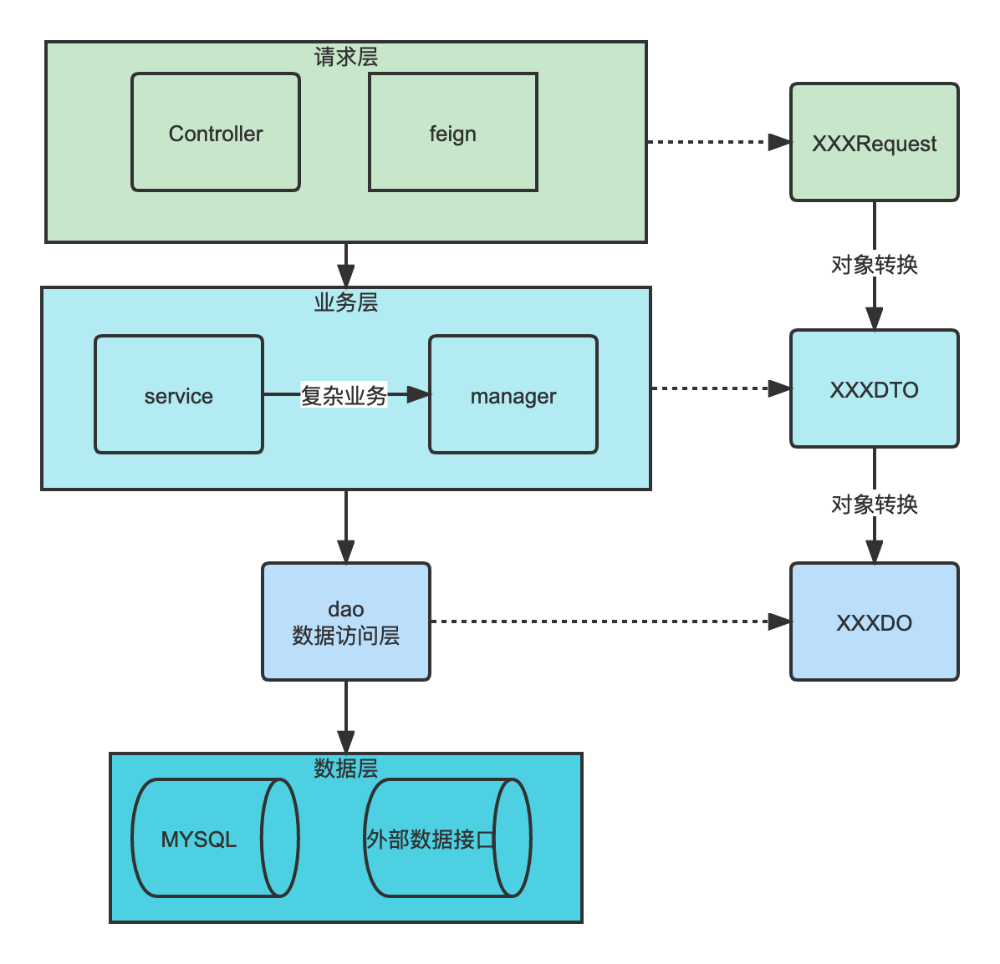

# 一种分包思路

Web 层：主要是对访问控制进行转发，各类基本参数校验，或者不复用的业务简单处理等。

Service 层：相对具体的业务逻辑服务层。  

Manager 层：通用业务处理层，它有如下特征

1）对第三方平台封装的层，预处理返回结果及转化异常信息，适配上层接口。

2）对 Service 层通用能力的下沉，如缓存方案、中间件通用处理。

3）与 DAO 层交互，对多个 DAO 的组合复用。

DAO 层：数据访问层，与底层 MySQL、Oracle、Hbase、OceanBase等进行数据交互。 