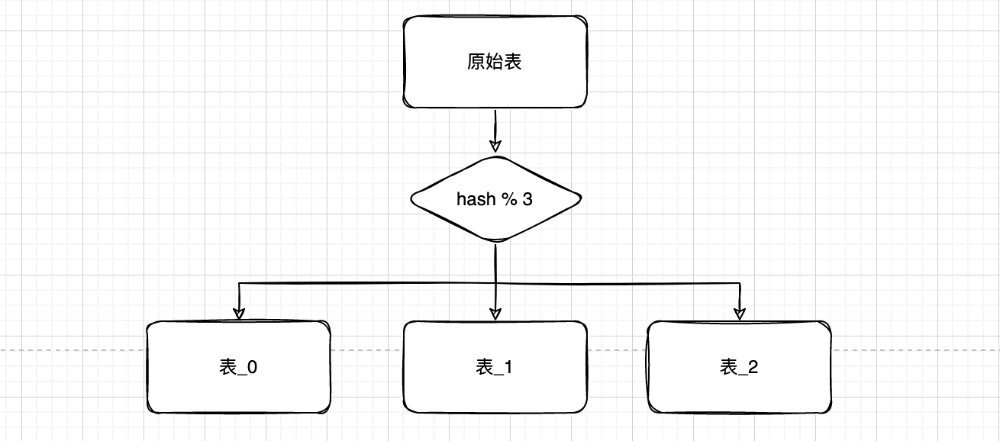
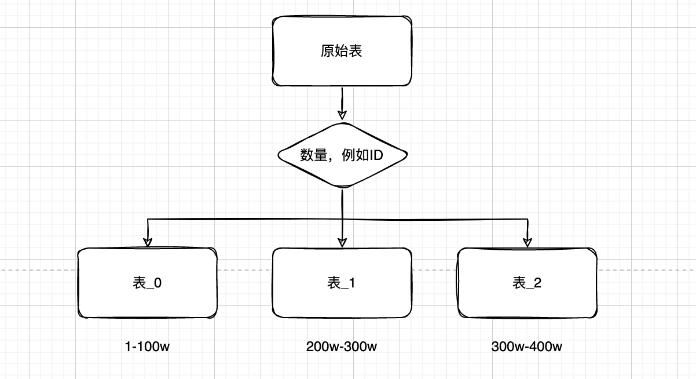
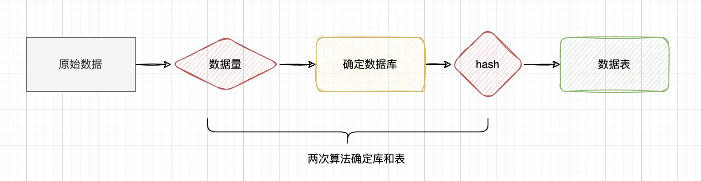

# 分库分表常见算法

分库分表分片策略选择，主要考虑两个原则：

1. 当前业务是否真的需要分库分表，分库分表虽然可以减少单库单表的数据压力，处于一个良好的查询响应范围，但是带来的问题也比较多，比如事务，数据查询等等，所以我认为不到万不得已，不要进行分库分表。
2. 既然已经决定了要进行分库分表，分库分表分片策略选择就比较重要。

## 哈希取模算法

根据某一列的哈希值来拆分表，比如将用户的 email 按照哈希值来拆分表，以达到数据分布均匀的目的。hash(字段) mod 数据库实例数或子表数量，是最为常见的一种路由方式。



```java
public class ModTest {
    public static void main(String[] args) {
        // 数量
        int num = 3;
        String key = UUID.randomUUID().toString();
        // hash值：返回一个数的绝对值
        long hash = Math.abs((long) key.hashCode());
        System.out.println(hash % num);
    }
}
```

优点：

1. 数据均衡：哈希拆分可以将数据均衡地分布在不同的表中，避免某一个表数据量过大，从而导致性能问题。
2. 横向扩展：当数据量增长时，可以通过增加新的表来进行横向扩展，而不需要进行纵向扩展。

缺点：

1. 就是扩容麻烦，需要重新计算每一行数据对应的哈希值。
2. 不适用于归档：哈希拆分没有考虑时间因素，因此无法将历史数据归档到单独的表中。

## 容量（时间）范围算法

- 按照范围拆分：根据某一列的值来拆分表，比如将 id 从 1 到 1000 的数据拆分到第一个数据库，将 id 从 1001 到 2000 的数据拆分到第二个数据库，依此类推。

- 时间拆分：根据时间来拆分表，比如将当月的数据拆分到当月的表中，将去年的数据拆分到去年的表中，依此类推。



优点：

1. 方便进行横向扩展：当数据量增长时，可以通过增加新的表来进行横向扩展，而不需要进行纵向扩展。
2. 规则简单，容易理解。
3. 历史数据可以进行单独的归档。

缺点：

1. 数据倾斜，数据热点可能存在于某个范围或者时间段中，数据库压力分摊不均匀

## 范围 + 取模算法

将范围拆分和取模算法结合起来使用。

1. 将数据按照范围放到不同的数据库中。
2. 取模运算，将数据分配到不同的数据表中。




## 总结

分库分表是一种数据库设计技术，其目的是为了提高数据库的性能和扩展性。它通过将数据库的表拆分到多个数据库中来实现这一目的。

要根据实际的业务情况进行组合，例如省、市；男、女；年龄；等等都可以作为策略。

- **增加了系统的复杂性**：分库分表会增加系统的复杂性，有时候需要额外的中间件（MyCat）来实现，并且需要在程序中额外处理分库分表的逻辑。分页、排序、跨节点联合查询等等问题。
- **降低了事务的原子性**：由于分库分表会将数据存储在多个数据库或表中，因此在一次事务中可能涉及多个数据库，降低了事务的原子性。如何解决跨库事务问题。
- **对性能的影响不确定**：分库分表并不是一定能提高性能，具体的性能提升取决于实际情况，如果没有正确地进行分库分表，可能会导致性能下降。
- **需要进行数据迁移**：如果需要扩展分库分表的范围，可能需要进行数据迁移，这会增加系统的复杂性和风险。

总之，分库分表有一些优点，但同时也有一些缺点，在实际应用中需要谨慎考虑。