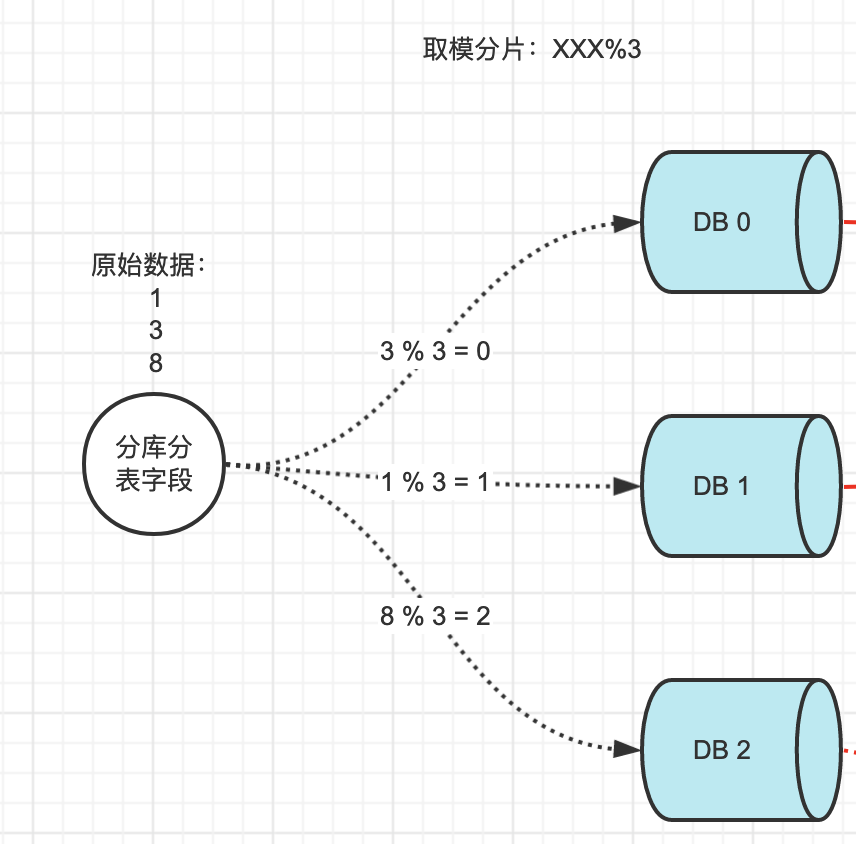
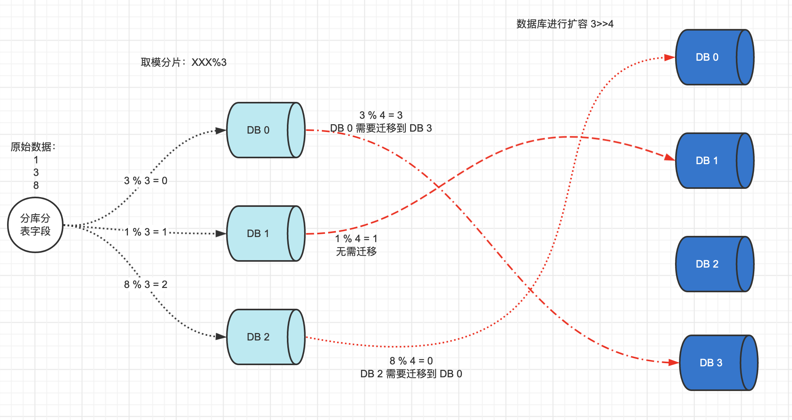
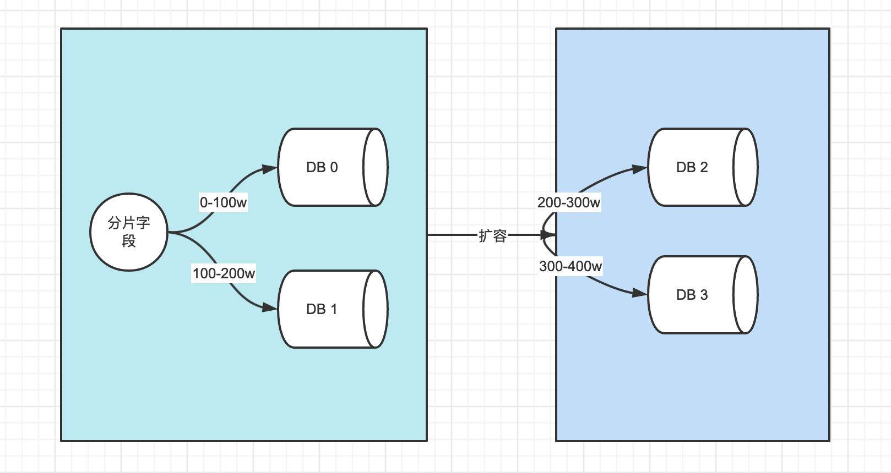
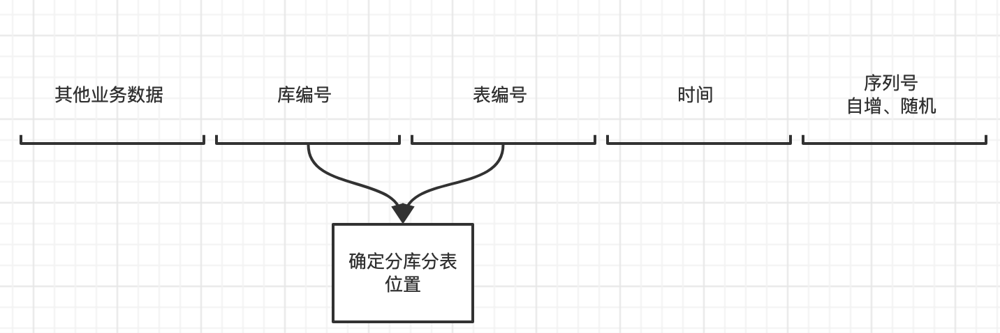
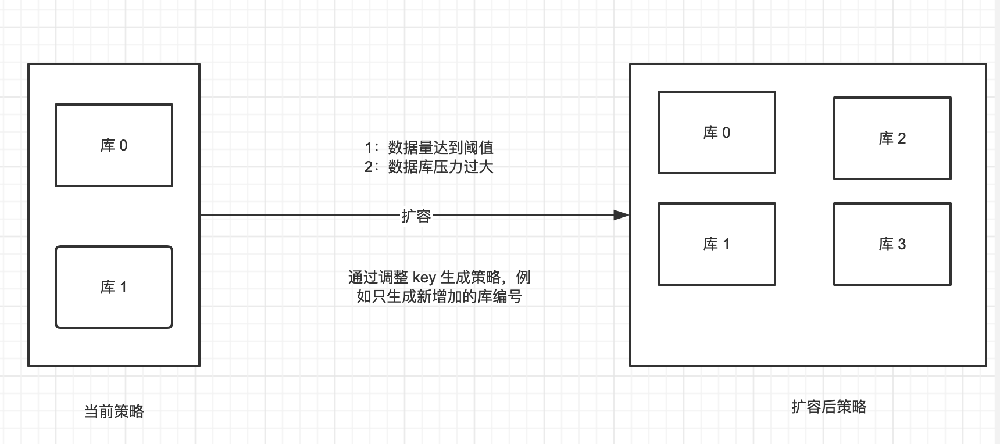
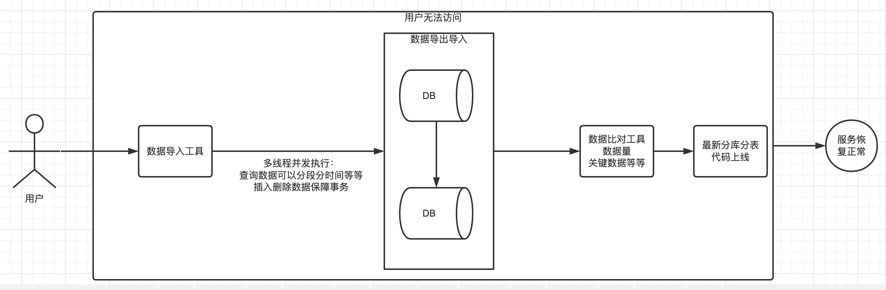

# 分库分表策略以及平滑扩容

当我们选择了一个分库分表分片策略后，就直接决定了以后是否能快速扩容，由于难于评估将来的业务发展，库和表准备多了资源是一种浪费，毕竟降本也是一个指标，准备少了，就需要有一个可靠的方式尽可能低的代价平滑的支持数据库和表的扩容。

## 取余取模算法

当前数据库 DB0、DB1、DB2，按照XXX%3 进行取模分片，将数据平均分配到三个数据库，如下所示：

项目运行一段时间后，发现此时三个数据库已经不能满足当前的业务需求，需要新增一个DB，此时就出现了扩容的问题：

## 分段分片算法

优点：算法简单，扩容也简单

缺点：这种方式，本质上并没有解决数据库的热点问题，没有将压力进行分摊。

## 自定义分片key生成策略

核心在于分片的key上面，让分片key具有一些业务含义。具体可以参考分布式ID生成算法——雪花算法（SnowFlake）。

举例说明：

举例说明：当前库编号：01-02，扩容时只要增大编号即可。

问题：和分段分片的算法其实一样，本质也是在当前库或者表达到一个阈值时，再进行扩容，其实并没有解决实际的热点问题。很难再已有数据的基础上使用这个方案。

一种解决思路：

- 提前设置阈值
- 动态监控阈值，通过调整自定义 key 生成策略，来进行压力调整。

## 停机迁移

停止服务之后，能够保证迁移工作的正常进行，但是服务停止会伤害用户体验，必须在指定的时间内完成迁移，做好提前的演练和准备工作。

- 数据比对工具：确认是否成功。
- 数据导入工具：进行数据导入到新的库中
- 数据备份，如果扩容在指定时间窗口内没有完成，或者扩容失败，需要进行数据回滚。
- 停机时间预估，针对当前的数据量以及可以接受的停机窗口，提前进行演练

## 数据库双写迁移

双写，顾名思义就是新库和旧库都进行数据的写入，比较常用的一种迁移方案，核心的是不用停机。

简单来说，就是在线上系统里面，之前所有写库的地方，增删改操作，除了对老库增删改，都加上对新库的增删改，这就是所谓的双写，同时写俩库，老库和新库。

然后系统部署之后，新库数据差太远，用之前说的导数工具，跑起来读老库数据写新库，写的时候要根据 gmt_modified 这类字段判断这条数据最后修改的时间，除非是读出来的数据在新库里没有，或者是比新库的数据新才会写。简单来说，就是不允许用老数据覆盖新数据。

导完一轮之后，有可能数据还是存在不一致，那么就程序自动做一轮校验，比对新老库每个表的每条数据，接着如果有不一样的，就针对那些不一样的，从老库读数据再次写。反复循环，直到两个库每个表的数据都完全一致为止。

接着当数据完全一致了，就 ok 了，基于仅仅使用分库分表的最新代码，重新部署一次，不就仅仅基于分库分表在操作了么，还没有几个小时的停机时间，很稳。所以现在基本玩儿数据迁移之类的，都是这么干的。

# 双倍扩容策略

如果你已经进行了分库分表，可以在设计之初就想好扩容的方案，即采用双倍扩容策略，可以由 dba 通过一下专业工具负责将原先数据库服务器的库，迁移到新的数据库服务器上去。扩容前每个节点的数据，有一半要迁移至一个新增节点中，对应关系比较简单。

具体操作如下(假设已有 2 个节点 A/B，要双倍扩容至 A/A2/B/B2 这 4 个节点)：

- 无需停止应用服务器；
- 新增两个数据库 A2/B2 作为从库，设置主从同步关系为：A=>A2、B=>B2，直至主从数据同步完毕(早期数据可手工同步)；
- 调整分片规则并使之生效：
  原 `ID%2=0 => A` 改为 `ID%4=0 => A, ID%4=2 => A2`；
  原 `ID%2=1 => B` 改为 `ID%4=1 => B, ID%4=3 => B2`。
- 解除数据库实例的主从同步关系，并使之生效；
- 此时，四个节点的数据都已完整，只是有冗余(多存了和自己配对的节点的那部分数据)，择机清除即可(过后随时进行，不影响业务)。