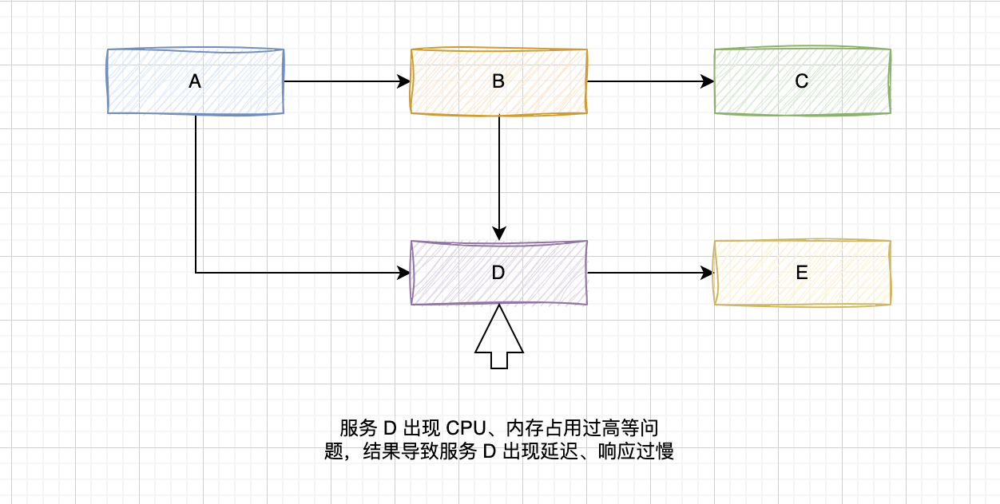

# 熔断和降级

在高并发环境下，服务之间的依赖关系导致调用失败，解决的方式通常是: 限流->熔断->隔离->降级, 其目的是防止雪崩效应。

## 雪崩效应

1. 服务 D 出现 CPU、内存占用过高等问题，结果导致服务 D 出现延迟、响应过慢
2. 此时服务 B 一直等待 D 的响应，也会出现请求堆积、资源占用
3. 慢慢扩散到所有微服务，引发雪崩效应

## 常见容错模式

1. 超时：请求主动设置一个超时时间，超时就直接返回，不会造成服务堆积

2. 限流：限制最大并发数

3. 熔断：当错误数超过阈值时快速失败，不调用后端服务，同时隔一定时间放几个请求去重试后端服务是否能正常调用，如果成功则关闭熔断状态，失败则继续快速失败，直接返回。（此处有个重试，重试就是弹性恢复的能力）

4. 隔离：把每个依赖或调用的服务都隔离开来，防止级联失败引起整体服务不可用

5. 降级：服务失败或异常后，返回指定的默认信息

## 服务降级

由于爆炸性的流量冲击，对一些服务进行有策略的放弃，以此缓解系统压力，保证目前主要业务的正常运行。它主要是针对非正常情况下的应急服务措施：当此时一些业务服务无法执行时，给出一个统一的返回结果。

- 前提：负荷超出整体负载承受能力。
- 目的：保证重要或基本服务正常运行，非重要服务延迟使用或暂停使用
- 大小：降低服务粒度，要考虑整体模块粒度的大小，将粒度控制在合适的范围内
- 可控性：在服务粒度大小的基础上增加服务的可控性，后台服务开关的功能是一项必要配置（单机可配置文件，其他可使用数据库和缓存），可分为手动控制和自动控制。
- 次序：一般从外围延伸服务开始降级，需要有一定的配置项，重要性低的优先降级，比如可以分组设置等级1-10，当服务需要降级到某一个级别时，进行相关配置

### 降级方式

- 延迟服务：比如发表了评论，重要服务，比如在文章中显示正常，但是延迟给用户增加积分，只是放到一个缓存中，等服务平稳之后再执行。
- 在粒度范围内关闭服务（片段降级或服务功能降级）：比如关闭相关文章的推荐，直接关闭推荐区
- 页面异步请求降级：比如商品详情页上有推荐信息/配送至等异步加载的请求，如果这些信息响应慢或者后端服务有问题，可以进行降级；
- 页面跳转（页面降级）：比如可以有相关文章推荐，但是更多的页面则直接跳转到某一个地址
- 写降级：比如秒杀抢购，我们可以只进行Cache的更新，然后异步同步扣减库存到DB，保证最终一致性即可，此时可以将DB降级为Cache。
- 读降级：比如多级缓存模式，如果后端服务有问题，可以降级为只读缓存，这种方式适用于对读一致性要求不高的场景。

### 降级预案

在进行降级之前要对系统进行梳理，看看系统是不是可以丢卒保帅；从而梳理出哪些必须誓死保护，哪些可降级；比如可以参考日志级别设置预案：

- 一般：比如有些服务偶尔因为网络抖动或者服务正在上线而超时，可以自动降级；

- 警告：有些服务在一段时间内成功率有波动（如在95~100%之间），可以自动降级或人工降级，并发送告警；
- 错误：比如可用率低于90%，或者数据库连接池被打爆了，或者访问量突然猛增到系统能承受的最大阀值，此时可以根据情况自动降级或者人工降级；
- 严重错误：比如因为特殊原因数据错误了，此时需要紧急人工降级。

### 服务降级分类

- 降级按照是否自动化可分为：自动开关降级（超时、失败次数、故障、限流）和人工开关降级（秒杀、电商大促等）。
- 降级按照功能可分为：读服务降级、写服务降级。
- 降级按照处于的系统层次可分为：多级降级。

### 自动降级分类

- 超时降级：主要配置好超时时间和超时重试次数和机制，并使用异步机制探测回复情况

- 失败次数降级：主要是一些不稳定的api，当失败调用次数达到一定阀值自动降级，同样要使用异步机制探测回复情况
- 故障降级：比如要调用的远程服务挂掉了（网络故障、DNS故障、http服务返回错误的状态码、rpc服务抛出异常），则可以直接降级。降级后的处理方案有：默认值（比如库存服务挂了，返回默认现货）、兜底数据（比如广告挂了，返回提前准备好的一些静态页面）、缓存（之前暂存的一些缓存数据）
- 限流降级: 当我们去秒杀或者抢购一些限购商品时，此时可能会因为访问量太大而导致系统崩溃，此时开发者会使用限流来进行限制访问量，当达到限流阀值，后续请求会被降级；降级后的处理方案可以是：排队页面（将用户导流到排队页面等一会重试）、无货（直接告知用户没货了）、错误页（如活动太火爆了，稍后重试）

### 问题

- 核心服务或非核心服务。
- 是否支持降级，及其降级策略。
- 业务放通场景，极其策略。

## 服务熔断

熔断这一概念来源于电子工程中的断路器（Circuit Breaker）。在互联网系统中，当下游服务因访问压力过大而响应变慢或失败，上游服务为了保护系统整体的可用性，可以暂时切断对下游服务的调用。

熔断机制是应对雪崩效应的一种微服务链路保护机制，当整个链路的某个微服务不可用或者响应时间太长时，会进行服务的降级，进而熔断该节点微服务的调用，快速返回”错误”的响应信息。

### 熔断的意义

**上游服务快速失败（Fail Fast），保护下游服务**。

### 熔断适用场景

出于系统性能问题的考虑，并发不高时timeout可以避免线程阻塞带来的性能问题，但是并发高时timeout就不能解决问题啦。这时可以用熔断。

只要是服务之间的调用，并且能设计合理的获取返回值的方案（返回值可以是默认值，或者通过一种后备（Fallback）方案获取的值），一般业务场景都可以做熔断处理。

比如电商行业，在sku不是很多的场景下，我们可以在订单服务冗余库存数据（注意控制合理的安全库存，防超卖）。下单减库存时，如果库存服务挂了，开启熔断后，我们可以直接从订单服务取库存，订单服务取不到库存，按扣减库存失败处理。这个可以做为后备（Fallback）方案。

### 断路器

“断路器”本身是一种开关装置，当某个服务单元发生故障监控(类似熔断保险丝)，向调用方法返回一个符合预期的、可处理的备选响应(FallBack)，而不是长时间的等待或者抛出调用方法无法处理的异常，这样就保证了服务调用方的线程不会被长时间、不必要地占用，从而避免了故障在分布式系统中的蔓延。乃至雪崩。

## 开源方案

1. Sentinel：

   阿里中间件团队开源的，面向分布式服务架构的轻量级高可用流量控制组件，主要以流量为切入点，从流量控制、熔断降级、系统负载保护等多个维度来帮助用户保护服务的稳定性。

2. Hystrix：

   Hystrix是一个用于分布式系统的延迟和容错的开源库。在分布式系统里，许多依赖不可避免的调用失败，比如超时、异常等，Hystrix能够保证在一个依赖出问题的情况下，不会导致整个服务失败，避免级联故障，以提高分布式系统的弹性。

3. Resilience4j：

   Resilience4j是一款轻量级，易于使用的容错库，其灵感来自于Netflix Hystrix，但是专为Java 8和函数式编程而设计。轻量级，因为库只使用了Vavr，它没有任何其他外部依赖下。相比之下，Netflix Hystrix对Archaius具有编译依赖性，Archaius具有更多的外部库依赖性，例如Guava和Apache Commons Configuration。

> https://pdai.tech/md/arch/arch-y-reduce.html
>
> 
>
> https://mp.weixin.qq.com/s?__biz=MzU0OTE4MzYzMw==&mid=2247506440&idx=4&sn=5719c4fa0b9c80ed2ea0ab3c35d19a6b&chksm=fbb153f6ccc6dae02cf5caae458cd245bde5ecf9ca3aa2905eab9a47cc4586064928ef82a314&scene=27

