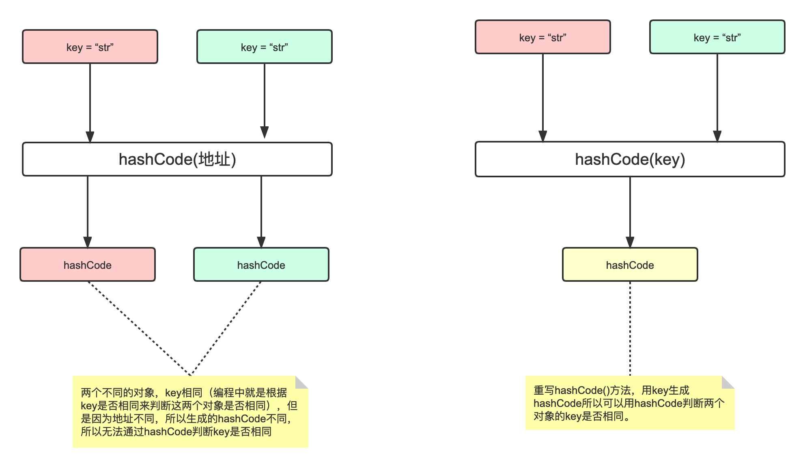

# HashCode

哈希码（HashCode），并不是完全唯一的，它是一种算法，让同一个类的对象按照自己不同的特征尽量的有不同的哈希码，但不表示不同的对象哈希码完全不同。

## hashCode与equals

equals()方法在Object中用的是 == 对比的是地址，所以要以对象某某个属性判断对象是否相等需要重写equals()方法。

基本逻辑：

- 两个对象 equals，Java 运行时环境会认为他们的 hashCode 一定相等。

- 两个对象不 equals，他们的 hashCode 有可能相等。

- 不管两个对象的 hashCode 是否相等，equals 都不一定。

### 重写 equals

Object.java，默认比较地址

```java
public boolean equals(Object obj) {
    return (this == obj);
}
```

String.java，重写了 equals

```java
public boolean equals(Object anObject) {
    if (this == anObject) {
        return true;
    }
    if (anObject instanceof String) {
        String anotherString = (String)anObject;
        int n = value.length;
        if (n == anotherString.value.length) {
            char v1[] = value;
            char v2[] = anotherString.value;
            int i = 0;
            while (n-- != 0) {
                if (v1[i] != v2[i])
                    return false;
                i++;
            }
            return true;
        }
    }
    return false;
}
```

## 重写hashCode

hashCode()方法只有在集合中会使用到，比如HashMap就会用hashCode判断key相同的元素是否已经存在于集合中，如果通过地址的方式生成hashCode，那么就无法通过key生成的hashCode是否相同来判断key是否存在了，所以，如果对象需要存储在集合中的话就需要覆盖hashCode()方法，让相同的key生成的hashCode相同。

以 HashMap 为例子：

```java
static final int hash(Object key) {
    int h;
    // 如果key为null，返回0
    // hashCode的高16位异或低16位得到哈希值
    // 主要从性能、哈希碰撞角度考虑，减少系统开销，不会造成因为高位没有参与下标计算从而引起的碰撞。
    return (key == null) ? 0 : (h = key.hashCode()) ^ (h >>> 16);
}
```



## 魔数31

```java
public static int hashCode(byte[] value) {
    int h = 0;
    int length = value.length >> 1;
    for (int i = 0; i < length; i++) {
        h = 31 * h + getChar(value, i);
    }
    return h;
}
```

1. 31 是一个奇质数，如果选择偶数会导致乘积运算时数据溢出。
2. 另外在二进制中，2个5次方是32，那么也就是 `31 * i == (i << 5) - i`。这主要是说乘积运算可以使用位移提升性能，同时目前的JVM虚拟机也会自动支持此类的优化。
