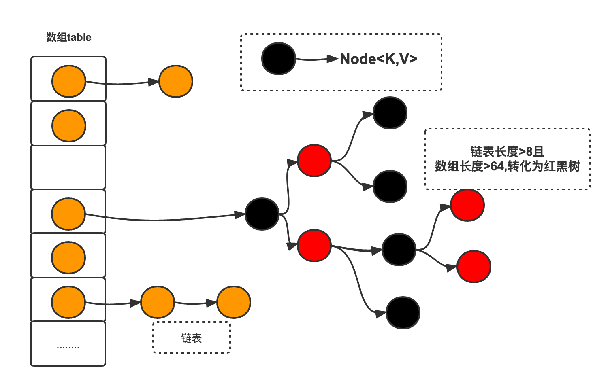
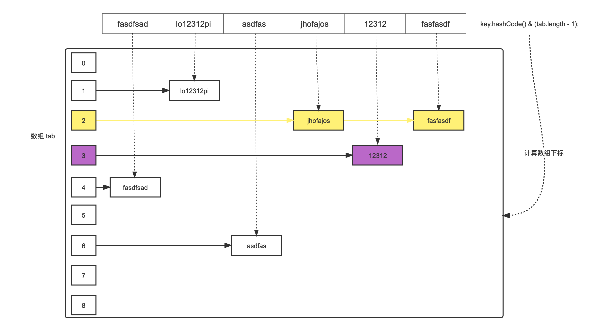

# HashMap加载（负载）因子

```java
/**
* The load factor for the hash table.
*
* 加载因子 默认 0.75
* @serial
*/
final float loadFactor;
/**
* The load factor used when none specified in constructor.
*
* 默认加载因子值
* 当元素数量达到当前容量的 75% 时，HashMap 会对数组进行扩容。该因子可在创建实例时指定。
*/
static final float DEFAULT_LOAD_FACTOR = 0.75f;
```

HashMap的底层其实也是哈希表（散列表），而解决冲突的方式是链地址法。HashMap的初始容量大小默认是16，为了减少冲突发生的概率，当HashMap的数组长度到达一个临界值的时候，就会触发扩容，把所有元素rehash之后再放在扩容后的容器中，这是一个相当耗时的操作。

0.75是一个默认构造值，创建HashMap可以调整，如果希望用更多的空间换取时间，可以把负载因子调的更小一些，减少碰撞。



**loadfactory设置为0.75是经过多重计算检验得到的可靠值，可以最大程度的减少rehash的次数，避免过多的性能消耗。**

## 减少 hash 碰撞

如下图：有一个位置存了 2 个元素，有两个位置没有元素。在计算 hash 过程中出现了碰撞，只能在同一个位置用链表存放，此时Map 数组的性能会降低



