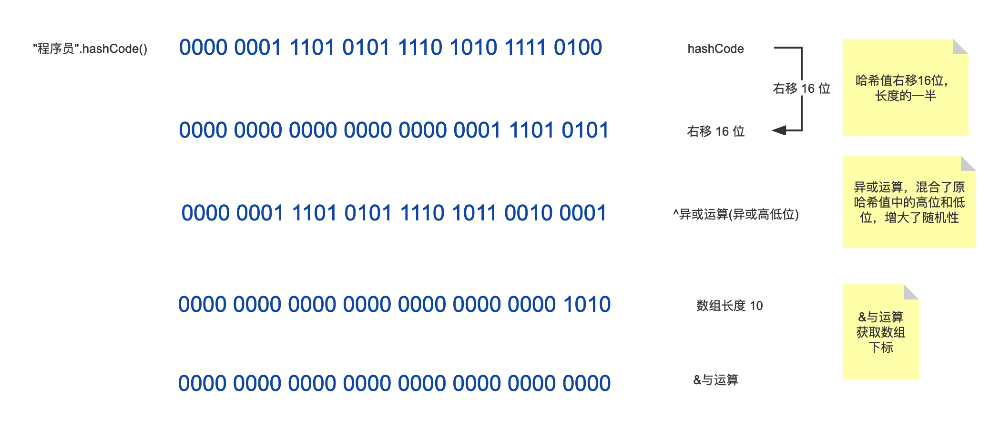

# HashMap的hash值计算

1. 原 hash 右移 16 位
2. 和原哈希值做异或运算，混合了原哈希值中的高位和低位，增大了**随机性**
3. 和数组长度做 & 与运算获取数组下标

HashMap 中的 hash()：

```java
static final int hash(Object key) {
    int h;
    // 如果key为null，返回0
    // hashCode的高16位异或低16位得到哈希值
    // 主要从性能、哈希碰撞角度考虑，减少系统开销，不会造成因为高位没有参与下标计算从而引起的碰撞。
    return (key == null) ? 0 : (h = key.hashCode()) ^ (h >>> 16);
}
```

Object 中的 hashCode()，取值范围为 -2^31——2^31-1,即-2147483648——2147483647

```java
public native int hashCode();
```

HashMap 中使用 key 的 hash 值作为数组下标，所以不能直接使用原生的 hashCode()，需要与数组长度进行**取模运算**得到一个数组下标。



## 扰动函数

HashMap 中的扰动函数主要起到“扰动哈希”的作用,通过简单的位运算,增强 hash 的随机性,提高Hash表的性能。

`hashCode`是一个int类型值，可以直接作为数组下标，并且不会出现碰撞，但是 int 的取值范围是[-2147483648, 2147483647]，无法直接作为数组的下标。

所以此时使用扰动函数增加随机性，让数据元素更加均衡的散列，减少碰撞。

