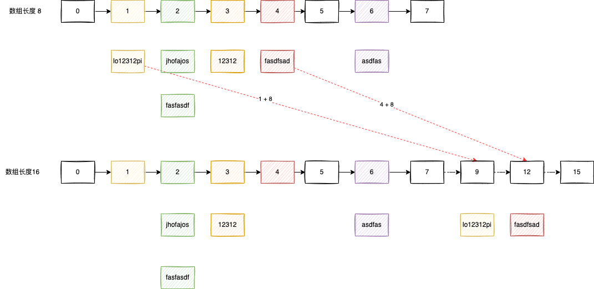

# HashMap的扩容

当 HashMap 数组长度不足时，会进行扩容，因为需要把元素拆分到新的数组中，所以需要重新计算 hash 值，jdk1.7中会需要重新计算哈希值，jdk1.8中已经进行优化，不再需要重新计算。

```java
// oldCap：旧数组长度
// e.hash：旧数组中节点的 hash 值
e.hash & oldCap
```

前提条件分析：

- e.hash：数组中节点的 hash 值，计算方式， (h = key.hashCode()) ^ (h >>> 16)

- oldCap：旧数组长度，是2的n次幂的整数，1000…0
- newCap：新数组的长度，2oldCap = oldCap << 1，也是是2的n次幂的整数，1000…0 
- 数组索引计算：(oldCap -1)  & e.hash，(2oldCap -1)  & e.hash
- & 与运算：两个同时为1，结果为1，否则为0

分析：e.hash & oldCap

- 等于 0 ，索引位置不变

- 不等于 0 ，增加扩容的长度


