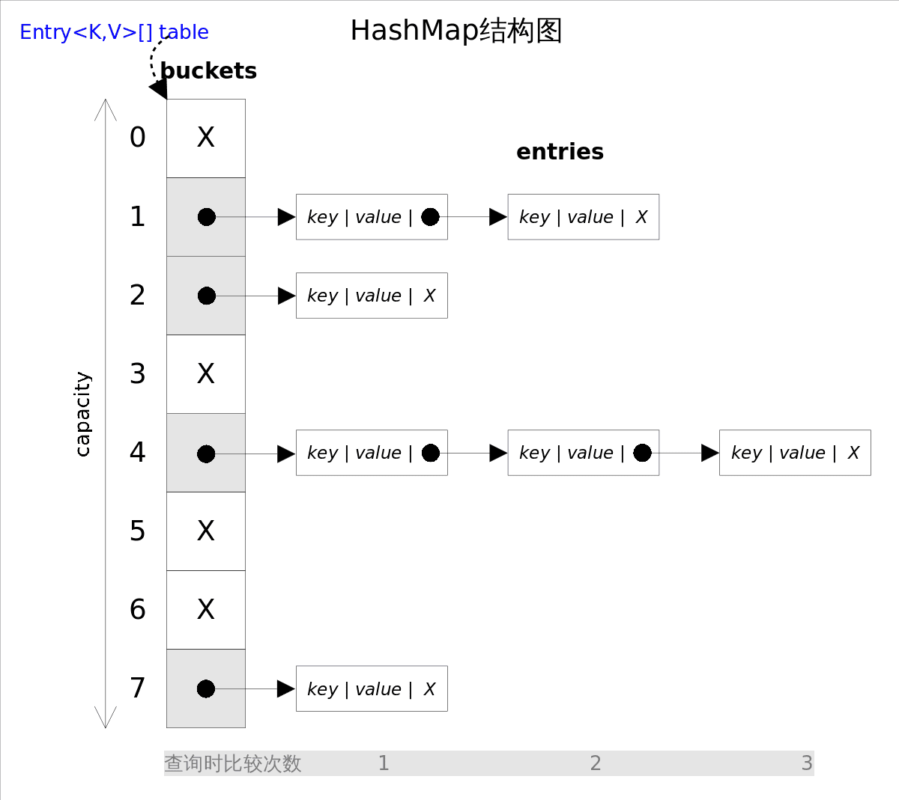
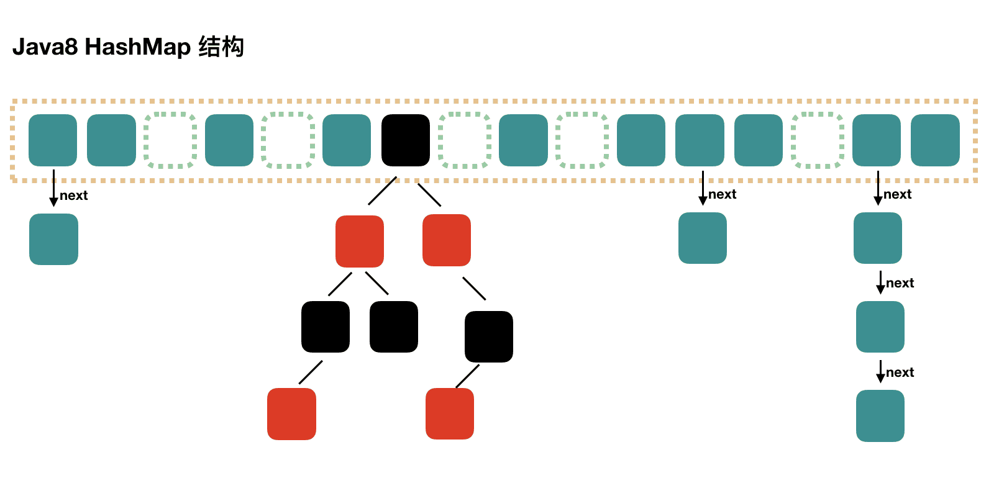

# Java集合

主要包括 Collection 和 Map 两种，Collection 存储着对象的集合，而 Map 存储着键值对(两个对象)的映射表。

## Collection

Set、List、Queue

### Set

- TreeSet 基于红黑树实现，支持有序性操作，例如根据一个范围查找元素的操作。但是查找效率不如 HashSet，HashSet 查找的时间复杂度为 O(1)，TreeSet 则为 O(logN)。
- HashSet 基于哈希表实现，支持快速查找，但不支持有序性操作。并且失去了元素的插入顺序信息，也就是说使用 Iterator 遍历 HashSet 得到的结果是不确定的。
- LinkedHashSet 具有 HashSet 的查找效率，且内部使用双向链表维护元素的插入顺序。

### List

- ArrayList 基于动态数组实现，支持随机访问。
- Vector 和 ArrayList 类似，但它是线程安全的。
- LinkedList 基于双向链表实现，只能顺序访问，但是可以快速地在链表中间插入和删除元素。不仅如此，LinkedList 还可以用作栈、队列和双向队列。

### Queue

- LinkedList 可以用它来实现双向队列。
- PriorityQueue 基于堆结构实现，可以用它来实现优先队列。

## Map

- `TreeMap` 基于红黑树实现。

- `HashMap` 1.7基于哈希表实现，1.8基于数组+链表+红黑树。

- `HashTable` 和 HashMap 类似，但它是线程安全的，这意味着同一时刻多个线程可以同时写入 HashTable 并且不会导致数据不一致。它是遗留类，不应该去使用它。现在可以使用 ConcurrentHashMap 来支持线程安全，并且 ConcurrentHashMap 的效率会更高(1.7 ConcurrentHashMap 引入了分段锁, 1.8 引入了红黑树)。

  1.7：

  

  从上图容易看出，如果选择合适的哈希函数，`put()`和`get()`方法可以在常数时间内完成。但在对*HashMap*进行迭代时，需要遍历整个table以及后面跟的冲突链表。因此对于迭代比较频繁的场景，不宜将*HashMap*的初始大小设的过大。

  有两个参数可以影响*HashMap*的性能: 初始容量(inital capacity)和负载系数(load factor)。初始容量指定了初始`table`的大小，负载系数用来指定自动扩容的临界值。当`entry`的数量超过`capacity*load_factor`时，容器将自动扩容并重新哈希。对于插入元素较多的场景，将初始容量设大可以减少重新哈希的次数。

  1.8：

  根据 Java7 HashMap 的介绍，我们知道，查找的时候，根据 hash 值我们能够快速定位到数组的具体下标，但是之后的话，需要顺着链表一个个比较下去才能找到我们需要的，时间复杂度取决于链表的长度，为 O(n)。

  为了降低这部分的开销，在 Java8 中，当链表中的元素达到了 8 个时，会将链表转换为红黑树，在这些位置进行查找的时候可以降低时间复杂度为 O(logN)。

  

  *HashSet*：

  *HashSet*是对*HashMap*的简单包装，对*HashSet*的函数调用都会转换成合适的*HashMap*方法。

  ```java
  //HashSet是对HashMap的简单包装
  public class HashSet<E>
  {
  	......
  	private transient HashMap<E,Object> map;//HashSet里面有一个HashMap
      // Dummy value to associate with an Object in the backing Map
      private static final Object PRESENT = new Object();
      public HashSet() {
          map = new HashMap<>();
      }
      ......
      public boolean add(E e) {//简单的方法转换
          return map.put(e, PRESENT)==null;
      }
      ......
  }
  ```

- `LinkedHashMap` 使用双向链表来维护元素的顺序，顺序为插入顺序或者最近最少使用(LRU)顺序。

  ```java
  // 基于 LinkedHashMap 的LRU
  public class LRU<K, V> extends LinkedHashMap<K, V> {
      private int capacity;
  
      /**
       * 传递进来最多能缓存多少数据
       *
       * @param capacity 缓存大小
       */
      public LRUCache(int capacity) {
          super(capacity, 0.75f, true);
          this.capacity = capacity;
      }
  
      /**
       * 如果map中的数据量大于设定的最大容量，返回true，再新加入对象时删除最老的数据
       *
       * @param eldest 最老的数据项
       * @return true则移除最老的数据
       */
      @Override
      protected boolean removeEldestEntry(Map.Entry<K, V> eldest) {
          // 当 map中的数据量大于指定的缓存个数的时候，自动移除最老的数据
          return size() > capacity;
      }
  }
  ```

- WeakHashMap

  ava中内存是通过GC自动管理的，GC会在程序运行过程中自动判断哪些对象是可以被回收的，并在合适的时机进行内存释放。GC判断某个对象是否可被回收的依据是，**是否有有效的引用指向该对象**。如果没有有效引用指向该对象(基本意味着不存在访问该对象的方式)，那么该对象就是可回收的。这里的**有效引用** 并不包括**弱引用**。也就是说，**虽然弱引用可以用来访问对象，但进行垃圾回收时弱引用并不会被考虑在内，仅有弱引用指向的对象仍然会被GC回收**。

  WeakHashMap 内部是通过弱引用来管理entry的，弱引用的特性对应到 WeakHashMap 上意味着什么呢？

  *WeakHashMap* 里的`entry`可能会被GC自动删除，即使程序员没有调用`remove()`或者`clear()`方法。

  ***WeakHashMap\* 的这个特点特别适用于需要缓存的场景**。在缓存场景下，由于内存是有限的，不能缓存所有对象；对象缓存命中可以提高系统效率，但缓存MISS也不会造成错误，因为可以通过计算重新得到。

> https://pdai.tech/md/interview/x-interview.html#_2-1-collection