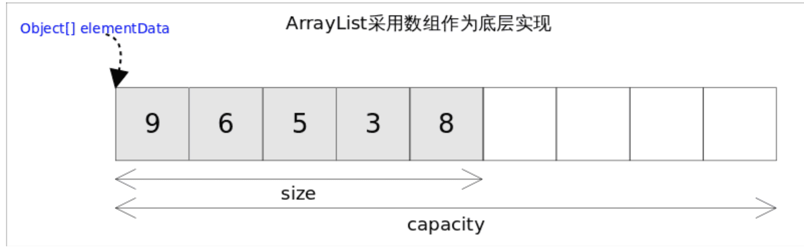

# Java集合ArrayList

*ArrayList*实现了*List*接口，是顺序容器，即元素存放的数据与放进去的顺序相同，允许放入`null`元素，底层通过**数组实现**。

- 未实现同步，其余跟*Vector*大致相同。
- 每个*ArrayList*都有一个容量(capacity)，表示底层数组的实际大小，容器内存储元素的个数不能多于当前容量。
- 当向容器中添加元素时，如果容量不足，容器会自动增大底层数组的大小。

## 自动扩容

每当向数组中添加元素时，都要去检查添加后元素的个数是否会超出当前数组的长度，如果超出，数组将会进行扩容。

数组扩容通过ensureCapacity(int minCapacity)方法来实现，实际添加大量元素前，我也可以使用ensureCapacity来手动增加ArrayList实例的容量，以减少递增式再分配的数量。

数组进行扩容时，会将老数组中的元素重新拷贝一份到新的数组中，每次数组容量的增长大约是其原容量的1.5倍。

- 可预知要保存的元素的多少时，要在构造ArrayList实例时，就指定其容量，以避免数组扩容的发生。
- 根据实际需求，通过调用ensureCapacity方法来手动增加ArrayList实例的容量。

## 快速失败机制

ArrayList也采用了快速失败的机制，通过记录modCount参数来实现。在面对并发的修改时，迭代器很快就会完全失败，而不是冒着在将来某个不确定时间发生任意不确定行为的风险。

> https://pdai.tech/md/interview/x-interview.html#_2-1-collection