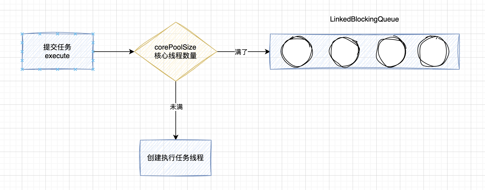
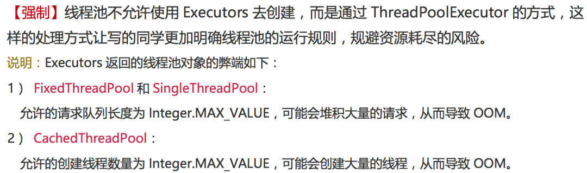

# 四种线程池

Executors 是创建线程池的工具类，比较典型常见的四种线程池包括：newFixedThreadPool 、 newSingleThreadExecutor 、 newCachedThreadPool 、newScheduledThreadPool。

## newFixedThreadPool 

- 固定大小可重复使用的线程池，corePoolSize = maximumPoolSize
- 以 LinkedBlockingQueue 无界阻塞队列存放等待线程。
- 随着线程任务不能被执行的的无限堆积，可能会导致 OOM

```java
public static ExecutorService newFixedThreadPool(int nThreads, 
                                                 ThreadFactory threadFactory) {
	return new ThreadPoolExecutor(nThreads, nThreads,
                0L, TimeUnit.MILLISECONDS,
                new LinkedBlockingQueue<Runnable>(),
                threadFactory);
}
```



## newSingleThreadExecutor 

- 只创建一个执行线程任务的线程池
- 如果出现意外终止则再创建一个
- 个无界队列存放待执行线程，无限堆积下会出现 OOM

```java
public static ExecutorService newSingleThreadExecutor() {
    return new FinalizableDelegatedExecutorService
        (new ThreadPoolExecutor(1, 1,
                                0L, TimeUnit.MILLISECONDS,
                                new LinkedBlockingQueue<Runnable>()));
}
```

## newCachedThreadPool 

- SynchronousQueue 是一个生产消费模式的阻塞任务队列，只要有任务就需要有线程执行，线程池中的线程可以重复使用。
- 如果线程任务比较耗时，又大量创建，会导致 OOM。

```java
public static ExecutorService newCachedThreadPool() {
	return new ThreadPoolExecutor(0, Integer.MAX_VALUE,
                              60L, TimeUnit.SECONDS,
                              new SynchronousQueue<Runnable>());
}
```

## newScheduledThreadPool

- 延迟定时执行，有点像我们的定时任务
- 无限大小的线程池 Integer.MAX_VALUE
- 无限容量的线程池，所以依旧有 OOM 风险

```java
public ScheduledThreadPoolExecutor(int corePoolSize) {
    super(corePoolSize, Integer.MAX_VALUE,
          DEFAULT_KEEPALIVE_MILLIS, MILLISECONDS,
          new DelayedWorkQueue());
}
```

## 总结

