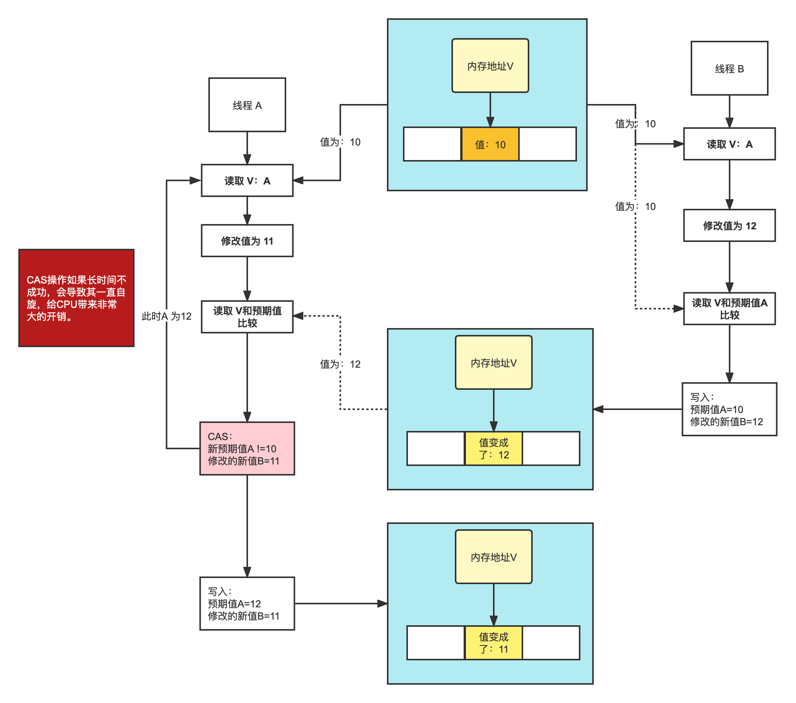
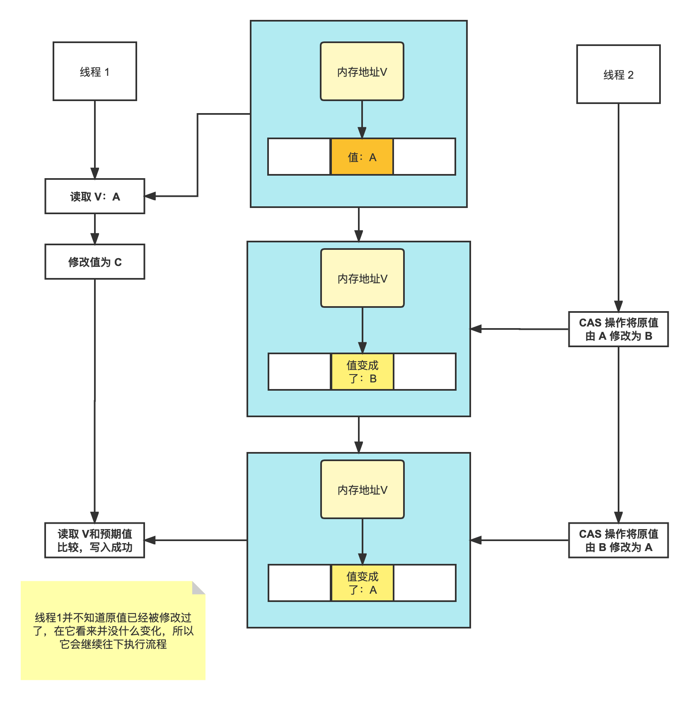

# 无锁CAS机制

CAS全称 Compare And Swap（⽐较与交换），是⼀种⽆锁算法。在不使⽤锁（没有线程被阻塞）的情况下实现多线程之间的变量java.util.concurrent包中的原⼦类就是通过CAS来实现了乐观锁。 

CAS(V,E,N)：

- V：需要操作的共享变量
- E：预期值
- N：新值

1. 如果V值等于E值，则将N值赋值给V。
2. 如果V值不等于E值，则此时说明在当前线程写回之前有其他线程对V做了更改，那么当前线程什么都不做。

当一个线程对V需要做更改时，先在操作之前先保存当前时刻共享变量的值，当线程操作完成后需要写回新值时先重新去获取一下最新的变量值与操作开始之前的保存的预期值比对，如果相同说明没有其他线程改过，那么当前线程就执行写入操作。但如果期望值与当前线程操作之前保存的不符，则说明该值已被其他线程修改，此时不执行更新操作，但可以选择重新读取该变量再尝试再次修改该变量，也可以放弃操作。

问题：

1. 循环时间⻓开销⼤。CAS操作如果⻓时间不成功，会导致其⼀直⾃旋，给CPU带来⾮常⼤的开销。

2. 只能保证⼀个共享变量的原⼦操作。对⼀个共享变量执⾏操作时，CAS能够保证原⼦操作，但是对多个共享变量操作时，CAS是⽆法保证操作的原⼦性的。

   Java从1.5开始JDK提供了AtomicReference类来保证引⽤对象之间的原⼦性，可以把多个变量放在⼀个对象⾥来进⾏CAS操作。

## ABA问题

1. 线程1执行读取操作，获取原值 A
2. 线程2执行完成 CAS 操作将原值由 A 修改为 B 
3. 线程2再次执行 CAS 操作，并将原值由 B 修改为 A 
4. 线程1将比较值（compareValue）与原值（oldValue）进行比较，发现两个值相等。 然后用新值（newValue）写入内存中，完成 CAS 操作

如上流程，线程1并不知道原值已经被修改过了，在它看来并没什么变化，所以它会继续往下执行流程。对于 ABA 问题，通常的处理措施是对每一次 CAS 操作设置版本号。

JDK从1.5开始提供了AtomicStampedReference类来解决ABA问题，具体操作封装在compareAndSet()中。compareAndSet()⾸先检查当前引⽤和当前标志与预 期引⽤和预期标志是否相等，如果都相等，则以原⼦⽅式将引⽤值和标志的值设置为给定的更新值。

- AtomicStampedReference：时间戳控制，能够完全解决
- AtomicMarkableReference：维护boolean值控制，不能完全杜绝
