# 线程池

为什么使用线程池：线程池的核心目的就是资源的利用，避免重复创建线程带来的资源消耗。因此引入一个池化技术的思想，避免重复创建、销毁带来的性能开销。

- 当需要多线程并发执行任务时，只能不断的通过new Thread创建线程，每创建一个线程都需要在堆上分配内存空间，同时需要分配虚拟机栈、本地方法栈、程序计数器等线程私有的内存空间，当这个线程对象被可达性分析算法标记为不可用时被GC回收，这样频繁的创建和回收需要大量的额外开销。
- JVM的内存资源是有限的，如果系统中大量的创建线程对象，JVM很可能直接抛出OutOfMemoryError异常，还有大量的线程去竞争CPU会产生其他的性能开销，更多的线程反而会降低性能，所以必须要限制线程数。

线程池好处：

- 线程池可以复用池中的线程，不需要每次都创建新线程，减少创建和销毁线程的开销；
- 线程池具有队列缓冲策略、拒绝机制和动态管理线程个数，特定的线程池还具有定时执行、周期执行功能
- 线程池可实现线程环境的隔离

## 执行流程

## 构造方法

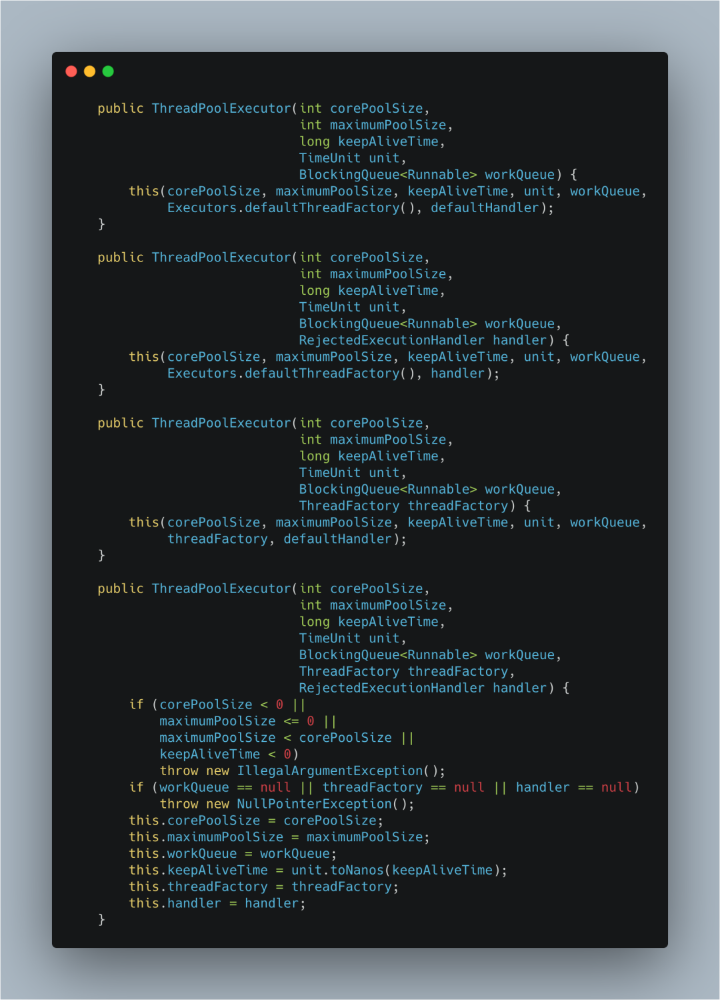

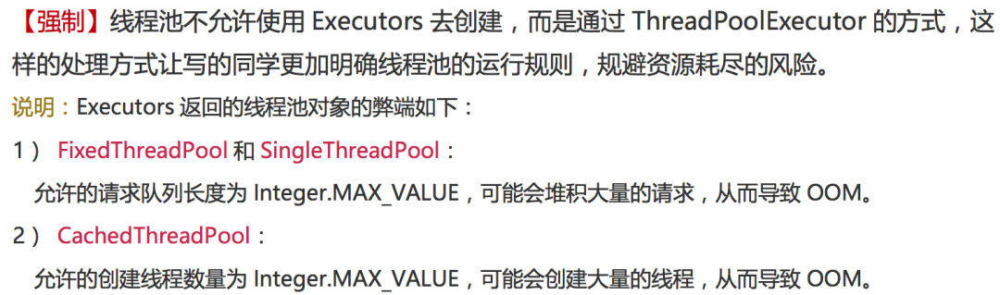

## 核心参数

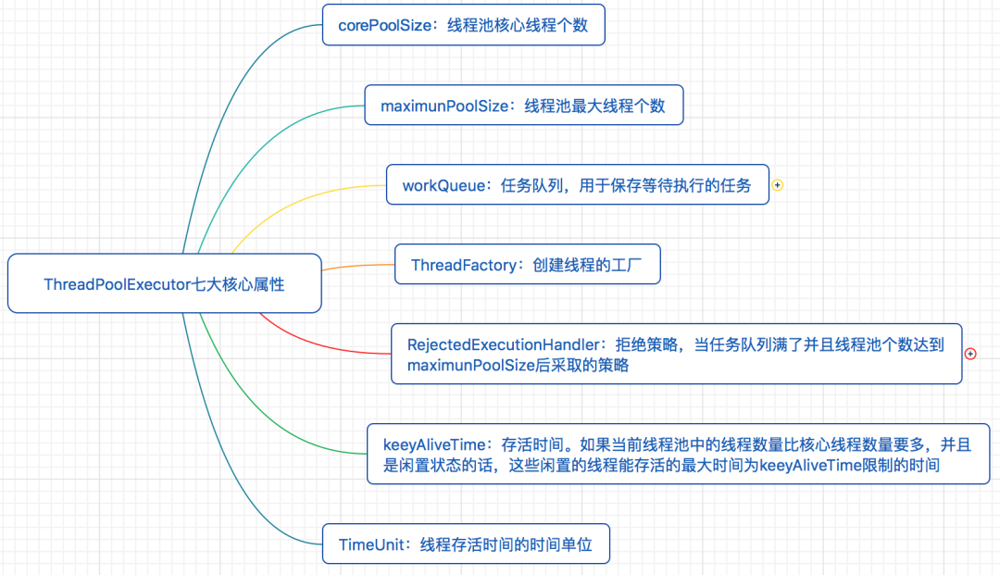

- corePoolSize(int)：核心线程数量。
  - 默认情况下，在创建了线程池后，线程池中的线程数为0，当有任务来之后，就会创建一个线程去执行任务，当线程池中的线程数目达到corePoolSize后，就会把到达的任务放到任务队列当中。线程池将长期保证这些线程处于存活状态，即使线程已经处于闲置状态。除非配置了allowCoreThreadTimeOut=true，核心线程数的线程也将不再保证长期存活于线程池内，在空闲时间超过keepAliveTime后被销毁。
- workQueue：阻塞队列，存放等待执行的任务，线程从workQueue中取任务，若无任务将阻塞等待。当线程池中线程数量达到corePoolSize后，就会把新任务放到该队列当中。JDK提供了四个可直接使用的队列实现，分别是：基于数组的有界队列ArrayBlockingQueue、基于链表的无界队列LinkedBlockingQueue、只有一个元素的同步队列SynchronousQueue、优先级队列PriorityBlockingQueue。在实际使用时一定要设置队列长度。
- maximumPoolSize(int)：线程池内的最大线程数量，线程池内维护的线程不得超过该数量，大于核心线程数量小于最大线程数量的线程将在空闲时间超过keepAliveTime后被销毁。当阻塞队列存满后，将会创建新线程执行任务，线程的数量不会大于maximumPoolSize。
- keepAliveTime(long)：线程存活时间，若线程数超过了corePoolSize，线程闲置时间超过了存活时间，该线程将被销毁。除非配置了allowCoreThreadTimeOut=true，核心线程数的线程也将不再保证长期存活于线程池内，在空闲时间超过keepAliveTime后被销毁。
- TimeUnit unit：线程存活时间的单位，例如TimeUnit.SECONDS表示秒。
- RejectedExecutionHandler：拒绝策略，当任务队列存满并且线程池个数达到maximunPoolSize后采取的策略。ThreadPoolExecutor中提供了四种拒绝策略，分别是：抛RejectedExecutionException异常的AbortPolicy(如果不指定的默认策略)、使用调用者所在线程来运行任务CallerRunsPolicy、丢弃一个等待执行的任务，然后尝试执行当前任务DiscardOldestPolicy、不动声色的丢弃并且不抛异常DiscardPolicy。项目中如果为了更多的用户体验，可以自定义拒绝策略。
- threadFactory：创建线程的工厂，虽说JDK提供了线程工厂的默认实现DefaultThreadFactory，但还是建议自定义实现最好，这样可以自定义线程创建的过程，例如线程分组、自定义线程名称等。

## 提交线程 execute

通过execute方法提交任务时，当线程池中的线程数小于corePoolSize时，新提交的任务将通过创建一个新线程来执行，即使此时线程池中存在空闲线程。

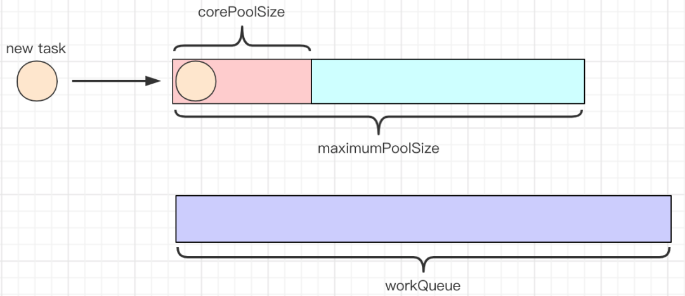

当线程池中线程数量达到corePoolSize时，新提交的任务将被放入workQueue中，等待线程池中线程调度执行。

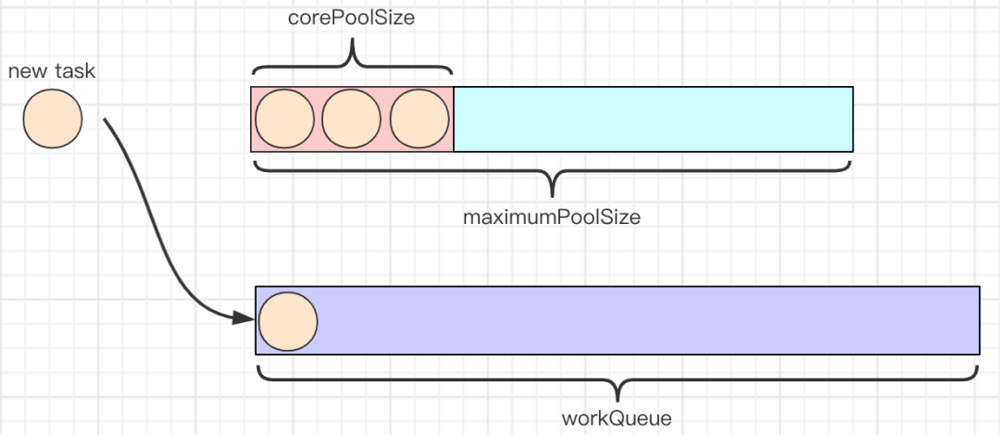

当workQueue已存满，且maximumPoolSize大于corePoolSize时，新提交的任务将通过创建新线程执行。

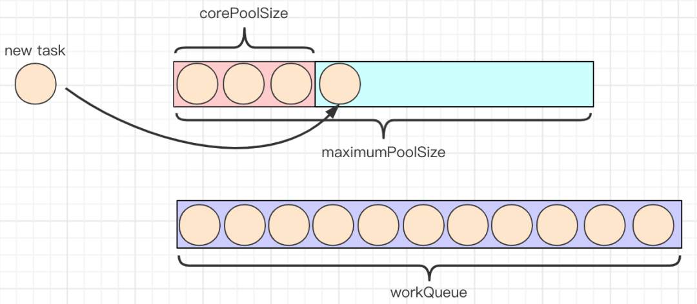

当线程池中的线程执行完任务空闲时，会尝试从workQueue中取头结点任务执行。

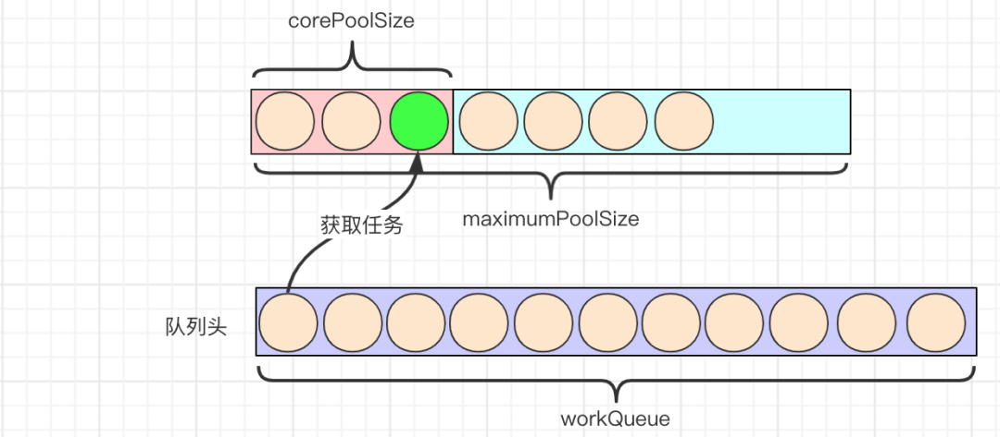

当线程池中线程数达到maxmumPoolSize，并且workQueue也存满时，新提交的任务由RejectedExecutionHandler执行拒绝操作。

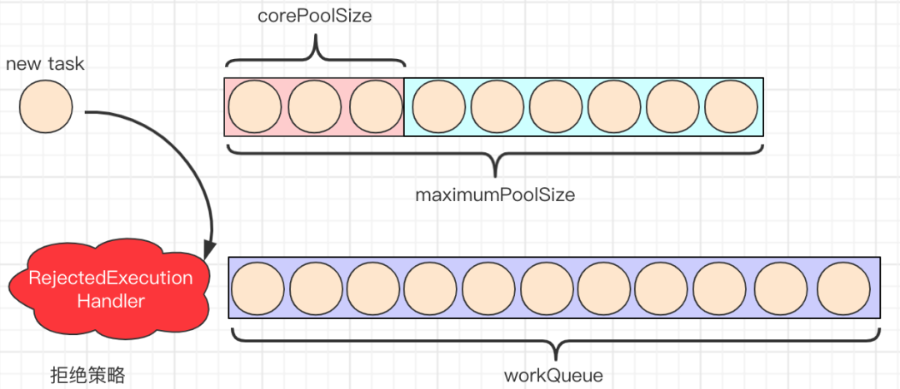

当线程池中线程数超过corePoolSize，并且未配置allowCoreThreadTimeOut=true，空闲时间超过keepAliveTime的线程会被销毁，保持线程池中线程数为corePoolSize。

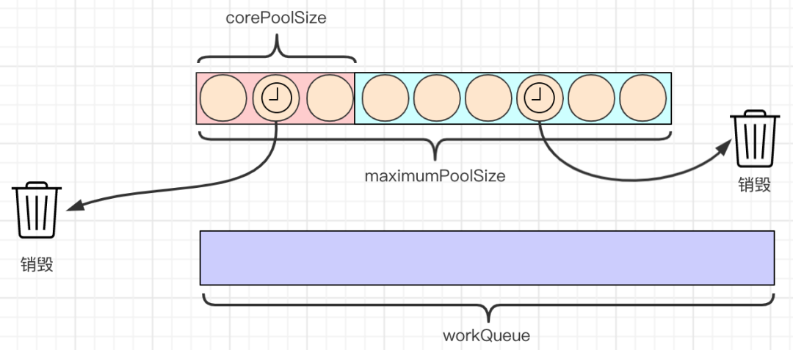

当设置allowCoreThreadTimeOut=true时，任何空闲时间超过keepAliveTime的线程都会被销毁。

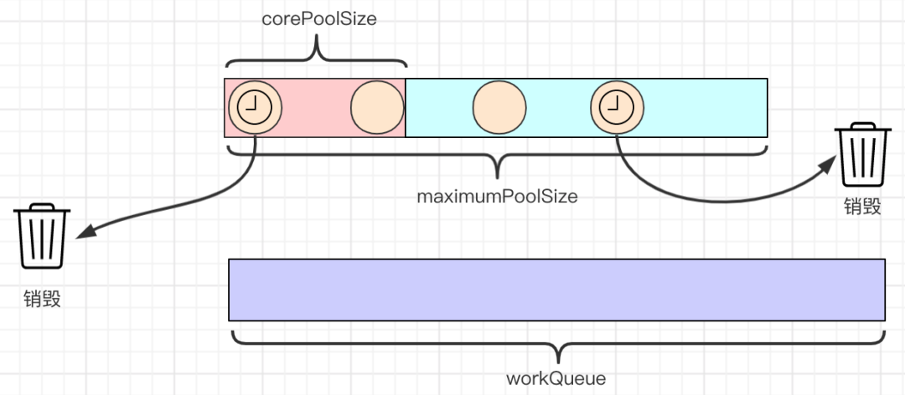

## 线程池底层实现原理

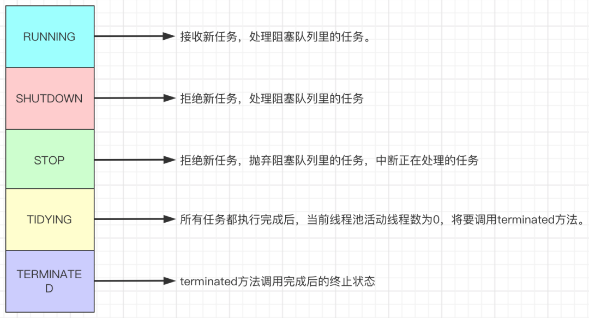

线程池不同状态之间的转换时机及转换关系

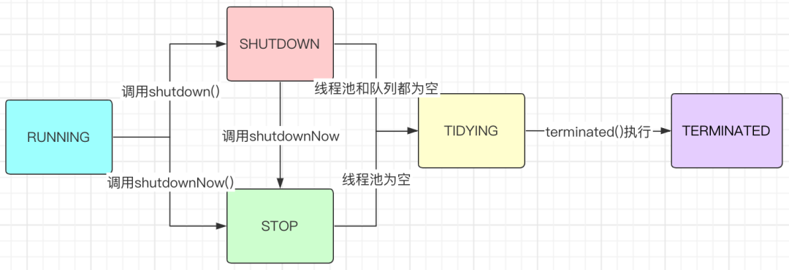

> https://www.cnblogs.com/JavaYuYin/p/18012766
