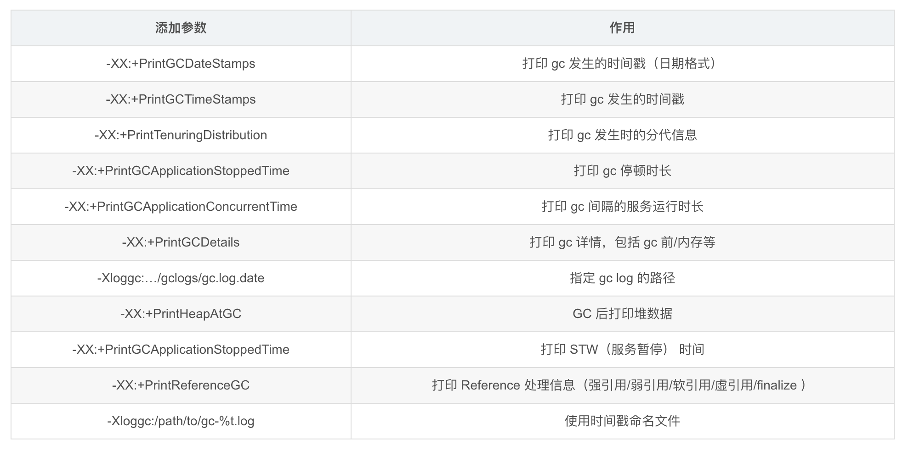

# GC调优

目的：GC时间够少, GC次数够少。

```shell
# 开启简单日志
-XX:+PrintGC
# 详细日志
-XX:+PrintGCDetails
# 开启带时间戳的日志
-XX:+PrintGCTimeStamps
# 日志格式化，时间格式化会有性能损耗，但GC的日志不算很多
XX:+PrintGCDateStamps
# 设置GC日志路径，如果设置的路径并不存在，JVM启动后并不会输出日志
-Xloggc:filename 
# 设置滚动日志
-XX:NumberOfGCLogFiles=N 设置文件数量
-XX:GCLogFileSize=N设置每个GC日志文件大小
```



- 新生代 GC（Minor GC）： 指发生新生代的的垃圾收集动作，Minor GC 非常频繁，回收速度一般也比较快。一般单次耗时 **<** 50ms，频率10秒以上，认为比较健康。

- 老年代 GC（Major GC/Full GC）： 指发生在老年代的 GC，出现了 Major GC 经常会伴随至少一次的 Minor GC（并非绝对），Major GC 的速度一般会比 Minor GC 的慢 10 倍以上。一般单次耗时 **<** 1秒，频率10分钟以上，认为比较健康。

> https://gceasy.io/ GC日志分析

## 性能监控故障处理

CPU 100%：

1. ps -ef | grep 运行的服务名字，直接top命令也可以看到各个进程CPU使用情况
2. top -Hp PID 显示进程PID下所有的线程，定位到消耗CPU最高的线程 top -H -p 特定进程中的线程
3. 将线程ID转换成16进制 printf '%x\n' 
4. jstack 导出进程当前时刻的线程快照到文件
5. 最后用 cat 命令结合 grep 命令对十六进制线程 PID 进行过滤，可以定位到出现问题的代码

## 常规属性

1. -Xms 5m设置JVM初始堆为5M，-Xmx 5m 设置JVM最大堆为5M。-Xms跟-Xmx值一样时可以避免每次垃圾回收完成后JVM重新分配内存

2. -Xmn 2g:设置年轻代大小为2G，一般默认为整个堆区的1/3 ~ 1/4。**-Xss**每个线程栈空间设置
3. -XX:SurvivorRatio，设置年轻代中Eden区与Survivor区的比值，默认=8，比值为8:1:1
4. -XX:+HeapDumpOnOutOfMemoryError： 当JVM发生OOM时，自动生成DUMP文件
5. -XX:PretenureSizeThreshold：当创建的对象超过指定大小时，直接把对象分配在老年代。
6. -XX:MaxTenuringThreshold：设定对象在Survivor区最大年龄阈值，超过阈值转移到老年代，默认15

7. 开启GC日志对性能影响很小且能帮助我们定位问题 -XX:+PrintGCTimeStamps - XX:+PrintGCDetails -Xloggc:gc.log日志位置

##  监控和故障处理工具

- jps 查看所有JAVA进程

- jstat 监视虚拟机各种运行状态信息

- jinfo 实时查看和修改虚拟机参数，不需要重启

- jmap 生成堆转储快照dump

- jhat 分析dump文件

- jstack 生成虚拟机当前时刻的线程快照

## 可视化工具

- Jconsole

- Visual VM 功能的集合，比Jprofiler强太多