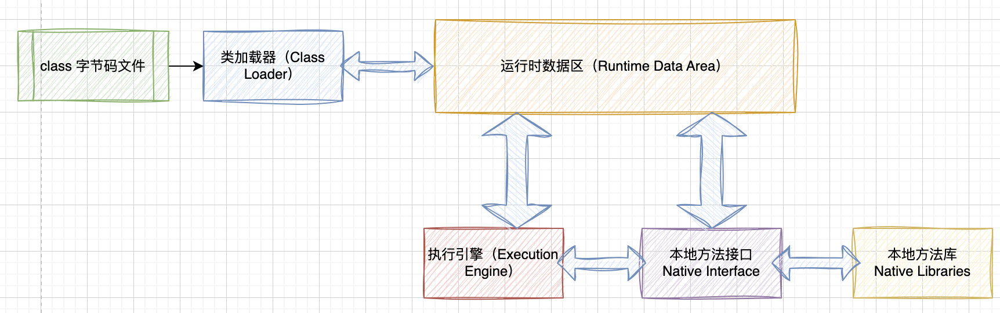
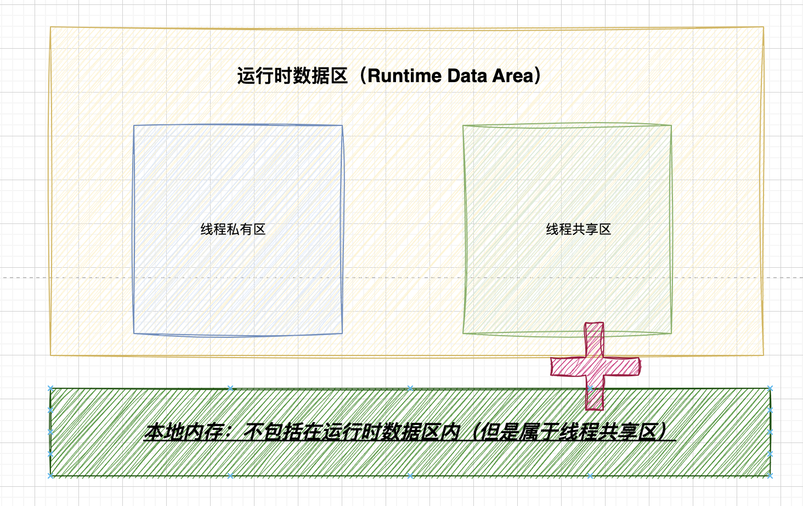
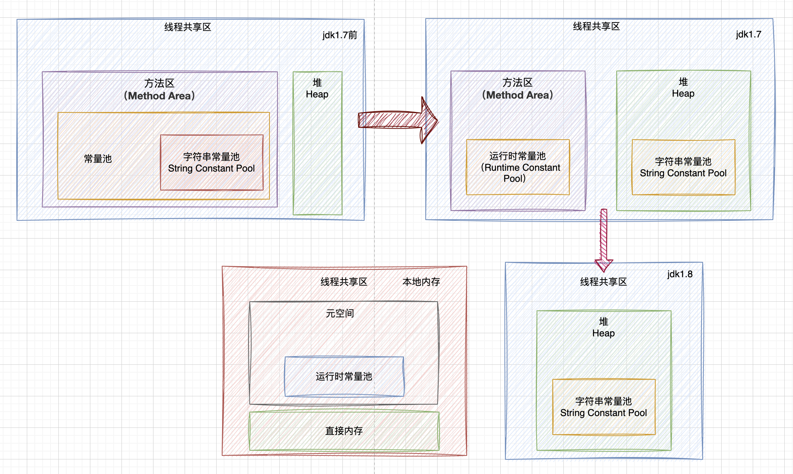
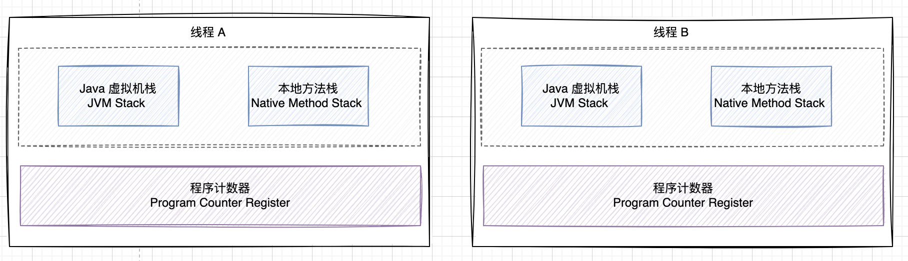
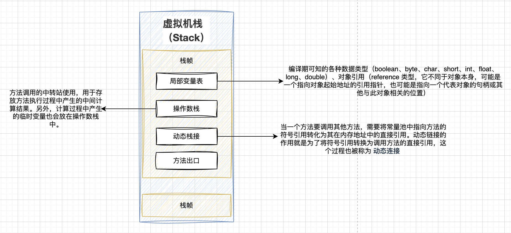

# Java内存布局

JVM在运行Java程序时，会把自身管理的内存分为若干个不同的数据区域，这些区域各自都有各自的用途，同时，不同的区域也有着不同的生命周期，有些区域随着虚拟机的启动而开辟，随着虚拟机的终止而销毁，有的区域则是在运行过程中不断的创建与销毁。

##  **JVM架构**

- **类加载器（Class Loader）**：负责加载字节码文件并将其转换为运行时的类对象。
- **运行时数据区（Runtime Data Area）**：包括方法区、堆、栈、本地方法栈和程序计数器等内存区域，用于存储程序的数据和执行过程中的信息。
- **执行引擎（Execution Engine）**：执行引擎解释或编译字节码，并将其转换为机器代码以执行。

## 运行时数据区域（Runtime Data Area）

运行时数据区域（Runtime Data Area）分为线程私有区、线程共享区两大块。

## 本地内存

1. **本地方法栈（Native Method Stack）**：本地方法栈类似于Java虚拟机中的Java方法栈，但它用于执行本地方法（Native Method）。本地方法栈中存储了本地方法的调用信息、局部变量等。
2. **本地堆（Native Heap）**：本地堆是本地代码使用的动态内存分配区域。与Java虚拟机的堆内存不同，本地堆由操作系统管理，用于存储本地代码创建的对象、数据结构等。
3. **本地直接内存（Direct Native Memory）**：本地直接内存是一种特殊的本地内存，通常通过Java NIO库的ByteBuffer等类来使用。它可以用于高性能I/O操作，因为数据可以直接传输到底层设备，而无需中间的Java堆内存缓冲区。
4. **本地库加载区域**：本地库加载区域用于存储本地库（Native Libraries）的代码和数据。本地库是使用本地编程语言（如C、C++）编写的库，可以通过Java本地接口（JNI）来加载和调用。
5. **其他本地资源**：本地内存还可以包括其他操作系统相关的资源，如文件句柄、网络连接等。

## 线程共享区

线程共享区域是所有线程共同使用的内存区域，用于存储类的信息、静态变量和常量等数据。

- **元空间（Metaspace）**：用于存储类结构信息、常量、静态变量、字节码等数据。
  - 对所有线程都是共享的，因此所有线程可以访问相同的类和类成员。
  - 方法区在Java 8及以后版本中不再称为永久代（PermGen），而是被元空间（Metaspace）取代。
- **堆（Heap）**：用于存储对象实例的内存区域。
  - 堆是用于存储对象实例的内存区域。
  - 所有通过`new`关键字创建的对象都存储在堆上。
  - 每个对象在堆中都有一个引用，引用是线程私有的。
  - 堆是Java虚拟机（JVM）管理的一部分，具有自动内存管理（垃圾回收）功能。
  - 堆的大小可以通过JVM的启动参数进行配置，它通常是Java程序中最大的内存区域之一。

- **字符串常量池（String Constant Pool）**：
  - 字符串常量池是用于存储字符串字面量（如`"Hello, World!"`）的特殊区域。
  - 字符串常量池的目的是提高字符串的重用性和性能。
- **运行时常量池（Runtime Constant Pool）**：
  - 运行时常量池是每个类或接口的一部分，用于存储编译时生成的字面常量、符号引用等信息。
  - 它在类加载时被创建，包含了一些在编译期已知的常量，以及一些在运行时生成的常量。
  - 运行时常量池通常位于方法区（在Java 7之前）或元空间（在Java 8及以后）中。

### 方法区（Method Area）替换为元空间（Metaspace）

JDK 1.8（Java 8）中将方法区（Method Area）替换为元空间（Metaspace）并将其移到本地内存的主要原因是为了解决一些与方法区相关的问题和限制，以提高Java应用程序的稳定性和性能。

1. **永久代（PermGen）的问题**：在JDK 1.7及之前的版本中，方法区通常实现为永久代。永久代有一些问题，包括固定大小难以调整、容易引发内存溢出错误、难以垃圾回收等。这些问题导致了应用程序在一些情况下可能会因为永久代的内存限制而崩溃。
2. **更灵活的内存管理**：元空间采用了更灵活的内存管理方式。它不再受到固定大小的限制，而是可以根据需要动态分配内存。这意味着应用程序在使用元空间时更容易适应不同的工作负载，而不会受到永久代大小的限制。
3. **性能优化**：元空间的内存管理与JVM的垃圾回收机制相分离，因此不再需要频繁的垃圾回收操作。这有助于减轻垃圾回收的压力，提高应用程序的性能。
4. **简化内存模型**：使用元空间简化了Java虚拟机的内存模型，将内存管理的责任转移到了操作系统层面，减少了Java虚拟机内部的复杂性。
5. **支持更大的内存**：由于元空间的灵活性，Java应用程序可以更轻松地处理需要大量类加载的情况，而不会受到永久代的限制。

## 线程私有区

对于每条线程而言，在创建它们时，JVM都会为它们分配的区域，这些内存区域的生命周期会随着线程的启动、死亡而创建和销毁。这些区域创建后，其他线程是不可见的，只有当前线程自身可以访问。

运行时数据区中的线程私有区域主要包含：程序计数器、虚拟机栈以及本地方法栈。

1. **Java虚拟机栈（JVM Stack）**：每个线程都有自己的Java虚拟机栈，用于存储方法的局部变量、操作数栈、方法出口等信息。栈帧（Stack Frame）是栈中的基本单元，每个方法在被调用时都会创建一个栈帧。栈中的数据仅在方法的执行期间可见，并且在方法返回时被销毁。
2. **本地方法栈（Native Method Stack）**：本地方法栈与Java虚拟机栈类似，但它用于执行本地方法（Native Method），这些方法是用本地编程语言（如C、C++）编写的。本地方法栈也是线程私有的，用于存储本地方法的局部变量和操作数栈。
3. **程序计数器（Program Counter）**：每个线程都有一个程序计数器，用于记录当前线程正在执行的字节码指令的地址或索引。程序计数器是线程私有的，用于支持线程切换和方法调用。

### 程序计数器（Progran Counter Register）

描述：

1. 程序计数器是JVM为每条线程开辟的一块较小的区域，每条线程都有且只有一个程序计数器，线程之间不相互干扰。
2. 生命周期与线程一致，随线程启动而生，线程销毁而亡。
3. 同时也是JVM所有内存区域中唯一不会发生OOM（`OutOfMemoryError`/内存溢出）的区域，GC机制不会触及的区域。

主要作用：

1. 作为当前线程执行时的字节码行号指示器来使用的，当线程执行一个Java方法时，记录线程正在执行的字节码指令地址，当执行引擎处理完某个指令后，程序计数器需要进行对应更新，将指针改向下一条要执行的指令地址，执行引擎会根据PC计数器中记录的地址进行对应的指令执行。当线程在执行一些由C/C++编写的Native方法时，PC计数器中则为空（Undefined）。
2. 可以保证线程发生CPU时间片切换后能恢复到正确的位置执行。

### 虚拟机栈（Stack）

虚拟机栈也被称为Java栈，在JVM的内存区域中，栈主要是作为运行时执行的单位，栈的作用是负责程序运行时具体如何执行、如何处理数据等工作。生命周期与线程一致，每个线程创建时都会为之创建一个虚拟机栈。

当线程在执行一个Java方法时，都会为执行的方法生产一个栈帧（Stack Frame），每个Java方法的调用到执行结束，对应着虚拟机栈中的一个栈帧的从入栈到出栈的过程，一个栈帧需要分配多大的内存空间，在编译器就已经确定了，不会受到运行时变量数据的大小影响。对于执行引擎而言，它只会对位于栈顶的栈帧元素（被称为当前栈帧）进行操作，与当前栈帧关联的方法被称为当前方法。

一个栈帧中主要包含局部变量表、操作数栈、动态链接、方法出口等信息。

> https://juejin.cn/post/7057538798686568461
>
> https://javaguide.cn/java/jvm/memory-area.html#%E8%BF%90%E8%A1%8C%E6%97%B6%E6%95%B0%E6%8D%AE%E5%8C%BA%E5%9F%9F
>
> https://javaguide.cn/java/jvm/memory-area.html