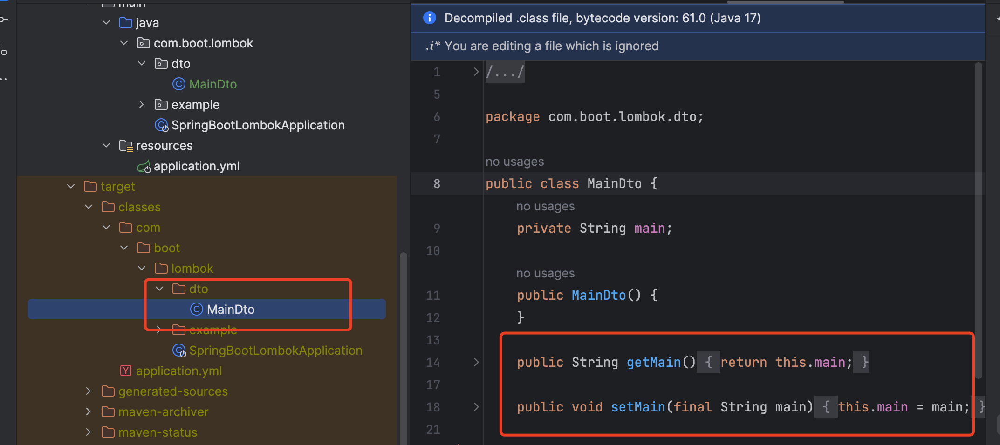
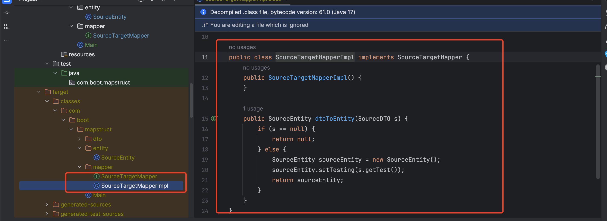
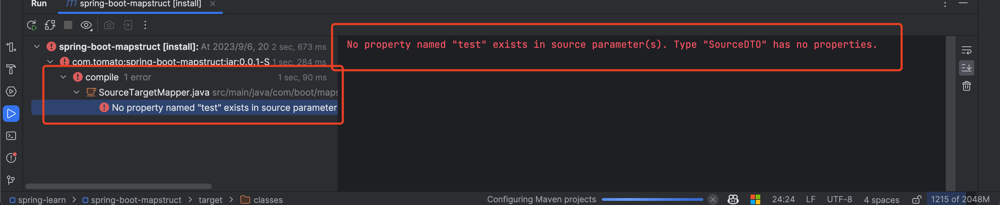
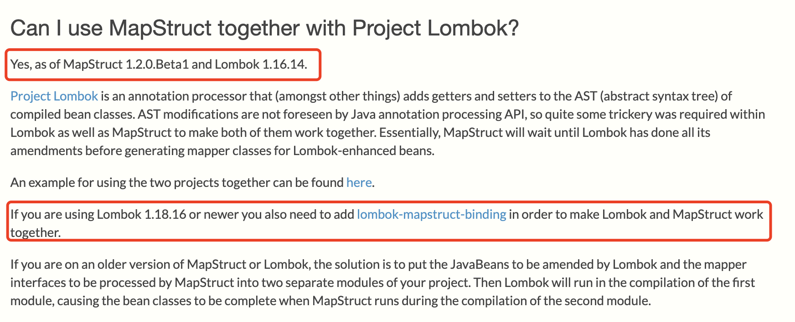

# MapStruct和lombok

项目地址：
https://github.com/mapstruct/mapstruct

示例代码位置：

[spring-learn/spring-boot-mapstruct at main · lizhifuabc/spring-learn (github.com)](https://github.com/lizhifuabc/spring-learn/tree/main/spring-boot-mapstruct)

## 正常使用 lombok

## 使用 MapStruct

## 单纯 pom 引入 MapStruct 和 lombok

## 冲突原因

摘自官网：[Frequently Asked Questions (FAQ) – MapStruct](https://mapstruct.org/faq/#Can-I-use-MapStruct-together-with-Project-Lombok)

> 我可以将MapStruct与Project Lombok一起使用吗？
>
> 是，自MapStruct 1.2.0.Beta1和Lombok 1.16.14起。
>
> Lombok是一个注解处理器，它可以（除了其他事情之外）在编译后的bean类的AST（抽象语法树）中添加getter和setter方法。Java注解处理API无法预见AST的修改，因此Lombok和MapStruct需要一些技巧来使它们一起工作。基本上，MapStruct会等待Lombok完成所有的修改，然后再为增强的bean生成映射器类。
>
> 这里有一个将这两个项目一起使用的例子。[mapstruct-examples/mapstruct-lombok at main · mapstruct/mapstruct-examples (github.com)](https://github.com/mapstruct/mapstruct-examples/tree/main/mapstruct-lombok)
>
> 如果你使用的是Lombok 1.18.16或更新的版本，你还需要添加lombok-mapstruct-binding，以使Lombok和MapStruct一起工作。
>
> 如果你使用的是较旧版本的MapStruct或Lombok，解决方案是将由Lombok修改的JavaBeans和由MapStruct处理的映射器接口放在项目的两个单独模块中。然后，在第一个模块的编译过程中运行Lombok，导致在第二个模块的编译过程中运行MapStruct时bean类已经完成。

1. 字节码增强导致的冲突MapStruct 和 Lombok 都会通过字节码增强的方式为类添加新的代码逻辑。如果增强逻辑顺序不当,会导致冲突。
2. 访问修饰符处理不同Lombok 会修改类、方法的访问修饰符,而 MapStruct 生成的代码需要按原有的访问修饰符执行。这会产生冲突。
3. 注解处理顺序异常两者都需要处理注解,如果处理顺序不正确,会导致注解被覆盖从而引发问题。
4. 默认构造函数处理不一致 Lombok 会生成默认构造函数,而 MapStruct 需要按原有的构造函数生成代码。这会产生冲突。
5. 对静态方法的处理差异两者在处理静态方法时,生成代码的方式会有差异,从而导致冲突。

## 解析

lombok-mapstruct-binding 的作用：

主要功能是:

1. 调整 MapStruct 和 Lombok 的字节码增强顺序,使其不再发生冲突。
2. 将 MapStruct 的代码生成顺序放在 Lombok 之后,以确保 Lombok 的修改可见。 
3. 为 MapStruct 生成的代码添加必要的 Lombok 注解,保证一致性。
4. 处理访问修饰符、构造函数等可能的差异,减少冲突。
5. 提供了额外的注解,用于标注需要特殊处理的类和属性。

通过使用 lombok-mapstruct-binding,可以 peaceful 地在一个项目中同时使用 MapStruct 和 Lombok,而不会出现冲突问题。它探测项目的依赖变化,自动调整 MapStruct 和 Lombok 的字节码增强顺序,从而实现冲突消除。

