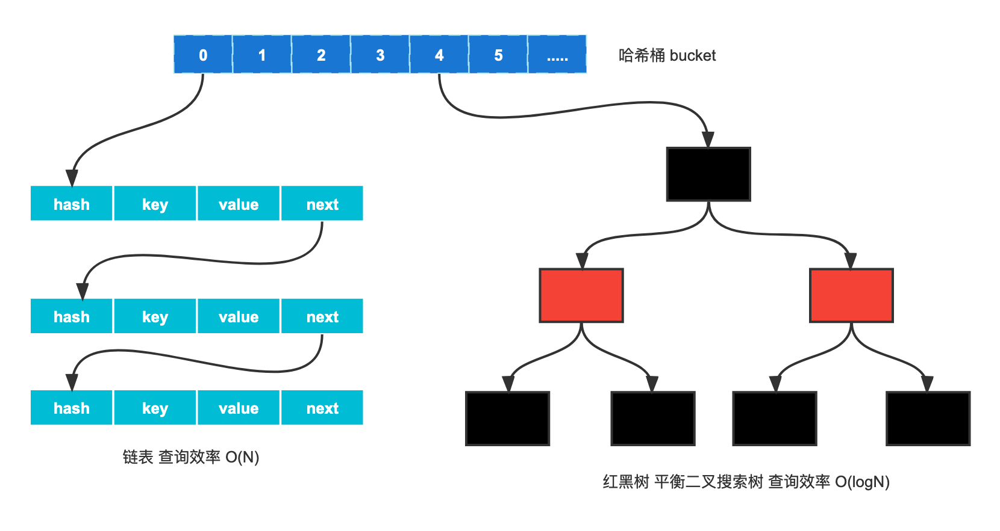

# HashMap

Java HashMap底层数据结构、方法实现原理等，基于JDK 1.8。

## 主要属性

```java
    /**
     * The default initial capacity - MUST be a power of two.
     *
     * 数组默认的初始化长度16 - 一定是二的幂
     */
    static final int DEFAULT_INITIAL_CAPACITY = 1 << 4; // aka 16

    /**
     * The maximum capacity, used if a higher value is implicitly specified
     * by either of the constructors with arguments.
     * MUST be a power of two <= 1<<30.
     *
     * 数组最大容量，2的30次幂，即1073741824 - 一定是二的幂
     */
    static final int MAXIMUM_CAPACITY = 1 << 30;

    /**
     * The load factor used when none specified in constructor.
     *
     * 默认加载因子值
     */
    static final float DEFAULT_LOAD_FACTOR = 0.75f;

    /**
     * The bin count threshold for using a tree rather than list for a
     * bin.  Bins are converted to trees when adding an element to a
     * bin with at least this many nodes. The value must be greater
     * than 2 and should be at least 8 to mesh with assumptions in
     * tree removal about conversion back to plain bins upon
     * shrinkage.
     *
     * 链表转换为红黑树的长度阈值
     */
    static final int TREEIFY_THRESHOLD = 8;

    /**
     * The bin count threshold for untreeifying a (split) bin during a
     * resize operation. Should be less than TREEIFY_THRESHOLD, and at
     * most 6 to mesh with shrinkage detection under removal.
     *
     * 红黑树转换为链表的长度阈值
     */
    static final int UNTREEIFY_THRESHOLD = 6;

    /**
     * The smallest table capacity for which bins may be treeified.
     * (Otherwise the table is resized if too many nodes in a bin.)
     * Should be at least 4 * TREEIFY_THRESHOLD to avoid conflicts
     * between resizing and treeification thresholds.
     *
     * 链表转换为红黑树时，数组容量必须大于等于64
     */
    static final int MIN_TREEIFY_CAPACITY = 64;
```


## 底层数据结构

Java HashMap底层采用哈希表结构（数组+链表、JDK1.8后为数组+链表或红黑树）实现，结合了数组和链表的优点：

- 数组：通过数组下标可以快速实现对数组元素的访问，效率极高；

- 链表：插入或删除数据不需要移动元素，只需修改节点引用，效率极高。



HashMap内部使用数组存储数据，数组中的每个元素类型为`Node<K,V>`

```java
    /**
     * Basic hash bin node, used for most entries.  (See below for
     * TreeNode subclass, and in LinkedHashMap for its Entry subclass.)
     */
    static class Node<K,V> implements Map.Entry<K,V> {
        final int hash;
        final K key;
        V value;
        Node<K,V> next;

        Node(int hash, K key, V value, Node<K,V> next) {
            this.hash = hash;
            this.key = key;
            this.value = value;
            this.next = next;
        }

        public final K getKey()        { return key; }
        public final V getValue()      { return value; }
        public final String toString() { return key + "=" + value; }

        public final int hashCode() {
            return Objects.hashCode(key) ^ Objects.hashCode(value);
        }

        public final V setValue(V newValue) {
            V oldValue = value;
            value = newValue;
            return oldValue;
        }

        public final boolean equals(Object o) {
            if (o == this)
                return true;
            if (o instanceof Map.Entry) {
                Map.Entry<?,?> e = (Map.Entry<?,?>)o;
                if (Objects.equals(key, e.getKey()) &&
                    Objects.equals(value, e.getValue()))
                    return true;
            }
            return false;
        }
    }

```

