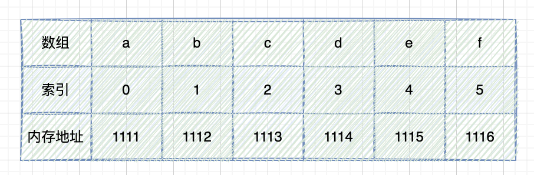
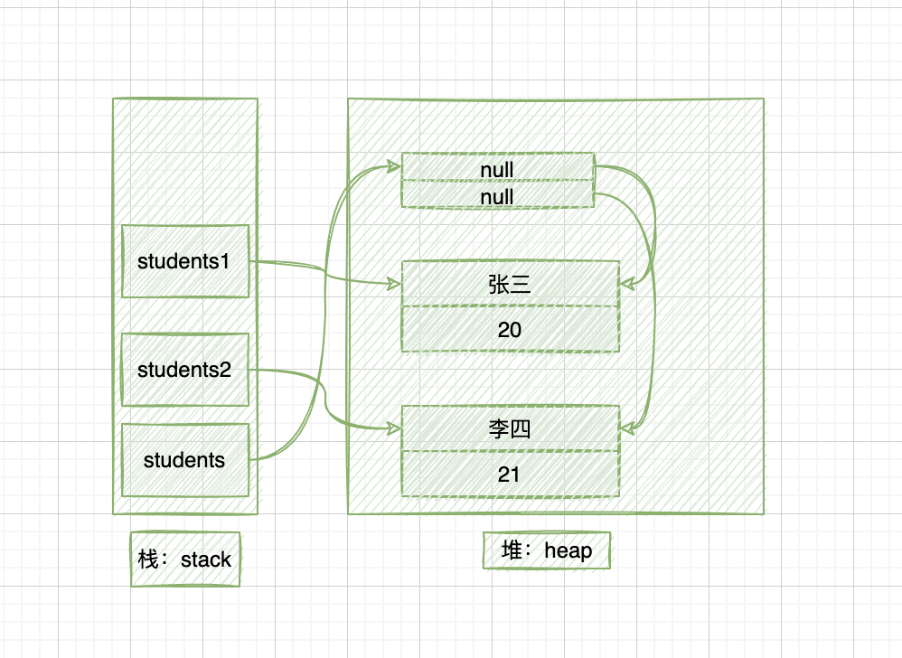

# 数组

初始化：

```java
public class ArrayDemo {
    public static void main(String[] args) {
        // 静态初始化
        String[] names = new String[]{"张三","李四","王五","赵六"};

        // 动态初始化：指定数组长度
        String[] strArr = new String[5];

        // 拆分初始化
        int[] nums = new int[]{1, 2, 3, 4, 5};
        int[] arr;
        arr = nums;
    }
}
```

备注：

1. 对于数组对象来说，必须初始化，也就是为该数组对象分配一块**连续的内存空间**。

   

2. 连续内存空间的长度就是数组对象的长度。

3. 对于数组变量来说，不需要进行初始化，只需让其指向一个有效的数组对象就可以。

4. 实际上，所有引用类型的变量，其变量本身不需要任何初始化，需要初始化的是它所引用的对象。

所有的局部变量都保存在栈内存中，不管是基本类型还是引用类型，局部变量都保存在各自的方法栈中。

例子：

```java
public class StudentDemo {
    public static void main(String[] args) {
        Student[] students = new Student[2];
        Student student1 = new Student("张三", 20);
        Student student2 = new Student("李四", 21);
        students[0] = student1;
        students[1] = student2;
    }
}
```

