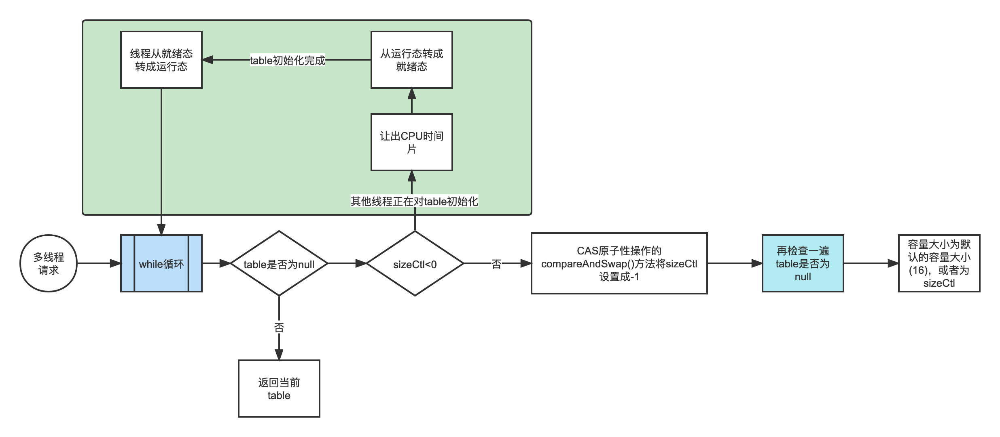

# ConcurrentHashMap初始化initTable()

ConcurrentHashMap 在多线程下是线程安全的，table初始化时会有多个线程会去执行initTable()方法尝试初始化table，而put和initTable都是没有加锁的(synchronize)，通过源码可以看得出，table的初始化只能由一个线程完成，但是每个线程都可以争抢去初始化table。

## 基础概念

 Thread.yield()：让当前处于运行状态下的线程转入就绪状态，运行状态下的线程 调用Thread.yield()进入就绪状态后，和其它就绪状态线程处于同一起跑线，也有可能被立即再次被调用；

## 初始化流程



核心流程：

1. table不为null，如果table初始化好了，那么该线程结束该方法返回。

2. table为null且sizeCtl小于0(其他线程正在对table初始化)，那么该线程调用Thread.yield()挂起该线程，让出CPU时间，直到其他线程已经初始化table，线程从就绪态转成运行态，如果table仍然为null，则继续while循环。

3. table为null且sizeCtl不小于0，CAS原子性操作的compareAndSwap()方法将sizeCtl设置成-1(正在初始化table)。如果设置成功，则再次判断table是否为空，不为空则初始化table，容量大小为默认的容量大小(16)，或者为sizeCtl。

   sizeCtl的初始化是在构造函数中进行的，sizeCtl = ((传入的容量大小 + 传入的容量大小无符号右移1位 + 1)的结果向上取最近的2幂次方)

源码注释：

```java
private final Node<K,V>[] initTable() {
    Node<K,V>[] tab; int sc;
    // 每次循环都获取最新的Node数组引用
    // 如果table为null或者长度为0，则一直循环试图初始化table
    while ((tab = table) == null || tab.length == 0) {
        //sizeCtl是一个标记位，若为-1也就是小于0，代表有线程在进行初始化工作了
        if ((sc = sizeCtl) < 0)
            // 执行Thread.yield()将当前线程挂起，让出CPU时间片
            Thread.yield(); // lost initialization race; just spin
        // CAS操作，将本实例的sizeCtl变量设置为-1，表示本线程正在进行初始化
        else if (U.compareAndSwapInt(this, SIZECTL, sc, -1)) {
            // 如果CAS操作成功了，代表本线程将负责初始化工作
            try {
                // 再检查一遍数组是否为空
                // 在while和compareAndSwapInt之间其他人已经成功的情况下。
                if ((tab = table) == null || tab.length == 0) {
                    //在初始化Map时，sizeCtl代表数组大小，默认16
                    //所以此时n默认为16
                    int n = (sc > 0) ? sc : DEFAULT_CAPACITY;
                    //Node数组
                    @SuppressWarnings("unchecked")
                    Node<K,V>[] nt = (Node<K,V>[])new Node<?,?>[n];
                    //将其赋值给table变量
                    table = tab = nt;
                    //通过位运算，n减去n二进制右移2位，相当于乘以0.75
                    //例如16经过运算为12，与乘0.75一样，只不过位运算更快
                    sc = n - (n >>> 2);
                }
            } finally {
                //将计算后的sc（12）直接赋值给sizeCtl，表示达到12长度就扩容
                //由于这里只会有一个线程在执行，直接赋值即可，没有线程安全问题
                //只需要保证可见性
                sizeCtl = sc;
            }
            break;
        }
    }
    return tab;
}
```

# 双重检测

1. 一个新的Map，table为null，
2. 线程A 进入initTable方法，发现table为null
3. 线程B 进入initTable方法，发现table为null
4. 线程A线程CAS成功，进入初始化，B线程让出CPU时间，线程A初始化结束，sizeCtl值位12
5. 线程B重新获得CPU时间，由于sizeCtl=12，B线程CAS成功会再次进行初始化。