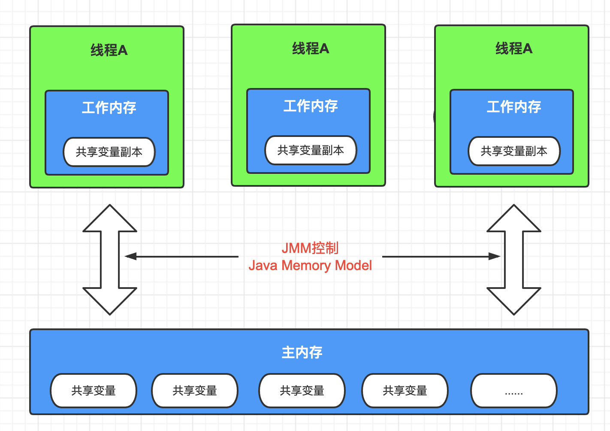
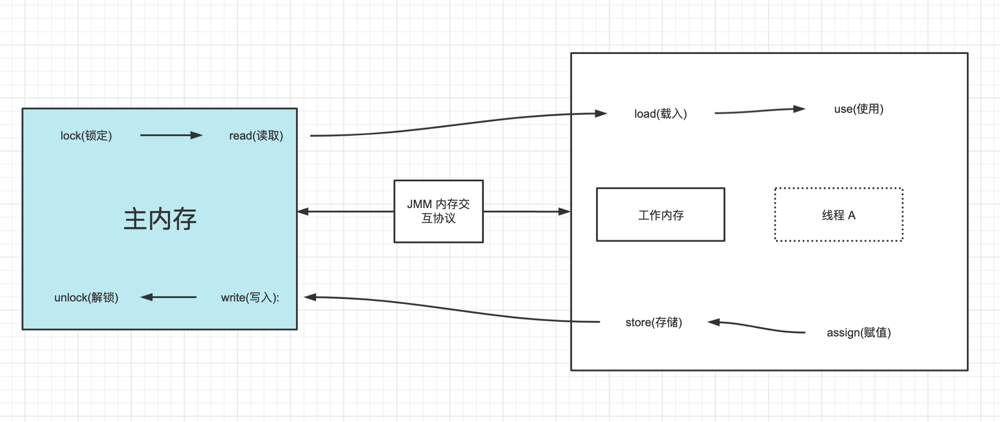

# JMM

**Java内存模型**（Java Memory Model，JMM）

Java虚拟机规范定义的，用来屏蔽掉Java程序在各种不同的硬件和操作系统对内存的访问的差异。

**Java内存区域**

 JVM运行时将数据分区域存储 ，简单的说就是不同的数据放在不同的地方。通常又叫 **运行时数据区域**。

## 内存交互

- **lock(锁定)**:作用于主内存的变量，一个变量在同一时间只能一个线程锁定，该操作表示这条线程独占这个变量
- **unlock(解锁)**:作用于主内存的变量，表示这个变量的状态由处于锁定状态被释放，这样其他线程才能对该变量进行锁定
- **read(读取)**:作用于主内存变量，表示把一个主内存变量的值传输到线程的工作内存，以便随后的load操作使用
- **load(载入)**:作用于线程的工作内存的变量，表示把read操作从主内存中读取的变量的值放到工作内存的变量副本中(副本是相对于主内存的变量而言的)
- **use(使用)**:作用于线程的工作内存中的变量，表示把工作内存中的一个变量的值传递给执行引擎，每当虚拟机遇到一个需要使用变量的值的字节码指令时就会执行该操作
- **assign(赋值)**:作用于线程的工作内存的变量，表示把执行引擎返回的结果赋值给工作内存中的变量，每当虚拟机遇到一个给变量赋值的字节码指令时就会执行该操作
- **store(存储)**:作用于线程的工作内存中的变量，把工作内存中的一个变量的值传递给主内存，以便随后的write操作使用
- **write(写入)**:作用于主内存的变量，把store操作从工作内存中得到的变量的值放入主内存的变量中。
