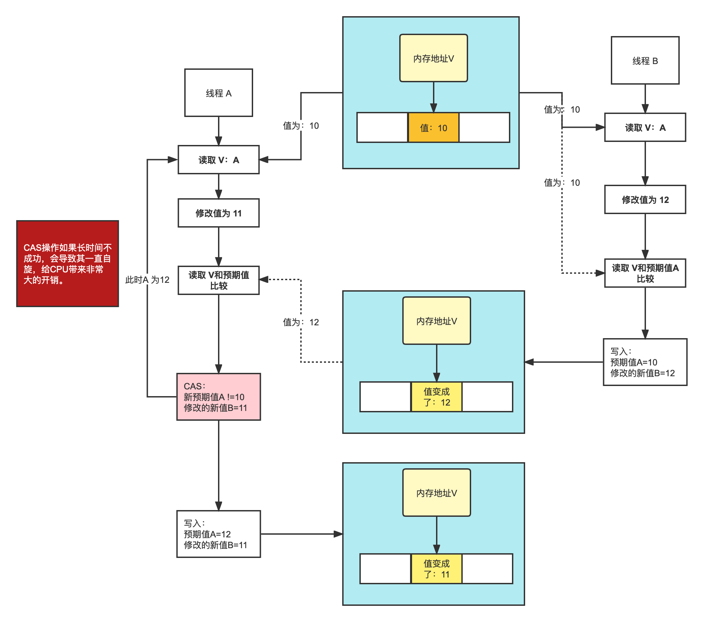
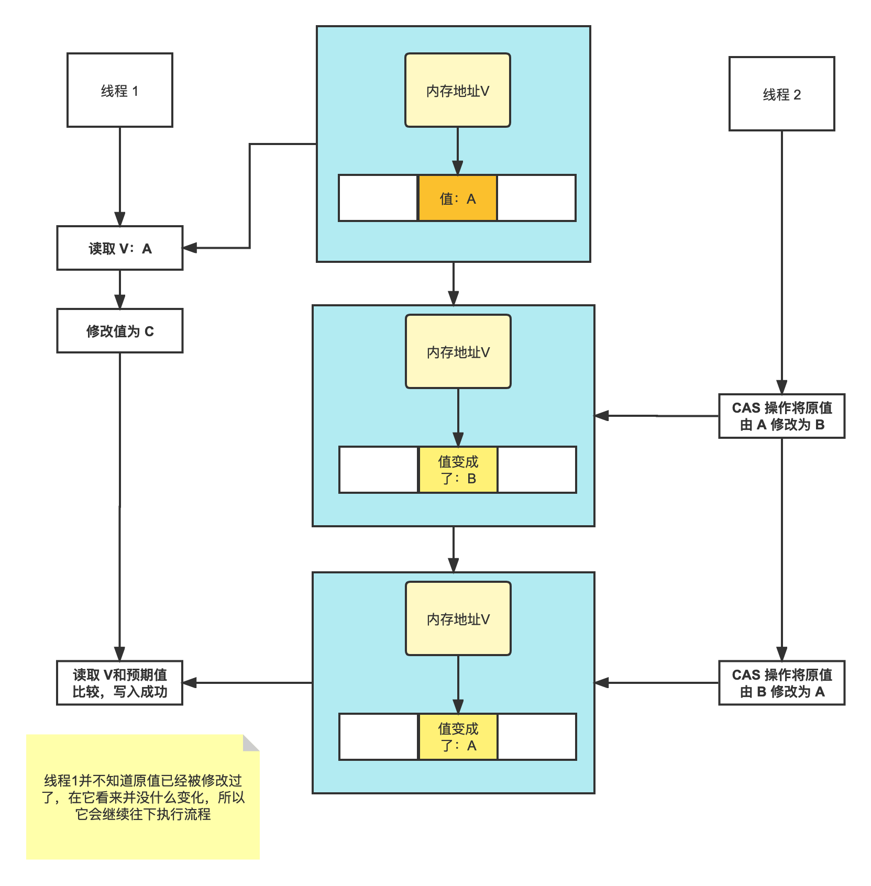

# CAS

CAS全称 Compare And Swap（⽐较与交换），是⼀种⽆锁算法。在不使⽤锁（没有线程被阻塞）的情况下实现多线程之间的变量java.util.concurrent包中的原⼦类就是通过CAS来实现了乐观锁。 

- 内存地址V。
- 旧的预期值A。
- 要写⼊的新值 B。

当且仅当 V 的值等于 A 时，CAS通过原⼦⽅式⽤新值B来更新V的值（⽐较+更新整体是⼀个原⼦操作），否则不会执⾏任何操作。⼀般情况下，更新是⼀个不断重试的操作。 

**CAS的核心**是在将B值写入到V之前要比较A值和V值是否相同，如果不相同证明此时V值已经被其他线程改变，重新将V值赋给A，并重新计算得到B，如果相同，则将B值赋给V。

问题：

1. 循环时间⻓开销⼤。CAS操作如果⻓时间不成功，会导致其⼀直⾃旋，给CPU带来⾮常⼤的开销。

2. 只能保证⼀个共享变量的原⼦操作。对⼀个共享变量执⾏操作时，CAS能够保证原⼦操作，但是对多个共享变量操作时，CAS是⽆法保证操作的原⼦性的。

    Java从1.5开始JDK提供了AtomicReference类来保证引⽤对象之间的原⼦性，可以把多个变量放在⼀个对象⾥来进⾏CAS操作。

## ABA问题

1. 线程1执行读取操作，获取原值 A
2. 线程2执行完成 CAS 操作将原值由 A 修改为 B 
3. 线程2再次执行 CAS 操作，并将原值由 B 修改为 A 
4. 线程1将比较值（compareValue）与原值（oldValue）进行比较，发现两个值相等。 然后用新值（newValue）写入内存中，完成 CAS 操作

如上流程，线程1并不知道原值已经被修改过了，在它看来并没什么变化，所以它会继续往下执行流程。对于 ABA 问题，通常的处理措施是对每一次 CAS 操作设置版本号。

JDK从1.5开始提供了AtomicStampedReference类来解决ABA问题，具体操作封装在compareAndSet()中。compareAndSet()⾸先检查当前引⽤和当前标志与预 期引⽤和预期标志是否相等，如果都相等，则以原⼦⽅式将引⽤值和标志的值设置为给定的更新值。