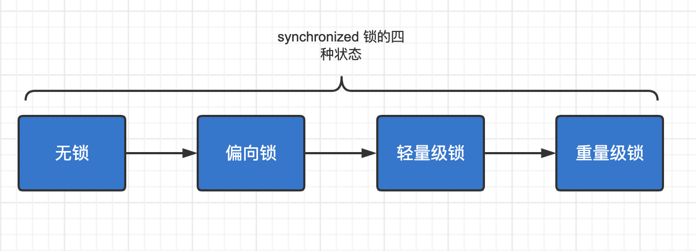

# synchronized

## Java对象头

synchronized是悲观锁，在操作同步资源之前需要给同步资源先加锁，这把锁就是存在Java对象头⾥的。

Hotspot虚拟机：

Mark Word（标记字段）：

默认存储对象的HashCode，分代年龄和锁标志位信息。这些信息都是与对象⾃身定义⽆关的数据，所以Mark Word被设计成⼀个⾮固定的数据结构以便在极⼩的空间内存存储尽量多的数据。它会根据对象的状态复⽤⾃⼰的存储空间，也就是说在运⾏期间Mark Word⾥存储 的数据会随着锁标志位的变化⽽变化。 

Klass Pointer（类型指针）：

对象指向它的类元数据的指针，虚拟机通过这个指针来确定这个对象是哪个类的实例。

 

## monitor

TODO