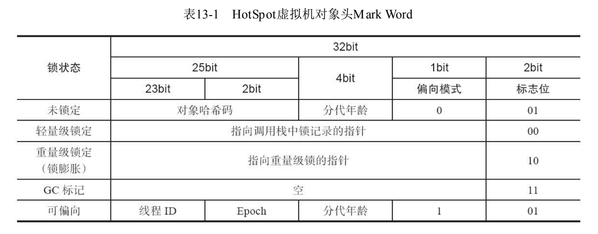

# synchronized

锁状态只能升级不能降级。

结论：

1. 偏向锁：通过对⽐Mark Word解决加锁问题，避免执⾏CAS操作。

2. 轻量级锁：通过⽤CAS操作和⾃旋来解决加锁问题，避免线程阻塞和唤醒⽽影响性能。
3. 重量级锁是将除了拥有锁的线程以外的线程都阻塞。

## Java对象头

synchronized是悲观锁，在操作同步资源之前需要给同步资源先加锁，这把锁就是存在Java对象头⾥的。

Hotspot虚拟机：

Mark Word（标记字段）：

默认存储对象的HashCode，分代年龄和锁标志位信息。这些信息都是与对象⾃身定义⽆关的数据，所以Mark Word被设计成⼀个⾮固定的数据结构以便在极⼩的空间内存存储尽量多的数据。它会根据对象的状态复⽤⾃⼰的存储空间，也就是说在运⾏期间Mark Word⾥存储 的数据会随着锁标志位的变化⽽变化。 

Klass Pointer（类型指针）：

对象指向它的类元数据的指针，虚拟机通过这个指针来确定这个对象是哪个类的实例。

 

## monitor

Monitor可以理解为⼀个同步⼯具或⼀种同步机制，通常被描述为⼀个对象。每⼀个Java对象就有⼀把看不⻅的锁，称为内部锁或者Monitor锁。 

Monitor是线程私有的数据结构，每⼀个线程都有⼀个可⽤monitor record列表，同时还有⼀个全局的可⽤列表。每⼀个被锁住的对象都会和⼀个 monitor关联，同时monitor中有⼀个Owner字段存放拥有该锁的线程的唯⼀标识，表示该锁被这个线程占⽤。 

synchronized通过Monitor来实现线程同步，Monitor是依赖于底层的操作系统的Mutex Lock（互斥锁）来实现的线程同步。

## 偏向锁

偏向锁是指⼀段同步代码⼀直被⼀个线程所访问，那么该线程会⾃动获取锁，降低获取锁的代价。

在⼤多数情况下，锁总是由同⼀线程多次获得，不存在多线程竞争，所以出现了偏向锁。其⽬标就是在只有⼀个线程执⾏同步代码块时能够提⾼性能。 

1. ⼀个线程访问同步代码块并获取锁时，会在Mark Word⾥存储锁偏向的线程ID。
2. 在线程进⼊和退出同步块时不再通过CAS操作来加锁和解锁，⽽是检测Mark Word⾥是否存储着指向当前线程的偏向锁。
3. 偏向锁只需要在置换ThreadID的时候依赖⼀次CAS原⼦指令即可。
4. 偏向锁只有遇到其他线程尝试竞争偏向锁时，持有偏向锁的线程才会释放锁，线程不会主动释放偏向锁。
5. 偏向锁的撤销，需要等待全局安全点（在这个时间点上没有字节码正在执⾏），它会⾸先暂停拥有偏向锁的线程，判断锁对象是否处于被锁定状态。撤销偏向锁后恢复到⽆锁（标志位为 01）或轻量级锁（标志位为00）的状态

-XX:-UseBiasedLocking=false 禁止锁优化

## 轻量级锁和重量级锁

是指当锁是偏向锁的时候，被另外的线程所访问，偏向锁就会升级为轻量级锁，其他线程会通过⾃旋的形式尝试获取锁，不会阻塞，从⽽提⾼性能。

1. 在代码进⼊同步块的时候，如果同步对象锁状态为⽆锁状态（锁标志位为01)状态，是否为偏向锁为(0)，虚拟机⾸先将在当前线程的栈帧中建⽴⼀个名为锁记录（Lock Record）的空间，⽤于存储锁对象⽬前的Mark Word的拷⻉，然后拷⻉对象头中的Mark Word复制到锁记录中。

2. 虚拟机将使⽤CAS操作尝试将对象的Mark Word更新为指向Lock Record的指针，并将Lock Record⾥的owner指针指向对象的 

   Mark Word。

3. 更新成功，对象Mark Word的锁标志位设置为 00，表示此对象处于轻量级锁定状态。
4. 如果轻量级锁的更新操作失败了，虚拟机⾸先会检查对象的Mark Word是否指向当前线程的栈帧，如果是就说明当前线程已经拥有了这个对象的锁，那就可以直接进⼊同步块继续执⾏，否则说明多个线程竞争锁.
5. 若当前只有⼀个等待线程，则该线程通过⾃旋进⾏等待。但是当⾃旋超过⼀定的次数，或者⼀个线程在持有锁，⼀个在⾃旋，⼜有第三个来访时，轻量级锁升级为重量级锁
6. 升级为重量级锁时，锁标志的状态值变为 10，此时Mark Word中存储的是指向重量级锁的指针，此时等待锁的线程都会进⼊阻塞状态。

