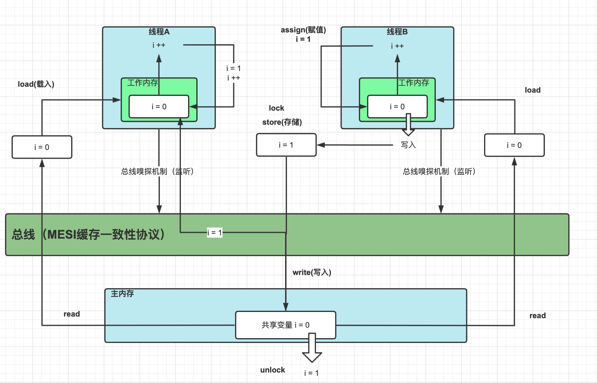

# volatile

Volatile缓存可见性实现原理：
底层实现主要是通过汇编lock前缀指令，它会锁定这块内存区域的缓存（缓存行锁定）并回写到主内存。

lock指令的解释：

1. 会将当前处理器缓存行的数据立即写回到系统内存。
2. 这个写回內存的操作会引起在其他CPU里缓存了该内存地址的数据无效(MESI)




- 可见性，当一条线程修改了这个变量的值，新值对于其他线程来说是可以立即得知。普通变量的值在线程间传递时均需要通过主内存来完成。
- 禁止指令重排序优化

使用场景：

- 运算结果并不依赖变量的当前值，或者能够确保只有单一的线程修改变量的值。

- 变量不需要与其他的状态变量共同参与不变约束。 

# 为什么不保障原子性

```java
public class VolatileTest {
    public static volatile int race = 0;
    private static final int THREADS_COUNT = 20;

    /**
     * race 自增
     */
    public static void increase() {
        race++;
    }

    public static void main(String[] args) {
        // 线程数组
        Thread[] threads = new Thread[THREADS_COUNT];
        // 创建线程
        for (int i = 0; i < THREADS_COUNT; i++) {
            threads[i] = new Thread(new Runnable() {
                @Override
                public void run() {
                    for (int j = 0; j < 100; j++) {
                        increase();
                    }
                }
            });
            // 执行
            threads[i].start();
        }
        //  等待所有累加线程都结束
        while (Thread.activeCount() > 1){
            Thread.yield();
        }
        System.out.println(race);
    }
}
```

多次执行结果都不一样，1998，2000，1987....

> 如果使用 IDEA 注意使用 DBUG 方式执行

```java
// class version 52.0 (52)
// access flags 0x21
public class com/tomato/study/jvm/juc/VolatileTest {

  // compiled from: VolatileTest.java
  // access flags 0x8
  static INNERCLASS com/tomato/study/jvm/juc/VolatileTest$1 null null

  // access flags 0x49
  public static volatile I race

  // access flags 0x1A
  private final static I THREADS_COUNT = 20

  // access flags 0x1
  public <init>()V
   L0
    LINENUMBER 9 L0
    ALOAD 0
    INVOKESPECIAL java/lang/Object.<init> ()V
    RETURN
   L1
    LOCALVARIABLE this Lcom/tomato/study/jvm/juc/VolatileTest; L0 L1 0
    MAXSTACK = 1
    MAXLOCALS = 1

  // access flags 0x9
  // 关键方法
  public static increase()V
   L0
    LINENUMBER 17 L0
    // GETSTATIC 指令 race的值取到操作栈顶时，volatile关键字保证了race的值在此时是正确的
    GETSTATIC com/tomato/study/jvm/juc/VolatileTest.race : I
    // 其他线程可能已经把race的值改变了，而操作栈顶的值就变成了过期的数据
    ICONST_1
    IADD
    // putstatic 指令执行后就可能把较小的race值同步回主内存之中
    PUTSTATIC com/tomato/study/jvm/juc/VolatileTest.race : I
   L1
    LINENUMBER 18 L1
    RETURN
    MAXSTACK = 2
    MAXLOCALS = 0

  // access flags 0x9
  public static main([Ljava/lang/String;)V
   L0
    LINENUMBER 22 L0
    BIPUSH 20
    ANEWARRAY java/lang/Thread
    ASTORE 1
   L1
    LINENUMBER 24 L1
    ICONST_0
    ISTORE 2
   L2
   FRAME APPEND [[Ljava/lang/Thread; I]
    ILOAD 2
    BIPUSH 20
    IF_ICMPGE L3
   L4
    LINENUMBER 25 L4
    ALOAD 1
    ILOAD 2
    NEW java/lang/Thread
    DUP
    NEW com/tomato/study/jvm/juc/VolatileTest$1
    DUP
    INVOKESPECIAL com/tomato/study/jvm/juc/VolatileTest$1.<init> ()V
    INVOKESPECIAL java/lang/Thread.<init> (Ljava/lang/Runnable;)V
    AASTORE
   L5
    LINENUMBER 34 L5
    ALOAD 1
    ILOAD 2
    AALOAD
    INVOKEVIRTUAL java/lang/Thread.start ()V
   L6
    LINENUMBER 24 L6
    IINC 2 1
    GOTO L2
   L3
    LINENUMBER 37 L3
   FRAME CHOP 1
    INVOKESTATIC java/lang/Thread.activeCount ()I
    ICONST_1
    IF_ICMPLE L7
   L8
    LINENUMBER 38 L8
    INVOKESTATIC java/lang/Thread.yield ()V
    GOTO L3
   L7
    LINENUMBER 40 L7
   FRAME SAME
    GETSTATIC java/lang/System.out : Ljava/io/PrintStream;
    GETSTATIC com/tomato/study/jvm/juc/VolatileTest.race : I
    INVOKEVIRTUAL java/io/PrintStream.println (I)V
   L9
    LINENUMBER 41 L9
    RETURN
   L10
    LOCALVARIABLE i I L2 L3 2
    LOCALVARIABLE args [Ljava/lang/String; L0 L10 0
    LOCALVARIABLE threads [Ljava/lang/Thread; L1 L10 1
    MAXSTACK = 6
    MAXLOCALS = 3

  // access flags 0x8
  static <clinit>()V
   L0
    LINENUMBER 10 L0
    ICONST_0
    PUTSTATIC com/tomato/study/jvm/juc/VolatileTest.race : I
    RETURN
    MAXSTACK = 1
    MAXLOCALS = 0
}

```

