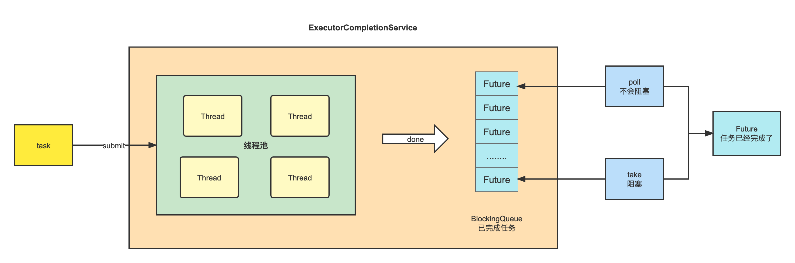

# 并发编程 CompletionService

为什么要使用并行任务，为了**提高接口的响应时间**。

## 例子

```java
public class Demo {
    @SneakyThrows
    public static void user(){
        System.out.println("获取用户信息");
        Thread.sleep(1000);
    }
    @SneakyThrows
    public static void school(){
        System.out.println("获取用户学校信息");
        Thread.sleep(1000);
    }
    @SneakyThrows
    public static void parent(){
        System.out.println("获取用户父母信息");
        Thread.sleep(1000);
    }
}
```

```java
public class Demo1 {
    public static void main(String[] args) throws Exception {
        LocalDateTime start = LocalDateTime.now();
        user();
        school();
        parent();
        LocalDateTime end = LocalDateTime.now();

        System.out.println("耗时：" + (end.getSecond() - start.getSecond()));
    }
}
```

```java
public class Demo2 {
    public static void main(String[] args) throws Exception {
        LocalDateTime start = LocalDateTime.now();
        // 调用 Demo 的三个方法
        CompletableFuture[] futures = new CompletableFuture[3];
        futures[0] = CompletableFuture.runAsync(() -> Demo.user());
        futures[1] = CompletableFuture.runAsync(() -> Demo.school());
        futures[2] = CompletableFuture.runAsync(() -> Demo.parent());

        // 等待所有的方法执行完毕
        CompletableFuture.allOf(futures).get();
        LocalDateTime end = LocalDateTime.now();

        System.out.println("耗时：" + (end.getSecond() - start.getSecond()));
    }
}
```

运行结果分析，接口确实响应快了。

耗时：3
耗时：1

## CompletionService



CompletionService 对 ExecutorService 进行了包装，可以一边生成任务,一边获取任务的返回值。让这两件事分开执行,任务之间不会互相阻塞，可以获取最先完成的任务结果。

**解决问题**：如果 Future 结果没有完成，调用 get() 方法，程序会阻塞在那里，直至获取返回结果。

**原理**：CompletionService 通过FutureTask+BlockingQueue(阻塞队列)，任务先完成可优先获取到，即结果按照完成先后顺序排序。

**使用场景**：

1. 批量提交异步任务。
2. 异步任务的执行结果有序化。先执行完的先进入阻塞队列。
3. 自定义线程池，避免耗时的任务拖垮整个应用的风险。


源码分析：

```java
// 主要成员变量
public class ExecutorCompletionService<V> implements CompletionService<V> {
    // 执行task的线程池
    private final Executor executor;
    // 用于调用AbstractExecutorService的newTaskFor方法，来实例化一个实现了RunnableFuture接口的对象
    // 如果executor继承了AbstractExecutorService ，则直接调用executor的newTaskFor方法
    // 目的是如果你自定义了ExecutorService，则调用自定义的newTaskFor方法
    // 否则直接创建一个FutureTask对象
    private final AbstractExecutorService aes;
    // 阻塞队列，保存完成的Future
    private final BlockingQueue<Future<V>> completionQueue;
}  
```

```java
// 提交一个Callable或者Runnable类型的任务，并返回Future
Future<V> submit(Callable<V> task)
Future<V> submit(Runnable task, V result)

// 阻塞方法，从结果队列中获取并移除一个已经执行完成的任务的结果，如果没有就会阻塞，直到有任务完成返回结果。  
Future<V> take() throws InterruptedException

// 从结果队列中获取并移除一个已经执行完成的任务的结果，如果没有就会返回null，该方法不会阻塞。
Future<V> poll()
Future<V> poll(long timeout, TimeUnit unit)
```

```java
private class QueueingFuture extends FutureTask<Void> {
    QueueingFuture(RunnableFuture<V> task) {
        super(task, null);
        this.task = task;
    }
    // 重写了FutureTask的done方法，任务完成后，将任务放入阻塞队列中
    protected void done() { completionQueue.add(task); }
    private final Future<V> task;
}
```

```java
private RunnableFuture<V> newTaskFor(Runnable task, V result) {
    if (aes == null)
        return new FutureTask<V>(task, result);
    else
        return aes.newTaskFor(task, result);
}
```