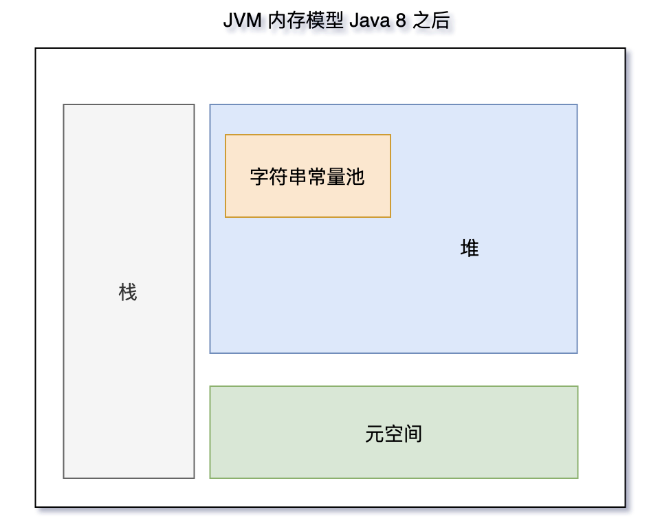

# 字符串常量池

在 JAVA 语言中有8中基本类型和一种比较特殊的类型 String 。这些类型为了使他们在运行过程中速度更快，更节省内存，都提供了一种常量池的概念。常量池就类似一个JAVA系统级别提供的缓存。

8种基本类型的常量池都是系统协调的，String类型的常量池比较特殊。它的主要使用方法有两种：

- 双引号声明出来的String对象会直接存储在常量池中。
- 非双引号声明的String对象，可以使用String提供的intern方法。intern 方法会从字符串常量池中查询当前字符串是否存在，若不存在就会将当前字符串放入常量池中

## 案例分析

```java
String s = "demo";
```

1. Java 虚拟机会先在字符串常量池中查找有没有 “demo” 这个字符串对象
2. 如果有，则不创建任何对象，直接将字符串常量池中这个 “demo” 的对象地址返回，赋给变量 s
3. 如果没有，在字符串常量池中创建 “demo” 这个对象，然后将其地址返回，赋给变量 s。

```java
// 创建三个对象，字符串常量池中一个，堆上两个。
String s = new String("demo");
String s1 = new String("demo");
```

```java
// 在字符串常量池创建一个对象
String s = "demo";
String s1 = "demo";
```

## 内存模型


Jdk 1.8:

