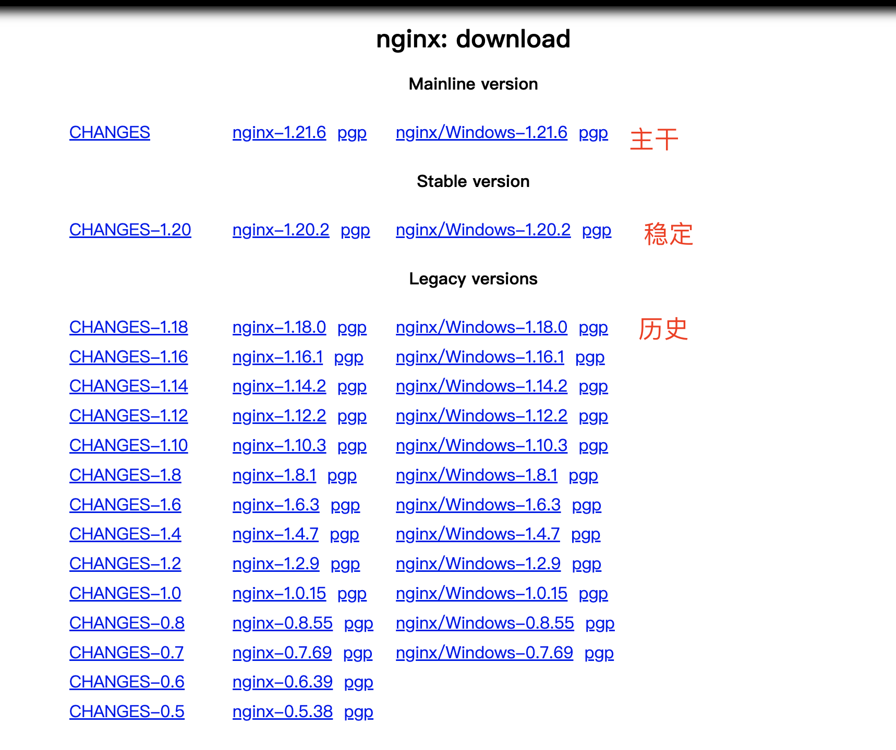
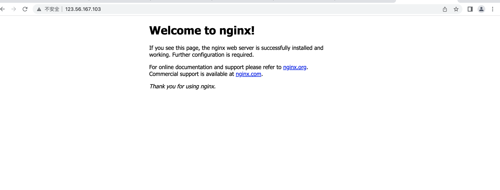

# 安装

官网：

[nginx: download](http://nginx.org/en/download.html)



 选择稳定版本：wget http://nginx.org/download/nginx-1.20.2.tar.gz

```shell
[root@iZ2zece5uq29km6k3tyi5oZ nginx]# wget http://nginx.org/download/nginx-1.20.2.tar.gz
--2022-03-31 11:55:54--  http://nginx.org/download/nginx-1.20.2.tar.gz
Resolving nginx.org (nginx.org)... 3.125.197.172, 52.58.199.22, 2a05:d014:edb:5704::6, ...
Connecting to nginx.org (nginx.org)|3.125.197.172|:80... connected.
HTTP request sent, awaiting response... 200 OK
Length: 1062124 (1.0M) [application/octet-stream]
Saving to: ‘nginx-1.20.2.tar.gz’

nginx-1.20.2.tar.gz                 100%[==================================================================>]   1.01M  1.22MB/s    in 0.8s    

2022-03-31 11:55:55 (1.22 MB/s) - ‘nginx-1.20.2.tar.gz’ saved [1062124/1062124]

[root@iZ2zece5uq29km6k3tyi5oZ nginx]# 
```

依赖安装：

```shell
yum -y install gcc zlib zlib-devel pcre-devel openssl openssl-devel
```

解压安装：

```shell
tar -zxvf nginx-1.20.2.tar.gz
-- SSL模块
./configure --with-http_ssl_module
-- 执行make命令
make
-- 执行make install 命令
make install
```

实际安装目录为  /usr/local/nginx

启动：

```shell
[root@iZ2zece5uq29km6k3tyi5oZ nginx]# cd /usr/local/nginx/
[root@iZ2zece5uq29km6k3tyi5oZ nginx]# whereis nginx
nginx: /usr/local/nginx
[root@iZ2zece5uq29km6k3tyi5oZ nginx]# ./nginx
-bash: ./nginx: No such file or directory
[root@iZ2zece5uq29km6k3tyi5oZ nginx]# cd sbin/
[root@iZ2zece5uq29km6k3tyi5oZ sbin]# ls
nginx
[root@iZ2zece5uq29km6k3tyi5oZ sbin]# ./nginx
[root@iZ2zece5uq29km6k3tyi5oZ sbin]# 
```



重启：

./nginx -s reload
