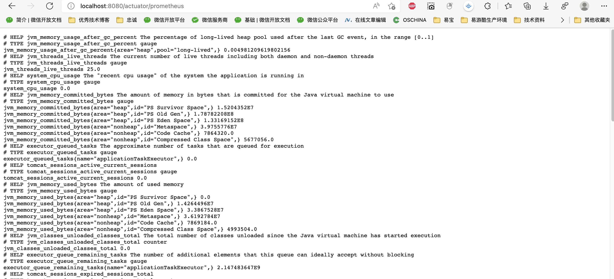

# Prometheus对接spring boot

SpringBoot监控:


## 核心代码

micrometer：监控指标的度量类库。

地址：https://github.com/micrometer-metrics/micrometer

```xml
<!--  web 依赖  -->
<dependency>
  <groupId>org.springframework.boot</groupId>
  <artifactId>spring-boot-starter-web</artifactId>
</dependency>

<dependency>
  <groupId>org.springframework.boot</groupId>
  <artifactId>spring-boot-starter-actuator</artifactId>
</dependency>

<dependency>
  <groupId>io.micrometer</groupId>
  <artifactId>micrometer-registry-prometheus</artifactId>
</dependency>

```

application.yml 配置：

```yml
# 暴露监控端点
management:
  endpoints:
    web:
      exposure:
        include: '*'
```

访问路径，可以查看监控的信息：[localhost:8080/actuator/prometheus](http://localhost:8080/actuator/prometheus)



## 报警配置

Grafana 目录下：grafana.ini，建议新建个人配置文件，下面是mac下配置文件存储位置

```shell
/usr/local/etc/grafana/grafana.ini
```

## 代码

简单源码：[tomato-cloud: tomato-cloud - Gitee.com](https://gitee.com/lizhifu/tomato-cloud/tree/master/tomato-study/tomato-study-prometheus)
