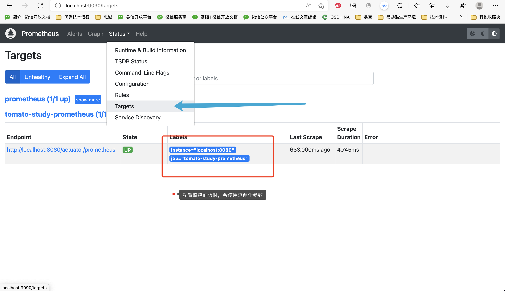
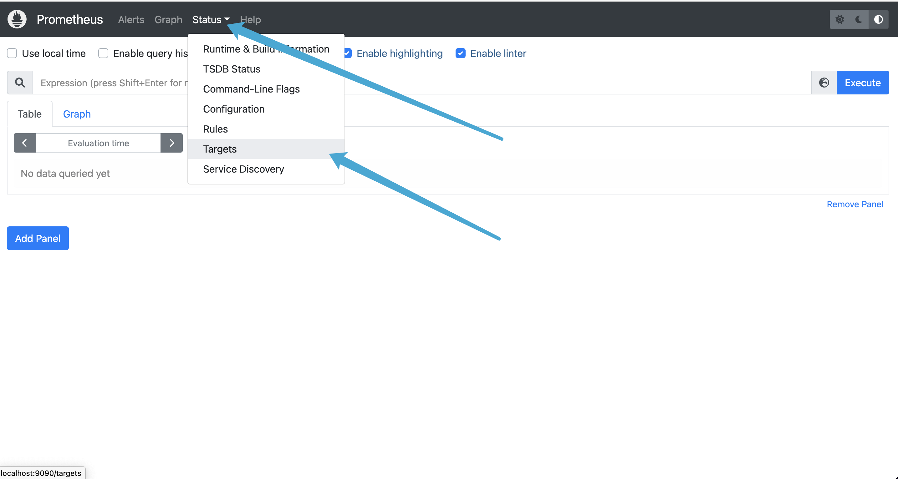
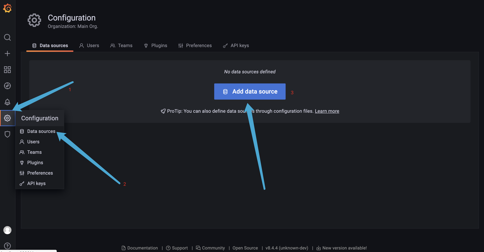
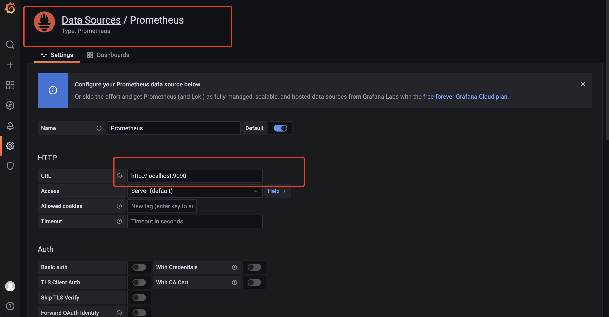
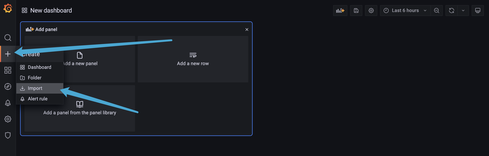
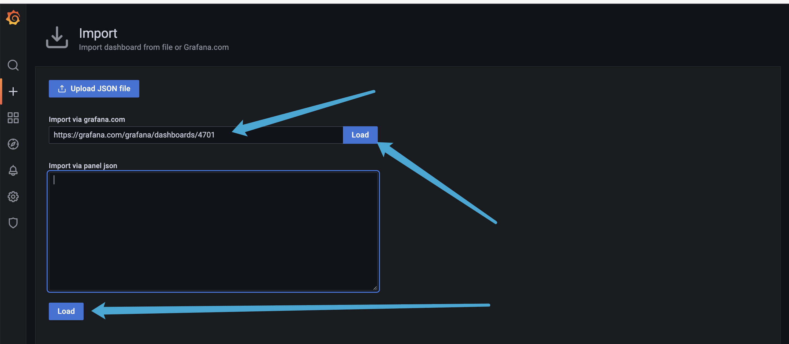
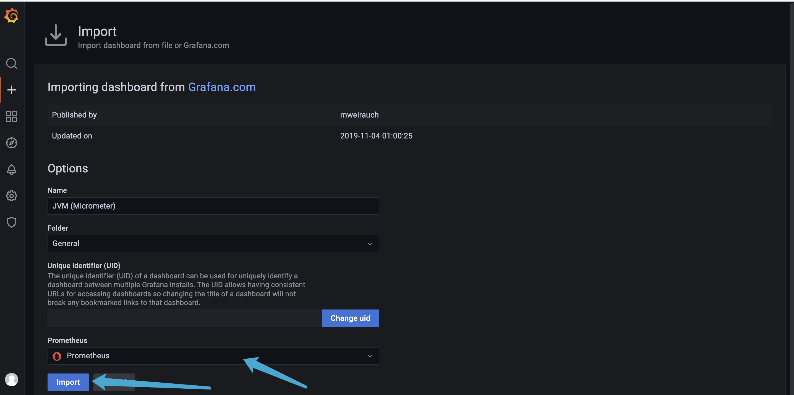
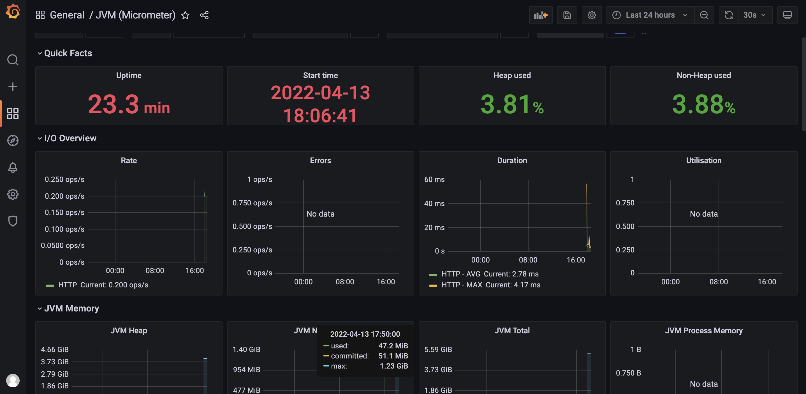

# Prometheus

Prometheus是一个开源监控解决方案，用于收集和聚合指标作为时间序列数据。更简单地说，Prometheus 商店中的每个项目都是一个指标事件，并带有它发生的时间戳。

## Mac 搭建Prometheus

地址：

[prometheus/prometheus: The Prometheus monitoring system and time series database. (github.com)](https://github.com/prometheus/prometheus)

[Prometheus - Monitoring system & time series database](https://prometheus.io/)

Mac 安装

```shell
brew install prometheus
```

默认安装路径：

```shell
/usr/local/Cellar/prometheus
```

默认配置文件：

```shell
/usr/local/etc/prometheus.yml
```

## 启动

```shell
prometheus --config.file=/usr/local/etc/prometheus.yml
```

访问：http://localhost:9090

## Spring boot 结合

`springboot`的web项目，pom依赖：

```xml
    <dependencies>

        <!--  web 依赖  -->
        <dependency>
            <groupId>org.springframework.boot</groupId>
            <artifactId>spring-boot-starter-web</artifactId>
        </dependency>

        <dependency>
            <groupId>org.springframework.boot</groupId>
            <artifactId>spring-boot-starter-actuator</artifactId>
        </dependency>

        <dependency>
            <groupId>io.micrometer</groupId>
            <artifactId>micrometer-registry-prometheus</artifactId>
        </dependency>

    </dependencies>
```

Yml配置文件:

```yml
server:
  port: 8080
# 暴露监控端点
management:
  endpoints:
    web:
      exposure:
        include: '*'
```

监控端点：http://127.0.0.1:8080/actuator/prometheus

```java
# HELP executor_queued_tasks The approximate number of tasks that are queued for execution
# TYPE executor_queued_tasks gauge
executor_queued_tasks{name="applicationTaskExecutor",} 0.0
# HELP executor_pool_max_threads The maximum allowed number of threads in the pool
# TYPE executor_pool_max_threads gauge
executor_pool_max_threads{name="applicationTaskExecutor",} 2.147483647E9
# HELP jvm_gc_pause_seconds Time spent in GC pause
# TYPE jvm_gc_pause_seconds summary
jvm_gc_pause_seconds_count{action="end of major GC",cause="Metadata GC Threshold",} 1.0
jvm_gc_pause_seconds_sum{action="end of major GC",cause="Metadata GC Threshold",} 0.072
jvm_gc_pause_seconds_count{action="end of minor GC",cause="Metadata GC Threshold",} 1.0
jvm_gc_pause_seconds_sum{action="end of minor GC",cause="Metadata GC Threshold",} 0.014
# HELP jvm_gc_pause_seconds_max Time spent in GC pause
# TYPE jvm_gc_pause_seconds_max gauge
jvm_gc_pause_seconds_max{action="end of major GC",cause="Metadata GC Threshold",} 0.0
jvm_gc_pause_seconds_max{action="end of minor GC",cause="Metadata GC Threshold",} 0.0
# HELP jvm_classes_loaded_classes The number of classes that are currently loaded in the Java virtual machine
# TYPE jvm_classes_loaded_classes gauge
jvm_classes_loaded_classes 7566.0
# HELP jvm_gc_memory_promoted_bytes_total Count of positive increases in the size of the old generation memory pool before GC to after GC
# TYPE jvm_gc_memory_promoted_bytes_total counter
jvm_gc_memory_promoted_bytes_total 3235200.0
# HELP tomcat_sessions_active_current_sessions  
# TYPE tomcat_sessions_active_current_sessions gauge
tomcat_sessions_active_current_sessions 0.0
# HELP executor_pool_size_threads The current number of threads in the pool
```




## 配置 prometheus.yml

```yaml
global:
  scrape_interval: 15s

scrape_configs:
  - job_name: "prometheus"
    static_configs:
    - targets: ["localhost:9090"]
  # 创建job 
  - job_name: "tomato-study-prometheus"
    scrape_interval: 5s
    metrics_path: '/actuator/prometheus'
    static_configs:
    - targets: ["localhost:8080"]
```

重启 prometheus：[Prometheus Time Series Collection and Processing Server](http://localhost:9090/targets)



## 安装 grafana

展示各种漂亮的图表。

Mac 安装

```shell
brew install grafana
```

默认安装路径：

```
/usr/local/Cellar/grafana/
```

启动：

```shell
grafana-server --config=/usr/local/etc/grafana/grafana.ini --homepath /usr/local/share/grafana --packaging=brew cfg:default.paths.logs=/usr/local/var/log/grafana cfg:default.paths.data=/usr/local/var/lib/grafana cfg:default.paths.plugins=/usr/local/var/lib/grafana/plugins
```

注：如需修改默认端口，可修改/usr/local/etc/grafana/grafana.ini 

访问：http://localhost:3000/  admin/admin,使用前必须更改密码 admin/123qwe

## 配置 grafana

grafana只是一个图表展示工具，必须添加数据源，才能读取到数据。





## 配置 Grafana DashBoard文件

推荐的Grafana DashBoard：

[JVM (Micrometer) dashboard for Grafana | Grafana Labs](https://grafana.com/grafana/dashboards/4701)

[Spring Boot 2.1 Statistics dashboard for Grafana | Grafana Labs](https://grafana.com/grafana/dashboards/10280)

[1 Node Exporter for Prometheus Dashboard CN 0413 ConsulManager 自动同步版本 dashboard for Grafana | Grafana Labs](https://grafana.com/grafana/dashboards/8919)

[Druid Connection Pool Dashboard dashboard for Grafana | Grafana Labs](https://grafana.com/grafana/dashboards/11157)

[1.主机基础监控(cpu，内存，磁盘，网络) dashboard for Grafana | Grafana Labs](https://grafana.com/grafana/dashboards/9276)







最终展示效果：

